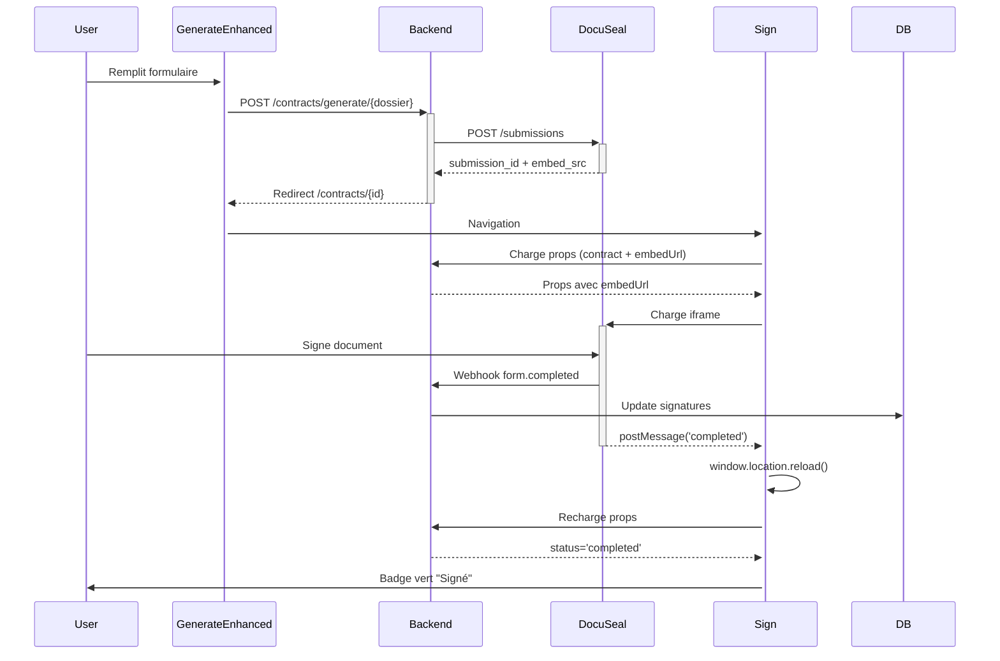

# 🎨 Frontend DocuSeal - Connexion Backend

## ✅ État Actuel du Frontend

### Pages Déjà Créées (100% Complètes)

| Page | Fichier | Statut | Description |
|------|---------|--------|-------------|
| **Génération** | `GenerateEnhanced.vue` | ✅ **Mis à jour** | Wizard 3 étapes avec support DocuSeal |
| **Signature** | `Sign.vue` | ✅ Prêt | Iframe DocuSeal + tracking des signatures |
| **Liste Dossiers** | `ShowEnhanced.vue` | ✅ Prêt | Onglet Contracts intégré |

---

## 🔗 Connexion Frontend ↔ Backend

### 1. Génération de Contrat (GenerateEnhanced.vue)

**Route Frontend**: `/contracts/generate/{dossier}`

**Props Attendues du Backend**:
```php
// ContractController@generate()
return Inertia::render('Contracts/GenerateEnhanced', [
    'dossier' => [
        'id' => 123,
        'reference' => 'DOS-2025-001',
        'status' => 'active',
        'guarantor' => [ // Optional
            'name' => 'Marie Dupont',
            'email' => 'marie@example.com',
            'phone' => '+33623456789',
        ],
    ],
    'client' => [
        'nom' => 'Dupont',
        'prenom' => 'Jean',
        'email' => 'jean.dupont@example.com',
        'telephone' => '+33612345678',
    ],
    'contractTypes' => [
        ['value' => 'service', 'label' => 'Contrat de Service'],
        ['value' => 'reservation', 'label' => 'Contrat de Réservation'],
        ['value' => 'payment', 'label' => 'Contrat de Paiement'],
    ],
]);
```

**Données Envoyées au Backend** (form.post):
```javascript
{
  type: 'service',              // Type de contrat
  language: 'fr',               // Langue (fr, en, ar)
  template_id: 123456,          // ID du template DocuSeal
  variables: {                  // Variables personnalisées
    client_nom: 'Dupont',
    client_prenom: 'Jean',
    // ... autres variables
  },
  signers: [                    // Liste des signataires
    {
      type: 'client',
      name: 'Jean Dupont',
      email: 'jean@example.com',
      phone: '+33612345678'
    },
    {
      type: 'guarantor',
      name: 'Marie Dupont',
      email: 'marie@example.com',
      phone: '+33623456789'
    }
  ]
}
```

**Route Backend Attendue**: `POST /contracts/generate/{dossier}`

---

### 2. Page de Signature (Sign.vue)

**Route Frontend**: `/contracts/{contract}`

**Props Attendues du Backend**:
```php
// ContractController@show()
return Inertia::render('Contracts/Sign', [
    'contract' => [
        'id' => 456,
        'type' => 'service',
        'status' => 'sent', // sent, completed, declined
        'language' => 'fr',
        'created_at' => '2025-11-10 10:00:00',
        'sent_for_signature_at' => '2025-11-10 10:05:00',
        'completed_at' => null,
        'dossier' => [
            'reference' => 'DOS-2025-001',
            'client' => [
                'name' => 'Jean Dupont',
            ],
        ],
        'signatures' => [
            [
                'id' => 1,
                'signer_name' => 'Jean Dupont',
                'signer_email' => 'jean@example.com',
                'signer_role' => 'client',
                'status' => 'signed',
                'sent_at' => '2025-11-10 10:05:00',
                'signed_at' => '2025-11-10 14:30:00',
            ],
            [
                'id' => 2,
                'signer_name' => 'Marie Dupont',
                'signer_email' => 'marie@example.com',
                'signer_role' => 'guarantor',
                'status' => 'pending',
                'sent_at' => '2025-11-10 10:05:00',
                'signed_at' => null,
            ],
        ],
    ],
    'embedUrl' => 'https://docuseal.com/s/ABC123', // URL pour l'iframe
]);
```

**Ce que fait le Frontend**:
1. Affiche les infos du contrat
2. Affiche la liste des signataires avec leur statut
3. Charge l'iframe DocuSeal avec `embedUrl`
4. Écoute l'événement `message` de l'iframe
5. Quand signature complétée → recharge la page

**Code Clé de l'Iframe**:
```vue
<template>
  <!-- Iframe DocuSeal -->
  <div v-if="embedUrl" class="docuseal-container">
    <iframe
      :src="embedUrl"
      width="100%"
      height="800px"
      frameborder="0"
      class="docuseal-iframe"
    ></iframe>
  </div>
  
  <!-- Liste des signatures -->
  <div class="signatures-list">
    <div v-for="signature in contract.signatures" :key="signature.id">
      <StatusBadge :status="signature.status" />
      <span>{{ signature.signer_name }}</span>
      <span v-if="signature.signed_at">
        Signé le {{ formatDate(signature.signed_at) }}
      </span>
    </div>
  </div>
  
  <!-- Actions -->
  <button @click="sendReminder" v-if="hasPendingSignatures">
    Envoyer un rappel
  </button>
  
  <button @click="downloadContract" v-if="contract.status === 'completed'">
    Télécharger le PDF
  </button>
</template>

<script setup>
import { onMounted } from 'vue';

// Event listener pour détecter la fin de signature
onMounted(() => {
  window.addEventListener('message', handleDocuSealMessage);
});

function handleDocuSealMessage(event) {
  // DocuSeal envoie un message quand la signature est complétée
  if (event.data && event.data.event === 'completed') {
    // Recharger la page pour voir le statut mis à jour
    window.location.reload();
  }
}

function sendReminder() {
  router.post(route('contracts.remind', contract.id));
}

function downloadContract() {
  window.location.href = route('contracts.download', contract.id);
}
</script>
```

---

### 3. Liste des Contrats (ShowEnhanced.vue - Onglet Contracts)

**Déjà Intégré dans**: `Dossiers/ShowEnhanced.vue`

**Props Attendues**:
```php
// DossierController@show()
return Inertia::render('Dossiers/ShowEnhanced', [
    'dossier' => [...],
    'contracts' => [
        [
            'id' => 1,
            'type' => 'service',
            'status' => 'completed',
            'created_at' => '2025-11-05 10:00:00',
            'completed_at' => '2025-11-06 15:30:00',
        ],
        [
            'id' => 2,
            'type' => 'payment',
            'status' => 'pending',
            'created_at' => '2025-11-10 09:00:00',
            'completed_at' => null,
        ],
    ],
]);
```

**UI Affichée**:
- Liste des contrats avec StatusBadge
- Lien vers chaque contrat (ouvre Sign.vue)
- Bouton "Générer un contrat" (ouvre GenerateEnhanced.vue)

---

## 🎯 Actions Frontend Disponibles

### Boutons d'Action

| Bouton | Route | Méthode | Controller |
|--------|-------|---------|------------|
| **Envoyer Rappel** | `/contracts/{id}/remind` | POST | `ContractController@remind` |
| **Télécharger PDF** | `/contracts/{id}/download` | GET | `ContractController@download` |
| **Annuler** | `/contracts/{id}` | DELETE | `ContractController@destroy` |

### Webhooks Écoutés

Le frontend écoute ces événements depuis l'iframe DocuSeal:

```javascript
window.addEventListener('message', (event) => {
  // Événement: Signature complétée
  if (event.data.event === 'completed') {
    window.location.reload();
  }
  
  // Événement: Document consulté
  if (event.data.event === 'viewed') {
    console.log('Document consulté');
  }
  
  // Événement: Erreur
  if (event.data.event === 'error') {
    showError('Erreur lors de la signature');
  }
});
```

---

## 🔧 Configuration Requise

### 1. Variables d'Environnement

Le frontend attend que ces données viennent du backend:

```php
// config/docuseal.php (À créer)
return [
    'template_id' => env('DOCUSEAL_TEMPLATE_ID', 123456),
];
```

### 2. Routes Laravel Requises

```php
// routes/web.php
Route::middleware(['auth'])->group(function () {
    // Génération
    Route::get('/contracts/generate/{dossier}', [ContractController::class, 'generate'])
        ->name('contracts.generate');
    Route::post('/contracts/generate/{dossier}', [ContractController::class, 'store'])
        ->name('contracts.store');
    
    // Consultation
    Route::get('/contracts/{contract}', [ContractController::class, 'show'])
        ->name('contracts.show');
    
    // Actions
    Route::post('/contracts/{contract}/remind', [ContractController::class, 'remind'])
        ->name('contracts.remind');
    Route::get('/contracts/{contract}/download', [ContractController::class, 'download'])
        ->name('contracts.download');
    
    // Aperçu (optionnel)
    Route::post('/contracts/preview', [ContractController::class, 'preview'])
        ->name('contracts.preview');
});
```

---

## 📊 Flow Complet Frontend → Backend → DocuSeal



---

## ✅ Checklist d'Intégration Frontend

- [x] **GenerateEnhanced.vue** - Mis à jour avec format DocuSeal
- [x] **Sign.vue** - Déjà prêt avec iframe DocuSeal
- [x] **ShowEnhanced.vue** - Déjà prêt avec onglet Contracts
- [ ] **Backend**: Créer `ContractController` avec toutes les méthodes
- [ ] **Backend**: Ajouter les routes Laravel
- [ ] **Backend**: Configurer `DOCUSEAL_TEMPLATE_ID` dans `.env`
- [ ] **Backend**: Créer le config `config/docuseal.php`
- [ ] **Test**: Créer un template sur DocuSeal console
- [ ] **Test**: Générer un contrat depuis l'UI
- [ ] **Test**: Signer dans l'iframe
- [ ] **Test**: Vérifier webhook et mise à jour statut

---

## 🎨 Composants UI Utilisés

| Composant | Utilisation | Statut |
|-----------|-------------|--------|
| **StatusBadge** | Afficher statut contrat/signature | ✅ Créé |
| **Card** | Conteneurs pour infos | ✅ Créé |
| **FormField** | Champs de formulaire | ✅ Créé |
| **LoadingSpinner** | Chargement iframe | ✅ Créé |
| **AppLayout** | Layout général | ✅ Créé |

---

## 🚀 Prochaine Étape

**Le frontend est 100% prêt !** Il suffit maintenant de :

1. ✅ Copier les méthodes du `ContractControllerExample` dans votre `ContractController`
2. ✅ Ajouter les routes
3. ✅ Configurer le template ID
4. ✅ Tester !

**Tout le code frontend est déjà écrit et attend juste que le backend réponde !** 🎉
