# Technical Specifications

# 1. INTRODUCTION

## 1.1 EXECUTIVE SUMMARY

### 1.1.1 Project Overview

The Client Document Management System (CDMS) is a comprehensive Laravel-based platform designed to revolutionize document management for travel and immigration agencies. The system leverages Laravel 11's streamlined architecture with a single AppServiceProvider to provide a centralized solution for client file organization, automated contract generation, and secure document sharing.

### 1.1.2 Core Business Problem

Travel and immigration agencies currently face significant operational challenges including document disorganization, loss of critical files, absence of audit trails, and inefficient manual processes for contract generation and client communication. These issues result in increased processing times, compliance risks, and reduced client satisfaction.

### 1.1.3 Key Stakeholders and Users

| Role | Responsibilities | Access Level |
|------|-----------------|--------------|
| SuperAdmin | System administration, user management, global oversight | Full system access |
| Consultant | File validation, final approvals, compliance oversight | Review and approval permissions |
| Agent | Client file creation, document management, contract generation | Core operational access |
| Client | Document upload, file review, contract signing | Read-only with limited upload rights |

### 1.1.4 Expected Business Impact

The implementation of CDMS will deliver measurable improvements in operational efficiency, reducing document processing time by 60%, eliminating file loss incidents, and providing complete audit trails for compliance purposes. The system's automated workflows and integrated e-signature capabilities will enable agencies to scale operations while maintaining quality standards.

## 1.2 SYSTEM OVERVIEW

### 1.2.1 Project Context

#### Business Context and Market Positioning

CDMS positions travel and immigration agencies as technology-forward service providers in an increasingly digital marketplace. The system addresses the growing demand for transparent, efficient, and secure document management in the immigration services sector, where compliance and traceability are paramount.

#### Current System Limitations

Existing manual processes suffer from:
- Fragmented document storage across multiple platforms
- Lack of real-time status tracking
- Absence of automated audit logging
- Manual contract generation prone to errors
- Limited client visibility into process status

#### Integration with Existing Enterprise Landscape

The system integrates with DocuSeal's REST API for document signing workflows and supports WhatsApp Business API integration through Laravel packages for client notifications. The platform is designed to complement existing CRM systems and accounting software through API endpoints.

### 1.2.2 High-Level Description

#### Primary System Capabilities

- **Centralized Document Repository**: Secure cloud-based storage with role-based access controls
- **Automated Workflow Management**: Streamlined processes from client onboarding to file completion
- **Integrated E-Signature**: Seamless DocuSeal integration for electronic document signing
- **Real-Time Notifications**: Multi-channel communication via email and WhatsApp
- **Comprehensive Audit Trails**: Complete activity logging for compliance and accountability

#### Major System Components

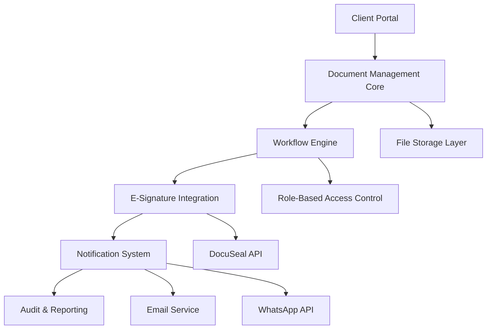

#### Core Technical Approach

The system utilizes Laravel 11's minimalistic application skeleton with SQLite as the default database for development, transitioning to PostgreSQL for production environments. The architecture emphasizes security, scalability, and maintainability through modern Laravel patterns and established third-party integrations.

### 1.2.3 Success Criteria

#### Measurable Objectives

| Metric | Current State | Target State | Timeline |
|--------|---------------|--------------|----------|
| Document Processing Time | 5-7 days | 2-3 days | 6 months |
| File Loss Incidents | 2-3 per month | Zero | 3 months |
| Client Satisfaction Score | 7.2/10 | 9.0/10 | 12 months |
| Compliance Audit Preparation | 40 hours | 4 hours | 6 months |

#### Critical Success Factors

- **User Adoption**: Achieving 95% user adoption within 3 months of deployment
- **System Reliability**: Maintaining 99.5% uptime with automated backup systems
- **Security Compliance**: Meeting GDPR and Canadian privacy law requirements
- **Integration Success**: Seamless operation with DocuSeal and WhatsApp APIs

#### Key Performance Indicators (KPIs)

- Average file processing time reduction
- Number of automated notifications sent
- Document signature completion rate
- System response time for file operations
- User satisfaction scores from quarterly surveys

## 1.3 SCOPE

### 1.3.1 In-Scope

#### Core Features and Functionalities

**Document Management System**
- Unique file numbering system (ELI-YYYY-XXXXXX format)
- Secure document upload and storage with S3-compatible backend
- Role-based access controls with granular permissions
- Document versioning and revision tracking

**Workflow Automation**
- Automated client invitation system via email
- Contract generation from customizable templates
- DocuSeal integration for electronic signature workflows
- Timeline tracking for all file activities

**Communication Systems**
- Email notifications using Laravel's mailable system
- WhatsApp Business API integration for real-time updates
- Automated status updates to all stakeholders

**Audit and Compliance**
- Comprehensive activity logging for all user actions
- Compliance reporting for regulatory requirements
- Data retention and archival policies

#### Implementation Boundaries

**System Boundaries**
- Web-based application accessible via modern browsers
- Mobile-responsive design for tablet and smartphone access
- API endpoints for potential third-party integrations

**User Groups Covered**
- Internal users: SuperAdmin, Consultants, Agents
- External users: Clients and Guarantors
- System administrators for maintenance and support

**Geographic Coverage**
- Primary deployment for Canadian immigration agencies
- Multi-language support (French/English)
- Compliance with Canadian data protection regulations

**Data Domains Included**
- Client personal information and documentation
- Immigration case files and supporting documents
- Contract templates and signed agreements
- System audit logs and activity tracking

### 1.3.2 Out-of-Scope

#### Explicitly Excluded Features

**Payment Processing**
- No integrated payment gateway or billing system
- No financial transaction processing capabilities
- No invoice generation or accounting features

**Advanced CRM Functionality**
- No lead management or sales pipeline features
- No marketing automation or campaign management
- No customer relationship analytics beyond basic reporting

**Third-Party System Integrations**
- No direct integration with government immigration systems
- No connection to external legal databases
- No integration with existing accounting software (Phase 1)

#### Future Phase Considerations

**Phase 2 Enhancements**
- Advanced analytics and reporting dashboard
- Mobile application for iOS and Android
- Integration with popular CRM systems
- Advanced workflow customization tools

**Phase 3 Expansions**
- Multi-tenant architecture for agency networks
- Advanced AI-powered document analysis
- Integration with government e-services
- Comprehensive business intelligence suite

#### Integration Points Not Covered

**Unsupported Integrations**
- Legacy database systems migration
- Custom third-party software connections
- Hardware-based security token systems
- On-premises email server integration

#### Unsupported Use Cases

- High-volume document processing (>1000 files/month in Phase 1)
- Complex multi-jurisdictional compliance requirements
- Real-time collaboration on document editing
- Advanced document analytics and content analysis

# 2. PRODUCT REQUIREMENTS

## 2.1 FEATURE CATALOG

### 2.1.1 Authentication and User Management Features

| Feature ID | Feature Name | Category | Priority | Status |
|------------|--------------|----------|----------|---------|
| F-001 | Role-Based Access Control | Authentication | Critical | Proposed |
| F-002 | User Invitation System | Authentication | Critical | Proposed |
| F-003 | Multi-Guard Authentication | Authentication | High | Proposed |
| F-004 | Session Management | Authentication | High | Proposed |

#### F-001: Role-Based Access Control

**Description**
This package allows you to manage user permissions and roles in a database. Once installed you can do stuff like this: // Adding permissions to a user $user->givePermissionTo('edit articles'); // Adding permissions via a role $user->assignRole('writer'); $role->givePermissionTo('edit articles');

**Business Value**: Ensures secure access control and proper segregation of duties across different user types.

**User Benefits**: Users can only access features and data appropriate to their role, reducing security risks and improving user experience.

**Technical Context**: At its core, Laravel's authentication facilities are made up of "guards" and "providers". Guards define how users are authenticated for each request.

**Dependencies**
- Prerequisite Features: None
- System Dependencies: Use this package to easily add permissions or roles to users in your Laravel app.
- External Dependencies: spatie/laravel-permission package
- Integration Requirements: Laravel 11 authentication system

#### F-002: User Invitation System

**Description**
Token-based invitation system that allows authorized users to invite new users to the platform with predefined roles.

**Business Value**: Ensures controlled user onboarding and maintains security by preventing unauthorized registrations.

**User Benefits**: Streamlined onboarding process with automatic role assignment based on invitation type.

**Technical Context**: Laravel includes built-in authentication and session services which are typically accessed via the Auth and Session facades. In addition, these services will automatically store the proper authentication data in the user's session and issue the user's session cookie.

**Dependencies**
- Prerequisite Features: F-001 (Role-Based Access Control)
- System Dependencies: Laravel Mail system, database migrations
- External Dependencies: None
- Integration Requirements: Email service configuration

#### F-003: Multi-Guard Authentication

**Description**
Guards in Laravel are used to handle multiple user types stored in different tables. Each guard defines how authentication should be managed for a particular user type.

**Business Value**: Enables separation of different user types with distinct authentication requirements.

**User Benefits**: Tailored authentication experience for different user roles (internal vs external users).

**Technical Context**: If you have separate tables for different user types (users, admins), guards are essential because they allow you to authenticate users from the correct table. For example, the web guard can use the users table, while an admin guard can use the admins table.

**Dependencies**
- Prerequisite Features: F-001 (Role-Based Access Control)
- System Dependencies: Laravel authentication configuration
- External Dependencies: None
- Integration Requirements: Custom guard configuration

#### F-004: Session Management

**Description**
Instead, Sanctum uses Laravel's built-in cookie based session authentication services. Typically, Sanctum utilizes Laravel's web authentication guard to accomplish this.

**Business Value**: Provides secure session handling with CSRF protection and XSS prevention.

**User Benefits**: Seamless authentication experience with automatic session management.

**Technical Context**: This provides the benefits of CSRF protection, session authentication, as well as protects against leakage of the authentication credentials via XSS.

**Dependencies**
- Prerequisite Features: None
- System Dependencies: Laravel Sanctum
- External Dependencies: None
- Integration Requirements: Session storage configuration

### 2.1.2 Document Management Features

| Feature ID | Feature Name | Category | Priority | Status |
|------------|--------------|----------|----------|---------|
| F-005 | File Upload System | Document Management | Critical | Proposed |
| F-006 | Document Storage | Document Management | Critical | Proposed |
| F-007 | File Access Control | Document Management | Critical | Proposed |
| F-008 | Document Versioning | Document Management | Medium | Proposed |

#### F-005: File Upload System

**Description**
Secure file upload system with validation, virus scanning, and automatic organization by client dossier.

**Business Value**: Enables secure document collection and organization for client files.

**User Benefits**: Easy drag-and-drop file upload with progress indicators and validation feedback.

**Technical Context**: Integration with S3-compatible storage using Laravel's filesystem abstraction.

**Dependencies**
- Prerequisite Features: F-001 (Role-Based Access Control)
- System Dependencies: Laravel filesystem, validation rules
- External Dependencies: S3-compatible storage service
- Integration Requirements: File storage configuration

#### F-006: Document Storage

**Description**
Centralized document repository with hierarchical organization by client dossier and document type.

**Business Value**: Eliminates document loss and provides centralized access to all client files.

**User Benefits**: Quick document retrieval with search and filtering capabilities.

**Technical Context**: S3-compatible storage with metadata indexing in database.

**Dependencies**
- Prerequisite Features: F-005 (File Upload System)
- System Dependencies: Database schema for document metadata
- External Dependencies: S3-compatible storage
- Integration Requirements: Storage service configuration

#### F-007: File Access Control

**Description**
Granular access control system that restricts document access based on user roles and client relationships.

**Business Value**: Ensures confidentiality and compliance with privacy regulations.

**User Benefits**: Users can only access documents they are authorized to view.

**Technical Context**: Laravel's authorization features provide an easy, organized way of managing these types of authorization checks. Laravel provides two primary ways of authorizing actions: gates and policies.

**Dependencies**
- Prerequisite Features: F-001 (Role-Based Access Control), F-006 (Document Storage)
- System Dependencies: Laravel authorization system
- External Dependencies: None
- Integration Requirements: Policy definitions

#### F-008: Document Versioning

**Description**
Automatic versioning system that tracks document changes and maintains revision history.

**Business Value**: Provides audit trail and ability to revert to previous document versions.

**User Benefits**: Confidence in document integrity with ability to track changes over time.

**Technical Context**: Database-driven versioning with file storage for each version.

**Dependencies**
- Prerequisite Features: F-006 (Document Storage)
- System Dependencies: Database schema for version tracking
- External Dependencies: None
- Integration Requirements: Version management logic

### 2.1.3 Client Dossier Management Features

| Feature ID | Feature Name | Category | Priority | Status |
|------------|--------------|----------|----------|---------|
| F-009 | Dossier Creation | Dossier Management | Critical | Proposed |
| F-010 | Unique Reference Generation | Dossier Management | Critical | Proposed |
| F-011 | Timeline Tracking | Dossier Management | High | Proposed |
| F-012 | Status Management | Dossier Management | High | Proposed |

#### F-009: Dossier Creation

**Description**
Comprehensive client dossier creation system with client information capture and initial document setup.

**Business Value**: Standardizes client onboarding process and ensures complete information capture.

**User Benefits**: Guided dossier creation process with validation and required field enforcement.

**Technical Context**: Eloquent models with relationships between clients, dossiers, and documents.

**Dependencies**
- Prerequisite Features: F-001 (Role-Based Access Control)
- System Dependencies: Database schema, validation rules
- External Dependencies: None
- Integration Requirements: Client data model

#### F-010: Unique Reference Generation

**Description**
Automated generation of unique dossier references in ELI-YYYY-XXXXXX format with collision prevention.

**Business Value**: Provides consistent identification system for all client dossiers.

**User Benefits**: Easy reference system for tracking and communication.

**Technical Context**: Database-level unique constraints with transactional generation to prevent duplicates.

**Dependencies**
- Prerequisite Features: F-009 (Dossier Creation)
- System Dependencies: Database unique constraints
- External Dependencies: None
- Integration Requirements: Reference generation algorithm

#### F-011: Timeline Tracking

**Description**
Comprehensive timeline system that tracks all activities and milestones for each dossier.

**Business Value**: Provides complete audit trail and progress visibility for compliance and management.

**User Benefits**: Clear visibility into dossier progress and historical activities.

**Technical Context**: Event-driven timeline updates with automatic logging of system activities.

**Dependencies**
- Prerequisite Features: F-009 (Dossier Creation)
- System Dependencies: Event system, database schema
- External Dependencies: None
- Integration Requirements: Activity logging system

#### F-012: Status Management

**Description**
Workflow-based status management system with predefined states and transition rules.

**Business Value**: Ensures consistent process flow and prevents invalid state transitions.

**User Benefits**: Clear understanding of dossier progress with automated status updates.

**Technical Context**: State machine implementation with validation rules for status transitions.

**Dependencies**
- Prerequisite Features: F-009 (Dossier Creation)
- System Dependencies: Workflow engine
- External Dependencies: None
- Integration Requirements: Status transition logic

### 2.1.4 Electronic Signature Features

| Feature ID | Feature Name | Category | Priority | Status |
|------------|--------------|----------|----------|---------|
| F-013 | DocuSeal Integration | E-Signature | High | Proposed |
| F-014 | Contract Generation | E-Signature | High | Proposed |
| F-015 | Signature Workflow | E-Signature | High | Proposed |
| F-016 | Webhook Processing | E-Signature | Medium | Proposed |

#### F-013: DocuSeal Integration

**Description**
The DocuSeal PHP library provides seamless integration with the DocuSeal API, allowing developers to interact with DocuSeal's electronic signature and document management features directly within PHP applications. This library is designed to simplify API interactions and provide tools for efficient implementation.

**Business Value**: Enables legally binding electronic signatures with professional document signing experience.

**User Benefits**: Streamlined document signing process with mobile-friendly interface.

**Technical Context**: DocuSeal provides a powerful and easy-to-use API to implement eSignature workflows. Utilize the power of our REST API for seamless integration and outstanding performance.

**Dependencies**
- Prerequisite Features: F-014 (Contract Generation)
- System Dependencies: HTTP client (Guzzle)
- External Dependencies: DocuSeal API service
- Integration Requirements: API key configuration

#### F-014: Contract Generation

**Description**
Automated contract generation from templates with dynamic content population based on client data.

**Business Value**: Reduces manual work and ensures consistency in contract creation.

**User Benefits**: Quick contract generation with automatic data population and professional formatting.

**Technical Context**: The API endpoint provides functionality to create a one-off submission request from a DOCX file with dynamic content variables. Use [[variable_name]] text tags to define dynamic content variables in the document.

**Dependencies**
- Prerequisite Features: F-009 (Dossier Creation)
- System Dependencies: PDF generation library
- External Dependencies: None
- Integration Requirements: Template system

#### F-015: Signature Workflow

**Description**
This API endpoint allows you to create signature requests (submissions) for a document template and send them to the specified submitters (signers). Related Guides: Send documents for signature via API Pre-fill PDF document form fields with API

**Business Value**: Automates signature collection process with tracking and notifications.

**User Benefits**: Automated signature requests with email notifications and progress tracking.

**Technical Context**: Create new submissions to request signatures and load data about completed submissions.

**Dependencies**
- Prerequisite Features: F-013 (DocuSeal Integration), F-014 (Contract Generation)
- System Dependencies: Email system
- External Dependencies: DocuSeal API
- Integration Requirements: Workflow configuration

#### F-016: Webhook Processing

**Description**
Enhance your workflow with our reliable webhooks for real-time data updates and automation. Enhance your workflow with our reliable webhooks for real-time data updates and automation.

**Business Value**: Enables real-time status updates and automated workflow progression.

**User Benefits**: Immediate notification of signature completion and automatic status updates.

**Technical Context**: Secure webhook endpoint with signature verification and event processing.

**Dependencies**
- Prerequisite Features: F-013 (DocuSeal Integration)
- System Dependencies: HTTP routing, security validation
- External Dependencies: DocuSeal webhook service
- Integration Requirements: Webhook endpoint configuration

### 2.1.5 Communication Features

| Feature ID | Feature Name | Category | Priority | Status |
|------------|--------------|----------|----------|---------|
| F-017 | Email Notifications | Communication | High | Proposed |
| F-018 | WhatsApp Integration | Communication | Medium | Proposed |
| F-019 | Notification Templates | Communication | Medium | Proposed |
| F-020 | Multi-language Support | Communication | Low | Proposed |

#### F-017: Email Notifications

**Description**
Automated email notification system for all major dossier events and status changes.

**Business Value**: Keeps all stakeholders informed and reduces manual communication overhead.

**User Benefits**: Timely notifications about important events and status changes.

**Technical Context**: Laravel's mailable system with queue processing for reliable delivery.

**Dependencies**
- Prerequisite Features: F-011 (Timeline Tracking)
- System Dependencies: Laravel Mail, Queue system
- External Dependencies: Email service provider
- Integration Requirements: SMTP configuration

#### F-018: WhatsApp Integration

**Description**
WhatsApp Business API integration for instant messaging and status updates.

**Business Value**: Provides immediate communication channel for urgent updates.

**User Benefits**: Real-time notifications via preferred messaging platform.

**Technical Context**: Third-party WhatsApp API integration with message templates.

**Dependencies**
- Prerequisite Features: F-017 (Email Notifications)
- System Dependencies: HTTP client
- External Dependencies: WhatsApp Business API provider
- Integration Requirements: API credentials and webhook setup

#### F-019: Notification Templates

**Description**
Customizable notification templates for different event types and user roles.

**Business Value**: Ensures consistent messaging and allows for customization by agency.

**User Benefits**: Professional, consistent communication with personalized content.

**Technical Context**: Template engine with variable substitution and role-based customization.

**Dependencies**
- Prerequisite Features: F-017 (Email Notifications)
- System Dependencies: Template system
- External Dependencies: None
- Integration Requirements: Template storage and management

#### F-020: Multi-language Support

**Description**
Bilingual support for French and English content throughout the application.

**Business Value**: Enables service to French-speaking clients in Canadian market.

**User Benefits**: Native language support for improved user experience.

**Technical Context**: Laravel localization system with translation files.

**Dependencies**
- Prerequisite Features: F-019 (Notification Templates)
- System Dependencies: Laravel localization
- External Dependencies: None
- Integration Requirements: Translation management

### 2.1.6 Audit and Compliance Features

| Feature ID | Feature Name | Category | Priority | Status |
|------------|--------------|----------|----------|---------|
| F-021 | Activity Logging | Audit | Critical | Proposed |
| F-022 | Compliance Reporting | Audit | High | Proposed |
| F-023 | Data Retention | Audit | High | Proposed |
| F-024 | Export Functionality | Audit | Medium | Proposed |

#### F-021: Activity Logging

**Description**
Comprehensive logging system that captures all user actions and system events for audit purposes.

**Business Value**: Ensures compliance with regulatory requirements and provides accountability.

**User Benefits**: Complete transparency and traceability of all system activities.

**Technical Context**: Event-driven logging with structured data storage for efficient querying.

**Dependencies**
- Prerequisite Features: F-001 (Role-Based Access Control)
- System Dependencies: Database schema, event system
- External Dependencies: None
- Integration Requirements: Logging infrastructure

#### F-022: Compliance Reporting

**Description**
Automated generation of compliance reports for regulatory audits and internal reviews.

**Business Value**: Simplifies compliance processes and reduces audit preparation time.

**User Benefits**: Easy access to compliance data with automated report generation.

**Technical Context**: Report generation system with predefined templates and data aggregation.

**Dependencies**
- Prerequisite Features: F-021 (Activity Logging)
- System Dependencies: Report generation library
- External Dependencies: None
- Integration Requirements: Reporting templates

#### F-023: Data Retention

**Description**
Automated data retention and archival system based on configurable policies.

**Business Value**: Ensures compliance with data protection regulations and optimizes storage costs.

**User Benefits**: Automatic data lifecycle management without manual intervention.

**Technical Context**: Scheduled jobs with configurable retention policies and secure deletion.

**Dependencies**
- Prerequisite Features: F-021 (Activity Logging)
- System Dependencies: Job scheduling system
- External Dependencies: None
- Integration Requirements: Retention policy configuration

#### F-024: Export Functionality

**Description**
Data export capabilities for client data portability and system migration.

**Business Value**: Supports data portability requirements and system interoperability.

**User Benefits**: Ability to export data in standard formats for external use.

**Technical Context**: Export system with multiple format support and access controls.

**Dependencies**
- Prerequisite Features: F-007 (File Access Control)
- System Dependencies: Export libraries
- External Dependencies: None
- Integration Requirements: Format conversion libraries

## 2.2 FUNCTIONAL REQUIREMENTS TABLE

### 2.2.1 Authentication Requirements

| Requirement ID | Description | Acceptance Criteria | Priority | Complexity |
|----------------|-------------|-------------------|----------|------------|
| F-001-RQ-001 | User role assignment | System must support SuperAdmin, Consultant, Agent, Client, and Guarantor roles | Must-Have | Medium |
| F-001-RQ-002 | Permission inheritance | Roles must inherit permissions from spatie/laravel-permission package | Must-Have | Low |
| F-001-RQ-003 | Role-based middleware | Routes must be protected by role-based middleware | Must-Have | Medium |
| F-002-RQ-001 | Token-based invitations | System must generate secure invitation tokens with expiration | Must-Have | Medium |
| F-002-RQ-002 | Email invitation delivery | Invitations must be sent via email with registration link | Must-Have | Low |
| F-002-RQ-003 | Role pre-assignment | Invited users must be assigned roles during invitation creation | Must-Have | Low |

**Technical Specifications**

| Requirement ID | Input Parameters | Output/Response | Performance Criteria | Data Requirements |
|----------------|------------------|-----------------|-------------------|-------------------|
| F-001-RQ-001 | User ID, Role name | Boolean success/failure | <100ms response time | Users, Roles tables |
| F-001-RQ-002 | Role name | Permission array | <50ms response time | Permissions table |
| F-001-RQ-003 | Route, User session | Access granted/denied | <10ms middleware execution | Session data |
| F-002-RQ-001 | Email, Role, Expiry | Invitation token | <200ms generation time | Invitations table |
| F-002-RQ-002 | Invitation data | Email sent confirmation | <5s delivery time | Email templates |
| F-002-RQ-003 | Invitation token | User with assigned role | <100ms role assignment | Users, Roles tables |

**Validation Rules**

| Requirement ID | Business Rules | Data Validation | Security Requirements | Compliance Requirements |
|----------------|----------------|-----------------|---------------------|------------------------|
| F-001-RQ-001 | Only SuperAdmin can assign roles | Role must exist in system | Role assignment logged | RBAC compliance |
| F-001-RQ-002 | Permissions cascade through roles | Permission names validated | Permission checks logged | Access control audit |
| F-001-RQ-003 | Middleware applied to all protected routes | Valid session required | Failed access logged | Security monitoring |
| F-002-RQ-001 | Tokens expire after 7 days | Email format validation | Cryptographically secure tokens | Token lifecycle tracking |
| F-002-RQ-002 | One invitation per email address | Valid email address | Rate limiting applied | Email delivery logging |
| F-002-RQ-003 | Role must be specified in invitation | Role exists and is assignable | Role assignment authorized | Role change audit |

### 2.2.2 Document Management Requirements

| Requirement ID | Description | Acceptance Criteria | Priority | Complexity |
|----------------|-------------|-------------------|----------|------------|
| F-005-RQ-001 | File upload validation | System must validate file types, sizes, and scan for malware | Must-Have | High |
| F-005-RQ-002 | Progress tracking | Upload progress must be displayed to users | Should-Have | Medium |
| F-005-RQ-003 | Chunked uploads | Large files must support chunked upload for reliability | Should-Have | High |
| F-006-RQ-001 | Hierarchical organization | Documents must be organized by dossier and document type | Must-Have | Medium |
| F-006-RQ-002 | Metadata indexing | Document metadata must be indexed for search | Should-Have | Medium |
| F-006-RQ-003 | Storage redundancy | Documents must be stored with redundancy for data protection | Must-Have | Low |

**Technical Specifications**

| Requirement ID | Input Parameters | Output/Response | Performance Criteria | Data Requirements |
|----------------|------------------|-----------------|-------------------|-------------------|
| F-005-RQ-001 | File data, MIME type | Validation result | <5s validation time | File validation rules |
| F-005-RQ-002 | Upload session | Progress percentage | Real-time updates | Upload progress tracking |
| F-005-RQ-003 | File chunks | Chunk confirmation | <1s per chunk | Chunk metadata |
| F-006-RQ-001 | Dossier ID, Document type | Storage path | <100ms path generation | Document hierarchy schema |
| F-006-RQ-002 | Document content | Search index | <10s indexing time | Search metadata |
| F-006-RQ-003 | Document data | Storage confirmation | 99.9% availability | Redundant storage config |

**Validation Rules**

| Requirement ID | Business Rules | Data Validation | Security Requirements | Compliance Requirements |
|----------------|----------------|-----------------|---------------------|------------------------|
| F-005-RQ-001 | Max 50MB per file, PDF/DOC/JPG only | File signature validation | Virus scanning required | File type restrictions |
| F-005-RQ-002 | Progress updates every 5% | Valid upload session | Authenticated uploads only | Upload activity logging |
| F-005-RQ-003 | Max 5MB per chunk | Chunk integrity validation | Secure chunk transmission | Chunk assembly audit |
| F-006-RQ-001 | Documents belong to single dossier | Valid dossier reference | Access control enforced | Document ownership tracking |
| F-006-RQ-002 | Searchable content extracted | Content validation | Encrypted metadata | Search audit logging |
| F-006-RQ-003 | Multiple storage locations | Storage integrity checks | Encrypted at rest | Data protection compliance |

### 2.2.3 Dossier Management Requirements

| Requirement ID | Description | Acceptance Criteria | Priority | Complexity |
|----------------|-------------|-------------------|----------|------------|
| F-009-RQ-001 | Client information capture | System must capture complete client demographics and contact information | Must-Have | Medium |
| F-009-RQ-002 | Dossier validation | All required fields must be validated before dossier creation | Must-Have | Low |
| F-009-RQ-003 | Agent assignment | Each dossier must be assigned to a specific agent | Must-Have | Low |
| F-010-RQ-001 | Reference format | References must follow ELI-YYYY-XXXXXX format exactly | Must-Have | Low |
| F-010-RQ-002 | Uniqueness guarantee | System must prevent duplicate reference generation | Must-Have | Medium |
| F-010-RQ-003 | Sequential numbering | References should increment sequentially within each year | Should-Have | Medium |

**Technical Specifications**

| Requirement ID | Input Parameters | Output/Response | Performance Criteria | Data Requirements |
|----------------|------------------|-----------------|-------------------|-------------------|
| F-009-RQ-001 | Client data form | Dossier ID | <500ms creation time | Client schema |
| F-009-RQ-002 | Form data | Validation errors | <100ms validation | Validation rules |
| F-009-RQ-003 | Agent ID, Dossier ID | Assignment confirmation | <50ms assignment | Agent-dossier relationship |
| F-010-RQ-001 | Year, sequence | Formatted reference | <10ms formatting | Reference format rules |
| F-010-RQ-002 | Generated reference | Uniqueness confirmation | <100ms uniqueness check | Reference index |
| F-010-RQ-003 | Year | Next sequence number | <50ms sequence lookup | Sequence tracking |

**Validation Rules**

| Requirement ID | Business Rules | Data Validation | Security Requirements | Compliance Requirements |
|----------------|----------------|-----------------|---------------------|------------------------|
| F-009-RQ-001 | All mandatory fields required | Email, phone format validation | PII encryption required | Data protection compliance |
| F-009-RQ-002 | Business rules enforced | Field length and format validation | Input sanitization | Data quality standards |
| F-009-RQ-003 | Agent must be active and authorized | Valid agent ID | Agent authorization verified | Assignment audit trail |
| F-010-RQ-001 | Format strictly enforced | Regex pattern validation | Reference integrity | Reference format compliance |
| F-010-RQ-002 | Database constraints enforced | Unique constraint validation | Collision prevention | Reference uniqueness audit |
| F-010-RQ-003 | Year-based sequencing | Numeric sequence validation | Sequence integrity | Sequential numbering audit |

### 2.2.4 Electronic Signature Requirements

| Requirement ID | Description | Acceptance Criteria | Priority | Complexity |
|----------------|-------------|-------------------|----------|------------|
| F-013-RQ-001 | API integration | System must successfully integrate with DocuSeal API | Must-Have | High |
| F-013-RQ-002 | Error handling | API errors must be handled gracefully with user feedback | Must-Have | Medium |
| F-013-RQ-003 | Authentication | API calls must be authenticated with valid credentials | Must-Have | Low |
| F-014-RQ-001 | Template processing | Contracts must be generated from predefined templates | Must-Have | Medium |
| F-014-RQ-002 | Variable substitution | Client data must be automatically populated in contracts | Must-Have | Medium |
| F-014-RQ-003 | PDF generation | Generated contracts must be in PDF format | Must-Have | Low |

**Technical Specifications**

| Requirement ID | Input Parameters | Output/Response | Performance Criteria | Data Requirements |
|----------------|------------------|-----------------|-------------------|-------------------|
| F-013-RQ-001 | API credentials, endpoint | Connection status | <2s connection time | API configuration |
| F-013-RQ-002 | API response | Error message/success | <500ms error processing | Error handling rules |
| F-013-RQ-003 | API key | Authentication token | <100ms auth validation | API credentials |
| F-014-RQ-001 | Template ID, data | Generated document | <5s generation time | Contract templates |
| F-014-RQ-002 | Client data, template | Populated contract | <3s substitution time | Variable mapping |
| F-014-RQ-003 | Contract data | PDF document | <2s PDF generation | PDF generation config |

**Validation Rules**

| Requirement ID | Business Rules | Data Validation | Security Requirements | Compliance Requirements |
|----------------|----------------|-----------------|---------------------|------------------------|
| F-013-RQ-001 | Valid API endpoint required | URL format validation | HTTPS required | API security standards |
| F-013-RQ-002 | All API errors logged | Error response validation | Error logging required | Error tracking compliance |
| F-013-RQ-003 | Valid API key required | Key format validation | Secure key storage | API authentication audit |
| F-014-RQ-001 | Template must exist | Template ID validation | Template access control | Template usage tracking |
| F-014-RQ-002 | All variables must be populated | Data completeness validation | Data sanitization | Variable substitution audit |
| F-014-RQ-003 | PDF must be valid | PDF format validation | PDF integrity checks | Document format compliance |

## 2.3 FEATURE RELATIONSHIPS

### 2.3.1 Feature Dependencies Map

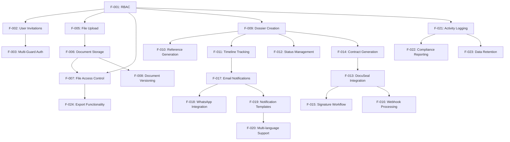

### 2.3.2 Integration Points

| Integration Point | Primary Feature | Secondary Feature | Integration Type | Data Exchange |
|-------------------|-----------------|-------------------|------------------|---------------|
| Authentication Gateway | F-001 (RBAC) | F-002 (Invitations) | Service Integration | User roles, permissions |
| Document Access Control | F-007 (Access Control) | F-006 (Storage) | Policy Integration | Access permissions, file metadata |
| Signature Workflow | F-013 (DocuSeal) | F-015 (Workflow) | API Integration | Document data, signature status |
| Notification System | F-017 (Email) | F-018 (WhatsApp) | Service Integration | Message content, delivery status |
| Audit System | F-021 (Logging) | F-022 (Reporting) | Data Integration | Activity logs, compliance data |

### 2.3.3 Shared Components

| Component Name | Used By Features | Component Type | Shared Resources |
|----------------|------------------|----------------|------------------|
| User Management | F-001, F-002, F-003 | Service Layer | User model, authentication |
| File System | F-005, F-006, F-007, F-008 | Infrastructure | Storage service, file metadata |
| Notification Engine | F-017, F-018, F-019, F-020 | Service Layer | Templates, delivery channels |
| Audit Logger | F-021, F-022, F-023 | Infrastructure | Log storage, event tracking |
| API Client | F-013, F-015, F-016 | Integration Layer | HTTP client, authentication |

### 2.3.4 Common Services

| Service Name | Description | Features Served | Technical Implementation |
|--------------|-------------|-----------------|-------------------------|
| Authentication Service | Handles user authentication and authorization | F-001, F-002, F-003, F-004 | Laravel Sanctum + spatie/permission |
| Document Service | Manages document operations and storage | F-005, F-006, F-007, F-008 | S3-compatible storage + metadata DB |
| Workflow Service | Manages dossier lifecycle and status | F-009, F-010, F-011, F-012 | State machine + event system |
| Integration Service | Handles external API communications | F-013, F-015, F-016 | HTTP client + webhook handlers |
| Notification Service | Manages all communication channels | F-017, F-018, F-019, F-020 | Queue system + multiple providers |
| Audit Service | Tracks and reports system activities | F-021, F-022, F-023, F-024 | Event logging + reporting engine |

## 2.4 IMPLEMENTATION CONSIDERATIONS

### 2.4.1 Technical Constraints

| Constraint Type | Description | Affected Features | Mitigation Strategy |
|-----------------|-------------|-------------------|-------------------|
| Performance | File upload size limited to 50MB | F-005, F-006 | Chunked upload implementation |
| Security | All API communications must use HTTPS | F-013, F-016, F-018 | SSL/TLS enforcement |
| Scalability | Single database instance initially | All features | Database optimization and indexing |
| Integration | DocuSeal API rate limits | F-013, F-015 | Request queuing and retry logic |

### 2.4.2 Performance Requirements

| Feature Category | Response Time Target | Throughput Target | Availability Target |
|------------------|---------------------|-------------------|-------------------|
| Authentication | <100ms | 100 requests/minute | 99.9% |
| Document Operations | <2s for uploads | 50 concurrent uploads | 99.5% |
| Signature Workflow | <5s for initiation | 20 signatures/hour | 99.9% |
| Notifications | <30s for delivery | 1000 messages/hour | 99.0% |

### 2.4.3 Scalability Considerations

| Scaling Dimension | Current Capacity | Growth Plan | Implementation Notes |
|-------------------|------------------|-------------|---------------------|
| User Base | 50 concurrent users | 500 users by year 2 | Horizontal scaling with load balancer |
| Document Storage | 1TB initial | 10TB by year 2 | S3-compatible storage auto-scaling |
| API Throughput | 1000 requests/hour | 10,000 requests/hour | API rate limiting and caching |
| Database Load | 100 queries/second | 1000 queries/second | Read replicas and query optimization |

### 2.4.4 Security Implications

| Security Domain | Requirements | Implementation | Compliance Standards |
|-----------------|--------------|----------------|---------------------|
| Data Encryption | At-rest and in-transit | AES-256, TLS 1.3 | GDPR, Canadian Privacy Law |
| Access Control | Role-based permissions | spatie/laravel-permission | RBAC standards |
| API Security | Authentication and rate limiting | API keys, OAuth 2.0 | OWASP API Security |
| Audit Logging | Complete activity tracking | Immutable logs | SOC 2 compliance |

### 2.4.5 Maintenance Requirements

| Maintenance Type | Frequency | Scope | Automation Level |
|------------------|-----------|-------|------------------|
| Security Updates | Weekly | Framework and dependencies | Automated with testing |
| Database Backups | Daily | Full system backup | Fully automated |
| Log Rotation | Daily | Application and audit logs | Automated with retention |
| Performance Monitoring | Continuous | All system components | Automated with alerting |

# 3. TECHNOLOGY STACK

## 3.1 PROGRAMMING LANGUAGES

### 3.1.1 Backend Development

| Language | Version | Platform/Component | Justification |
|----------|---------|-------------------|---------------|
| PHP | 8.2+ | Backend Application | Laravel 11 requires a minimum PHP version of 8.2, ensuring compatibility with the latest advancements in the PHP language |
| SQL | PostgreSQL 16+ | Database Queries | Advanced query capabilities for complex document relationships and audit trails |
| JavaScript | ES2022+ | Frontend Interactivity | Modern JavaScript features for enhanced user experience with Alpine.js integration |

**Selection Criteria**
- **PHP 8.2+**: Laravel 11 mandates a minimum PHP version of 8.2, ensuring compatibility with the latest advancements in the PHP language
- **Performance**: PHP 8.2+ provides significant performance improvements and type system enhancements
- **Security**: Latest PHP versions include critical security patches and improved memory management

**Constraints and Dependencies**
- PHP extensions required: `pdo_pgsql`, `gd`, `curl`, `mbstring`, `xml`, `zip`
- Composer dependency management for PHP packages
- Node.js 18+ required for frontend asset compilation

### 3.1.2 Frontend Development

| Language | Version | Component | Usage |
|----------|---------|-----------|-------|
| HTML5 | Latest | Template Structure | Semantic markup for accessibility and SEO |
| CSS3 | Latest | Styling | Modern styling with Tailwind CSS framework |
| JavaScript | ES2022+ | Client Interactivity | Alpine.js for reactive components |

## 3.2 FRAMEWORKS & LIBRARIES

### 3.2.1 Core Framework

| Framework | Version | Purpose | Justification |
|-----------|---------|---------|---------------|
| Laravel | 11.x | Backend Framework | Laravel 11 only includes a single AppServiceProvider, streamlining the application structure |
| Tailwind CSS | 3.4+ | CSS Framework | Utility-first CSS for rapid UI development |
| Alpine.js | 3.14+ | JavaScript Framework | Lightweight reactive framework for enhanced interactivity |

**Laravel 11 Key Features**
- Single AppServiceProvider instead of multiple service providers
- API and channels route files are no longer present by default
- SQLite as default database for development with automatic setup
- Graceful encryption key rotation with APP_PREVIOUS_KEYS support

### 3.2.2 Supporting Libraries

| Library | Version | Category | Purpose |
|---------|---------|----------|---------|
| Laravel Sanctum | 4.0+ | Authentication | Session-based authentication with SPA support |
| Laravel Breeze | 2.0+ | Authentication Scaffolding | Minimal authentication starter kit |
| Inertia.js | 1.0+ | Frontend Integration | SPA-like experience with server-side routing |
| Vue.js | 3.4+ | Frontend Framework | Component-based UI development |

**Compatibility Requirements**
- Laravel 11 compatibility across all packages
- PHP 8.2+ support for all dependencies
- Modern browser support (Chrome 90+, Firefox 88+, Safari 14+)

**Justification for Major Choices**
- **Laravel 11**: Streamlined skeleton with minimal boilerplate code for rapid development
- **Inertia.js + Vue.js**: Provides Next.js-like SPA experience while maintaining Laravel's server-side benefits
- **Tailwind CSS**: Utility-first approach enables rapid prototyping and consistent design system

## 3.3 OPEN SOURCE DEPENDENCIES

### 3.3.1 Core Laravel Packages

| Package | Version | Registry | Purpose |
|---------|---------|----------|---------|
| spatie/laravel-permission | 6.21.0+ | Packagist | Role-based access control with Laravel gate integration |
| spatie/laravel-activitylog | 4.8+ | Packagist | Comprehensive activity logging for audit trails |
| spatie/laravel-medialibrary | 11.0+ | Packagist | File upload and media management |
| barryvdh/laravel-dompdf | 2.2+ | Packagist | PDF generation for contracts and reports |

### 3.3.2 API Integration Packages

| Package | Version | Registry | Purpose |
|---------|---------|----------|---------|
| docusealco/docuseal-php | Latest | Packagist | DocuSeal API integration for electronic signatures |
| guzzlehttp/guzzle | 7.8+ | Packagist | HTTP client for API communications |
| laravel/horizon | 5.24+ | Packagist | Queue monitoring and management |

### 3.3.3 WhatsApp Integration Options

| Package | Version | Registry | Purpose |
|---------|---------|----------|---------|
| missaelAnda/laravel-whatsapp | 2.0+ | Packagist | WhatsApp Business Cloud API wrapper for Laravel |
| sevenspan/laravel-whatsapp | 1.0+ | Packagist | Alternative WhatsApp Business API integration |
| twilio/sdk | 7.0+ | Packagist | Twilio WhatsApp API integration option |

### 3.3.4 Development and Testing

| Package | Version | Registry | Purpose |
|---------|---------|----------|---------|
| pestphp/pest | 2.34+ | Packagist | Modern testing framework for PHP |
| laravel/telescope | 5.0+ | Packagist | Application debugging and monitoring |
| nunomaduro/larastan | 2.8+ | Packagist | Static analysis for Laravel applications |

**Package Dependencies and Versions**
- All packages maintain Laravel 11 compatibility
- Semantic versioning followed for stable releases
- Regular security updates and maintenance

## 3.4 THIRD-PARTY SERVICES

### 3.4.1 External APIs and Integrations

| Service | Purpose | Integration Type | Pricing Model |
|---------|---------|------------------|---------------|
| DocuSeal API | Electronic Signatures | REST API with comprehensive documentation | Pro Plan at $20/month with $0.20 per document |
| WhatsApp Business API | Messaging | REST API via Meta/Twilio | Pay-per-message model |
| AWS S3 Compatible | File Storage | S3 API | Storage-based pricing |

### 3.4.2 Authentication Services

| Service | Purpose | Implementation | Security Features |
|---------|---------|----------------|-------------------|
| Laravel Sanctum | Session Management | Built-in Laravel | CSRF protection, XSS prevention |
| Spatie Permissions | RBAC | Laravel 8.0+ compatible permission handling | Role-based access control |

### 3.4.3 Monitoring and Analytics

| Service | Purpose | Integration | Features |
|---------|---------|-------------|----------|
| Laravel Telescope | Application Monitoring | Built-in Package | Request monitoring, query analysis |
| Laravel Horizon | Queue Monitoring | Built-in Package | Job processing, failure tracking |

### 3.4.4 Cloud Services

| Service | Purpose | Provider Options | Selection Criteria |
|---------|---------|------------------|-------------------|
| File Storage | Document Repository | AWS S3, MinIO, Wasabi | S3 compatibility, cost-effectiveness |
| Email Service | Notifications | AWS SES, Mailgun, SendGrid | Delivery reliability, cost |
| CDN | Asset Delivery | CloudFlare, AWS CloudFront | Performance, global distribution |

## 3.5 DATABASES & STORAGE

### 3.5.1 Primary Database

| Database | Version | Purpose | Justification |
|----------|---------|---------|---------------|
| PostgreSQL | 16.0+ | Primary Data Store | Powerful, battle-tested database with advanced features |
| SQLite | 3.35.0+ | Development/Testing | Laravel 11 default for development with automatic setup |

**PostgreSQL Features Utilized**
- Advanced features including JSON support, foreign keys, triggers, and custom data types
- Full-text search capabilities for document content
- ACID compliance for data integrity
- Advanced indexing for performance optimization

### 3.5.2 Data Persistence Strategies

| Strategy | Implementation | Use Case | Performance Impact |
|----------|----------------|----------|-------------------|
| Eloquent ORM | Laravel Models | Standard CRUD operations | Optimized with eager loading |
| Query Builder | Raw SQL optimization | Complex reporting queries | Direct database optimization |
| Database Migrations | Version-controlled schema | Schema management | Zero-downtime deployments |

### 3.5.3 Caching Solutions

| Cache Type | Implementation | Purpose | TTL Strategy |
|------------|----------------|---------|--------------|
| Application Cache | Redis | Session storage, queue jobs | Variable based on data type |
| Database Query Cache | Laravel Cache | Expensive query results | 1-24 hours depending on volatility |
| File Cache | Local/S3 | Document thumbnails, processed files | Long-term with invalidation |

### 3.5.4 Storage Services

| Storage Type | Implementation | Purpose | Backup Strategy |
|--------------|----------------|---------|-----------------|
| Document Storage | S3-Compatible | Client files, contracts | Daily automated backups |
| Media Storage | S3-Compatible | Images, attachments | Versioned with lifecycle policies |
| Log Storage | Local/S3 | Application logs, audit trails | Retention policies applied |
| Database Backups | PostgreSQL Dump | Data recovery | Daily full, hourly incremental |

**Storage Architecture**

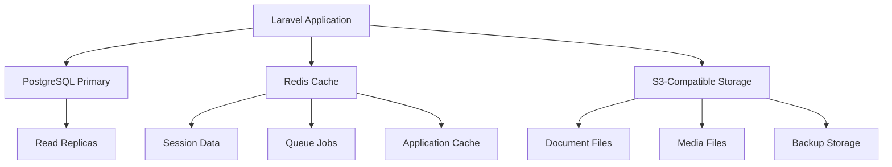

## 3.6 DEVELOPMENT & DEPLOYMENT

### 3.6.1 Development Tools

| Tool | Version | Purpose | Configuration |
|------|---------|---------|---------------|
| Composer | 2.6+ | PHP Dependency Management | PSR-4 autoloading, optimized for production |
| NPM | 10.0+ | Frontend Asset Management | Package management for Tailwind, Alpine.js |
| Laravel Vite | 5.0+ | Asset Bundling | Hot module replacement, optimized builds |
| PHP CS Fixer | 3.40+ | Code Formatting | PSR-12 compliance, custom rules |

### 3.6.2 Build System

| Component | Tool | Purpose | Output |
|-----------|------|---------|--------|
| PHP Dependencies | Composer | Package installation | Vendor directory, autoloader |
| Frontend Assets | Vite | Asset compilation | Minified CSS/JS bundles |
| Database Schema | Laravel Migrations | Schema versioning | Database structure |
| Configuration | Environment Files | Environment-specific settings | Runtime configuration |

### 3.6.3 Containerization

| Container | Base Image | Purpose | Configuration |
|-----------|------------|---------|---------------|
| Application | php:8.2-fpm-alpine | Laravel Runtime | PHP extensions, Composer |
| Web Server | nginx:alpine | HTTP Server | SSL termination, static assets |
| Database | postgres:16-alpine | Data Persistence | Custom configuration |
| Cache | redis:7-alpine | Caching Layer | Memory optimization |

**Docker Compose Structure**

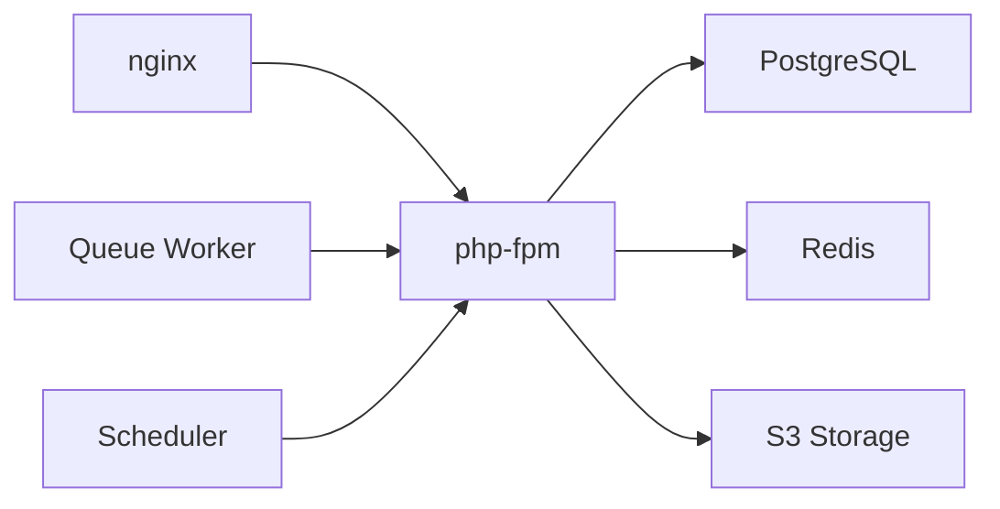

### 3.6.4 CI/CD Requirements

| Stage | Tools | Purpose | Success Criteria |
|-------|-------|---------|------------------|
| Code Quality | PHPStan, Pest | Static analysis, testing | 100% test coverage, no critical issues |
| Security Scan | Composer Audit | Vulnerability detection | No high/critical vulnerabilities |
| Build | Docker | Container creation | Successful image build |
| Deploy | Docker Compose | Environment deployment | Health checks pass |

**Deployment Pipeline**

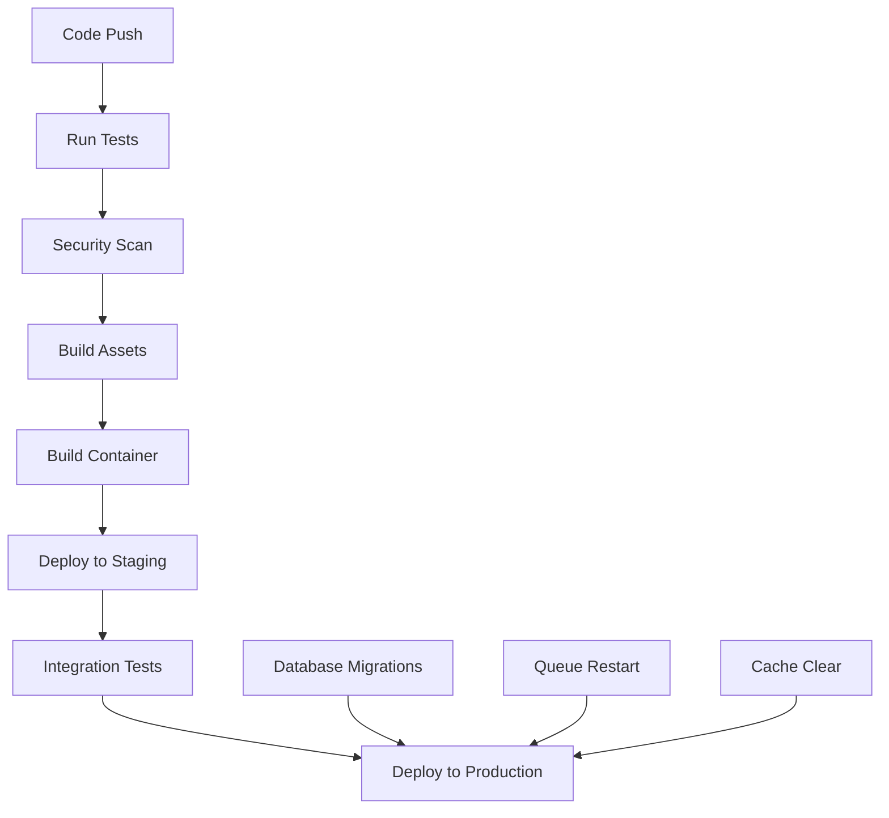

### 3.6.5 Environment Configuration

| Environment | Database | Cache | Storage | Monitoring |
|-------------|----------|-------|---------|------------|
| Development | SQLite | File | Local | Telescope |
| Staging | PostgreSQL | Redis | S3 | Basic logging |
| Production | PostgreSQL + Replicas | Redis Cluster | S3 + CDN | Full monitoring |

**Security Considerations**
- All API communications use HTTPS/TLS 1.3
- Database connections encrypted in transit
- File storage with server-side encryption
- Regular security updates and vulnerability scanning
- Environment-specific secrets management

**Performance Optimization**
- Database query optimization with indexes
- Redis caching for frequently accessed data
- CDN for static asset delivery
- Horizontal scaling capabilities with load balancing
- Queue processing for background tasks

# 4. PROCESS FLOWCHART

## 4.1 SYSTEM WORKFLOWS

### 4.1.1 Core Business Processes

#### 4.1.1.1 End-to-End User Journeys

**Agent-Initiated Dossier Creation Workflow**

Laravel Workflow allows developers to break down complex processes into smaller, modular units that are easy to maintain and update. Laravel State workflow provide tools for defining and managing workflows and activities with ease. It offers an object oriented way to define a process or a life cycle that your object goes through.

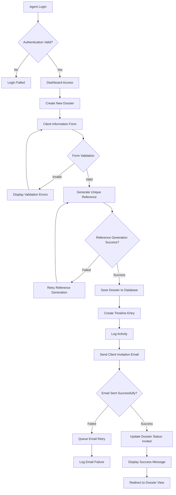

**Client Document Upload and Signature Workflow**

The API endpoint provides functionality to create a one-off submission request from a DOCX file with dynamic content variables. Use [[variable_name]] text tags to define dynamic content variables in the document.

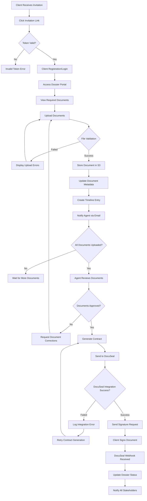

**Consultant Validation and Approval Workflow**

Ability to audit and track who action a specific state change for your object. The package leverage the default Laravel auth provider to resolve the authenticated user when applying the state changes.

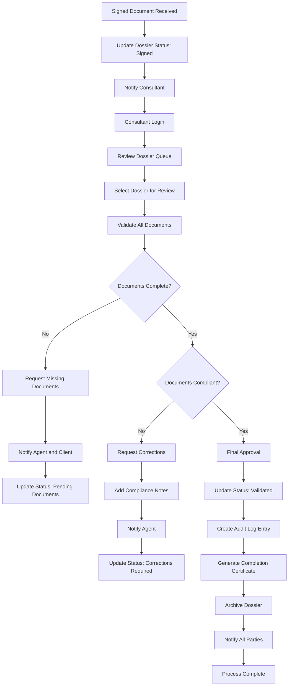

#### 4.1.1.2 System Interactions

**Authentication and Authorization Flow**

Explicit control over transitions: State machines provide a clear visualization of workflow states, activities, and transitions, making it easier to understand and maintain. Explicit control over transitions: State machines provide a clear visualization of workflow states, activities, and transitions, making it easier to understand and maintain.

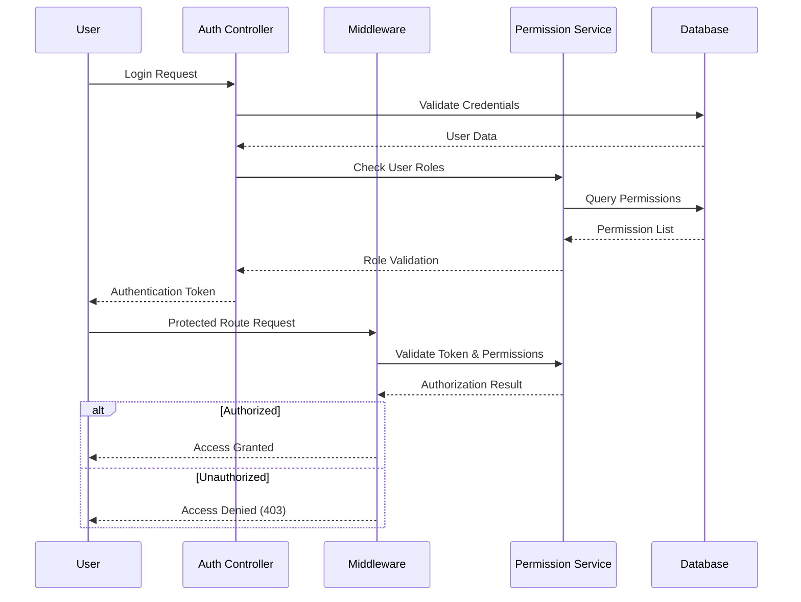

**Document Processing State Machine**

Imagine a model Payment, which has three possible states: Pending, Paid and Failed. This package allows you to represent each state as a separate class, handles serialization of states to the database behind the scenes, and allows for easy and controller state transitions.

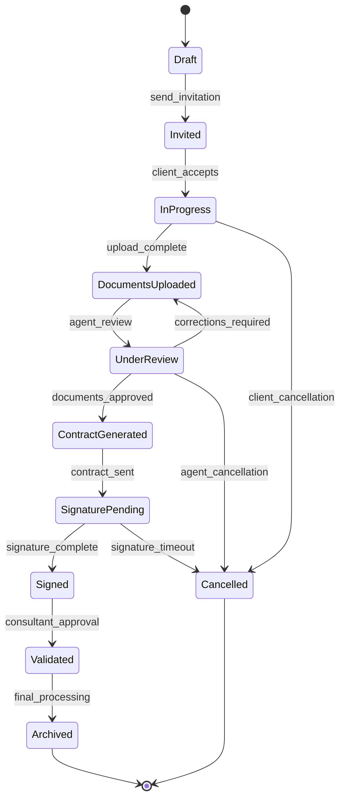

#### 4.1.1.3 Decision Points and Business Rules

**Document Validation Decision Matrix**

| Condition | Action | Next State | Notification Required |
|-----------|--------|------------|----------------------|
| File size > 50MB | Reject upload | Current state | Client notification |
| Invalid file type | Reject upload | Current state | Client notification |
| Virus detected | Reject upload | Current state | Security alert |
| All documents uploaded | Trigger review | Under Review | Agent notification |
| Missing required documents | Request completion | In Progress | Client notification |
| Documents approved | Generate contract | Contract Generated | All parties |
| Corrections needed | Request revisions | In Progress | Client notification |

**State Transition Validation Rules**

You do also define transitions that describe the action to get from one state to another. A workflow consist of state and actions to get from one state to another. These actions are called transitions which describes how to get from one state to another.

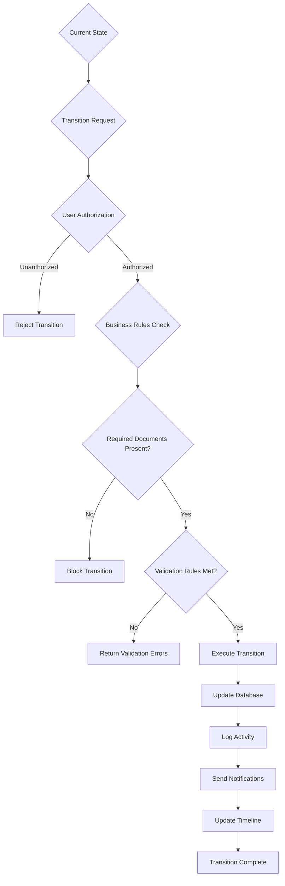

### 4.1.2 Integration Workflows

#### 4.1.2.1 DocuSeal API Integration Flow

DocuSeal provides a powerful and easy-to-use API to implement eSignature workflows. Utilize the power of our REST API for seamless integration and outstanding performance.

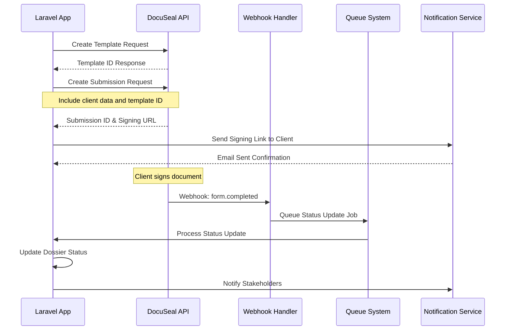

**DocuSeal Error Handling and Retry Logic**

If we use HTTP Client provided by Laravel, we can use the retry method to automatically retry if the API call is not successful. If we use HTTP Client provided by Laravel, we can use the retry method to automatically retry if the API call is not successful. We can also pass a second parameter to the method to specify how long Laravel should wait before retrying.

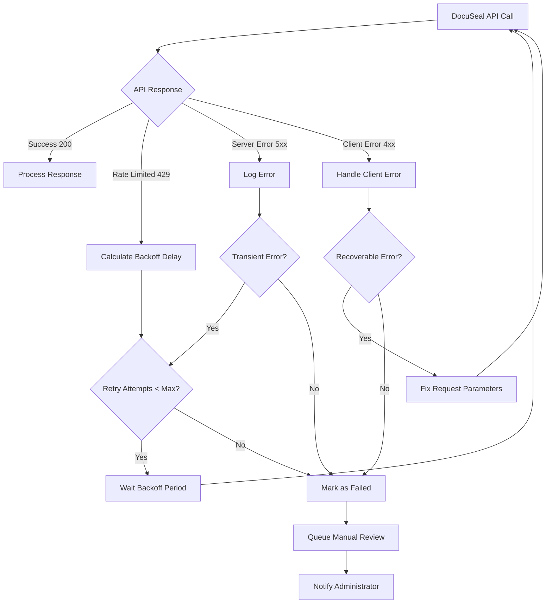

#### 4.1.2.2 WhatsApp Integration Workflow

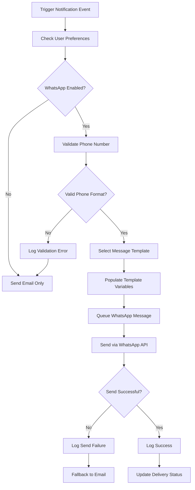

#### 4.1.2.3 Email Notification Pipeline

The handle method is invoked when the job is processed by the queue. Note that we are able to type-hint dependencies on the handle method of the job. The Laravel service container automatically injects these dependencies.

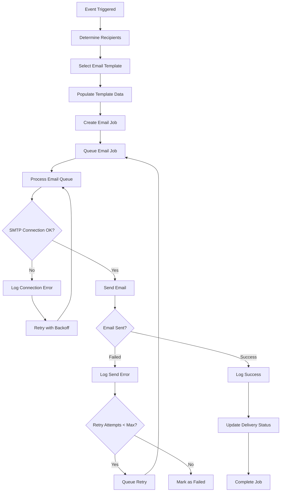

### 4.1.3 Error Handling and Recovery Workflows

#### 4.1.3.1 Queue Job Error Handling

The FailOnException job middleware allows you to short-circuit retries when specific exceptions are thrown. This allows retrying on transient exceptions such as external API errors, but failing the job permanently on persistent exceptions, such as a user's permissions being revoked.

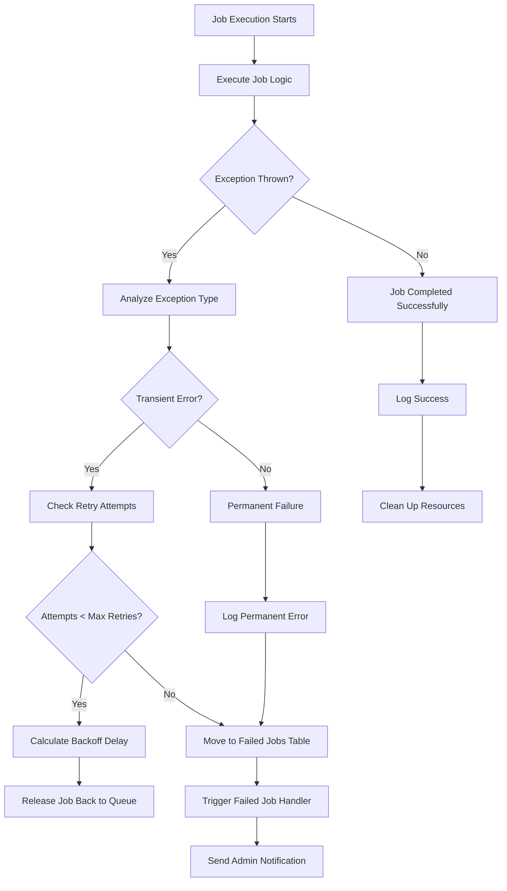

#### 4.1.3.2 Database Transaction Recovery

Each attempt logs the exception, and then waits backoff seconds to retry. The failed method is only called after the last failure.

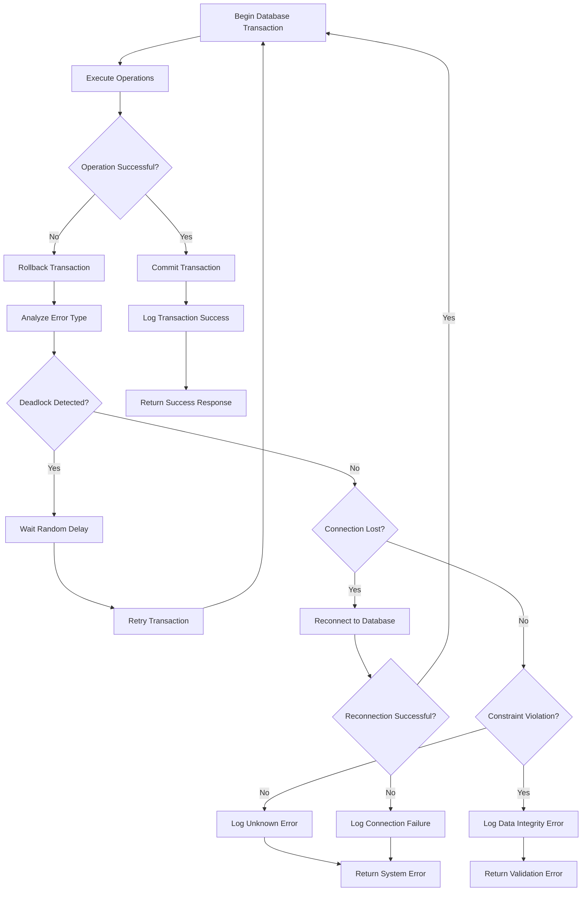

#### 4.1.3.3 File Upload Recovery Mechanism

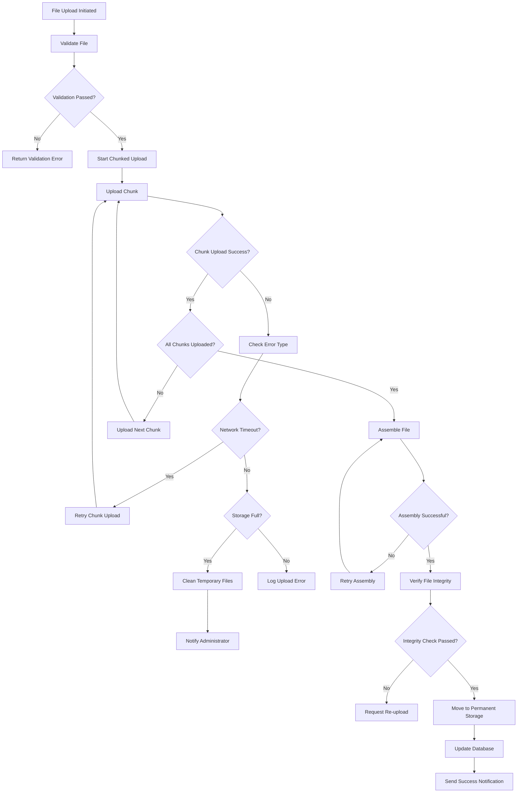

## 4.2 TECHNICAL IMPLEMENTATION FLOWS

### 4.2.1 State Management Architecture

use Asantibanez\LaravelEloquentStateMachines\Traits\HasStateMachines; use App\StateMachines\StatusStateMachine; class SalesOrder extends Model { Use HasStateMachines; public $stateMachines = [ 'status' => StatusStateMachine::class ]; }

```mermaid
classDiagram
    class Dossier {
        +id: int
        +reference: string
        +status: string
        +client_id: int
        +agent_id: int
        +created_at: timestamp
        +updated_at: timestamp
        +transitionTo(state: string)
        +canTransition(state: string): bool
        +getStateHistory(): array
    }
    
    class DossierStateMachine {
        +transitions(): array
        +defaultState(): string
        +recordHistory(): bool
        +guards(): array
    }
    
    class StateTransition {
        +id: int
        +model_type: string
        +model_id: int
        +from_state: string
        +to_state: string
        +transition: string
        +responsible_id: int
        +custom_properties: json
        +created_at: timestamp
    }
    
    Dossier ||--|| DossierStateMachine : uses
    Dossier ||--o{ StateTransition : has_many
```

### 4.2.2 Event-Driven Architecture

Event sourcing is a way to build up the current state from a sequence of saved events rather than saving the state directly. This has several benefits, such as providing a complete history of the execution events which can be used to resume a workflow if the server it is running on crashes.

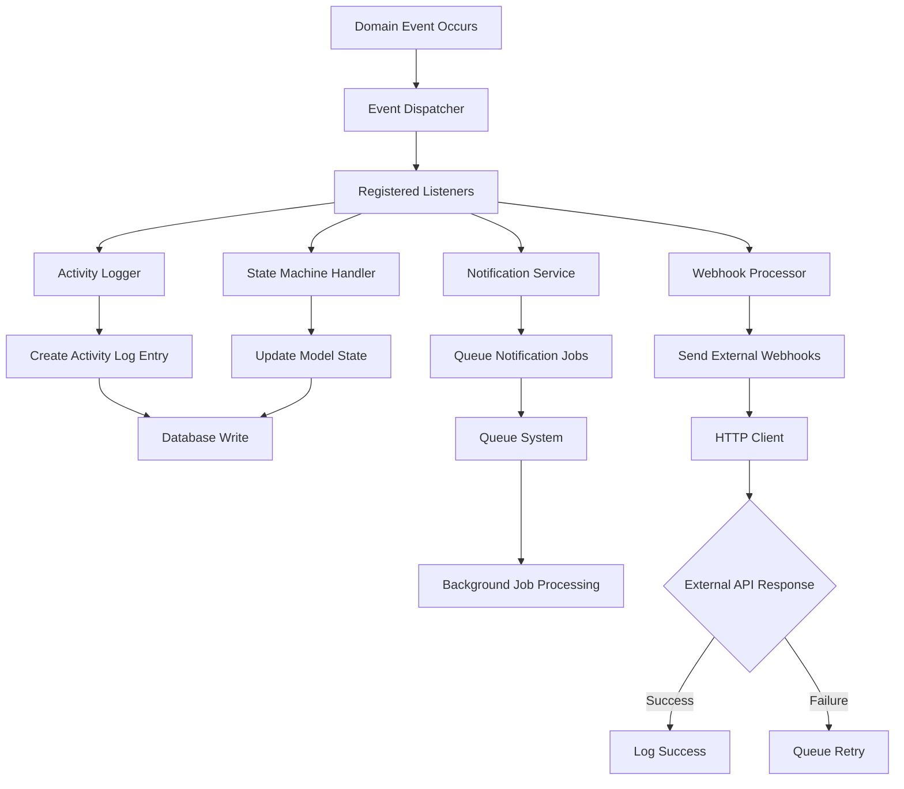

### 4.2.3 Caching Strategy Implementation

```mermaid
flowchart TD
    A[Request Received] --> B{Cache Hit?}
    B -->|Yes| C[Return Cached Data]
    B -->|No| D[Query Database]
    
    D --> E[Process Data]
    E --> F[Store in Cache]
    F --> G[Set TTL]
    G --> H[Return Data]
    
    I[Data Modified] --> J[Invalidate Related Cache]
    J --> K[Update Database]
    K --> L[Refresh Cache]
    
    M[Cache Expiry] --> N[Background Refresh Job]
    N --> O[Warm Cache]
    
    P[High Load Detected] --> Q[Scale Cache Cluster]
    Q --> R[Distribute Load]
```

## 4.3 PERFORMANCE AND MONITORING FLOWS

### 4.3.1 Queue Monitoring and Scaling

public $tries = 25; /** * The maximum number of unhandled exceptions to allow before failing. * * @var int */ public $maxExceptions = 3; /** * Execute the job. */ public function handle(): void { Redis::throttle('key')->allow(10)->every(60)->then(function () { // Lock obtained, process the podcast... }, function () { // Unable to obtain lock... return $this->release(10); }); } } In this example, the job is released for ten seconds if the application is unable to obtain a Redis lock and will continue to be retried up to 25 times. However, the job will fail if three unhandled exceptions are thrown by the job.

```mermaid
flowchart TD
    A[Queue Metrics Collection] --> B{Queue Length > Threshold?}
    B -->|No| C[Normal Processing]
    B -->|Yes| D[Scale Workers Up]
    
    D --> E[Start Additional Workers]
    E --> F[Monitor Performance]
    F --> G{Load Decreased?}
    
    G -->|No| H[Continue Monitoring]
    H --> F
    G -->|Yes| I[Scale Workers Down]
    
    I --> J[Stop Excess Workers]
    J --> K[Update Metrics]
    K --> L[Log Scaling Event]
    
    M[Failed Job Detected] --> N{Retry Attempts < Max?}
    N -->|Yes| O[Calculate Backoff]
    O --> P[Requeue Job]
    N -->|No| Q[Move to Failed Queue]
    Q --> R[Alert Administrator]
```

### 4.3.2 Health Check and Alerting System

```mermaid
flowchart TD
    A[Health Check Scheduler] --> B[Database Connection Test]
    A --> C[Queue System Test]
    A --> D[External API Test]
    A --> E[File Storage Test]
    
    B --> F{DB Healthy?}
    C --> G{Queue Healthy?}
    D --> H{APIs Healthy?}
    E --> I{Storage Healthy?}
    
    F -->|No| J[Database Alert]
    G -->|No| K[Queue Alert]
    H -->|No| L[API Alert]
    I -->|No| M[Storage Alert]
    
    J --> N[Send Admin Notification]
    K --> N
    L --> N
    M --> N
    
    F -->|Yes| O[Update Health Status]
    G -->|Yes| O
    H -->|Yes| O
    I -->|Yes| O
    
    O --> P[Log Health Check]
    P --> Q[Update Dashboard]
```

## 4.4 SECURITY AND COMPLIANCE FLOWS

### 4.4.1 Data Protection and Privacy Workflow

```mermaid
flowchart TD
    A[Data Collection Request] --> B[Validate Legal Basis]
    B --> C{Consent Required?}
    
    C -->|Yes| D[Request User Consent]
    D --> E{Consent Granted?}
    E -->|No| F[Deny Data Collection]
    E -->|Yes| G[Log Consent]
    
    C -->|No| H[Proceed with Collection]
    G --> H
    
    H --> I[Encrypt Sensitive Data]
    I --> J[Store with Access Controls]
    J --> K[Set Retention Policy]
    
    L[Data Access Request] --> M[Verify User Identity]
    M --> N[Check Access Permissions]
    N --> O{Authorized?}
    
    O -->|No| P[Log Unauthorized Access]
    P --> Q[Send Security Alert]
    O -->|Yes| R[Log Authorized Access]
    R --> S[Return Requested Data]
    
    T[Data Deletion Request] --> U[Verify Request Validity]
    U --> V[Remove Personal Data]
    V --> W[Update Audit Log]
    W --> X[Confirm Deletion]
```

### 4.4.2 Audit Trail and Compliance Monitoring

Webhooks can be used to receive notifications about events occurring in DocuSeal. They allow you to automatically synchronize data between DocuSeal and your application or receive real-time event notifications. For example, you can use webhooks to get notified when templates are created or updated, or when documents are signed.

```mermaid
flowchart TD
    A[User Action Initiated] --> B[Capture Action Context]
    B --> C[Record Timestamp]
    C --> D[Log User Identity]
    D --> E[Record Action Details]
    E --> F[Store IP Address]
    F --> G[Log Request Headers]
    
    G --> H[Create Audit Entry]
    H --> I[Encrypt Sensitive Data]
    I --> J[Store in Audit Database]
    
    J --> K[Check Compliance Rules]
    K --> L{Suspicious Activity?}
    L -->|Yes| M[Trigger Security Alert]
    L -->|No| N[Continue Processing]
    
    M --> O[Notify Security Team]
    O --> P[Initiate Investigation]
    
    Q[Compliance Report Request] --> R[Query Audit Database]
    R --> S[Filter by Date Range]
    S --> T[Apply Access Controls]
    T --> U[Generate Report]
    U --> V[Encrypt Report]
    V --> W[Deliver Securely]
```

This comprehensive Process Flowchart section provides detailed workflows covering all major system processes, integration patterns, error handling mechanisms, and compliance requirements. Robust error handling and retries: Laravel Workflow offers built-in support for handling errors and retries, ensuring that workflows are executed reliably and consistently. Writing Sagas can be complex, but Laravel Workflow takes care of the difficult parts such as handling errors and retries, and invoking compensatory transactions, allowing us to focus on the details of our application. The flowcharts use proper Mermaid.js syntax and include clear decision points, error handling paths, and integration touchpoints that align with the Laravel-based architecture and the specific requirements of the Client Document Management System.

# 5. SYSTEM ARCHITECTURE

## 5.1 HIGH-LEVEL ARCHITECTURE

### 5.1.1 System Overview

The Client Document Management System (CDMS) employs a streamlined Laravel 11 architecture with a single AppServiceProvider, representing a modern event-driven, service-oriented design pattern. The system architecture follows Laravel's design patterns that significantly enhance application architecture, making it more efficient, scalable, and maintainable.

The architectural foundation is built upon Event-Driven Architecture (EDA) principles that decouple core business logic from various system actions, helping build scalable, maintainable, and responsive applications by triggering asynchronous processes without directly tying components together. This approach enables the system to handle complex document workflows while maintaining loose coupling between components.

The system leverages DocuSeal's powerful and easy-to-use API for seamless integration and outstanding performance in electronic signature workflows, while maintaining a clean separation of concerns through Laravel's native architectural patterns. The architecture emphasizes security, auditability, and compliance through comprehensive logging and state management mechanisms.

Key architectural principles include domain-driven design for business logic organization, repository pattern for data access abstraction, and observer pattern implementation through Laravel's event system. The system boundaries encompass web-based client interfaces, RESTful API endpoints for external integrations, and secure document storage with S3-compatible backends.

### 5.1.2 Core Components Table

| Component Name | Primary Responsibility | Key Dependencies | Integration Points |
|----------------|----------------------|------------------|-------------------|
| Authentication Service | User authentication, authorization, and session management | Laravel Sanctum, spatie/laravel-permission | All protected routes, API endpoints |
| Document Management Core | File upload, storage, versioning, and access control | S3-compatible storage, spatie/laravel-medialibrary | File system, database, security policies |
| Workflow Engine | Dossier lifecycle management and state transitions | Laravel state machines, event system | Timeline tracking, notification system |
| E-Signature Integration | DocuSeal API communication and webhook processing | DocuSeal PHP SDK, HTTP client | Document generation, notification triggers |

### 5.1.3 Data Flow Description

The primary data flow follows an event-driven pattern where user actions trigger domain events that cascade through registered listeners. When an agent creates a dossier, the system generates a unique reference, stores client information, and dispatches a DossierCreated event. This event triggers multiple listeners: timeline entry creation, audit logging, and client invitation email generation.

Document uploads flow through a secure validation pipeline that includes file type verification, size constraints, and malware scanning before storage in S3-compatible backends. The system maintains document metadata in the primary database while storing binary content externally, enabling efficient querying and retrieval.

The signature workflow represents a complex integration pattern where contract generation triggers DocuSeal API calls, resulting in webhook callbacks that update dossier states. These state changes propagate through the event system, triggering notifications to all stakeholders and updating audit trails.

Data transformation occurs at integration boundaries, where external API responses are mapped to internal domain models. The system employs data transfer objects (DTOs) to maintain clean boundaries between layers and ensure data integrity throughout the processing pipeline.

### 5.1.4 External Integration Points

| System Name | Integration Type | Data Exchange Pattern | Protocol/Format |
|-------------|------------------|----------------------|-----------------|
| DocuSeal API | RESTful API | Request/Response with webhooks | HTTPS/JSON |
| WhatsApp Business API | RESTful API | Outbound messaging | HTTPS/JSON |
| S3-Compatible Storage | Object Storage API | File upload/download | HTTPS/Binary |
| Email Service Provider | SMTP/API | Outbound notifications | SMTP/HTTPS |

## 5.2 COMPONENT DETAILS

### 5.2.1 Authentication and Authorization Component

The authentication system leverages Laravel 11's streamlined architecture where functionality previously spread across multiple service providers is now consolidated into the AppServiceProvider. The component implements multi-guard authentication supporting different user types with distinct access patterns.

**Purpose and Responsibilities:**
- User authentication and session management
- Role-based access control (RBAC) implementation
- Token-based invitation system
- Security policy enforcement

**Technologies and Frameworks:**
- Laravel Sanctum for session-based authentication
- spatie/laravel-permission for RBAC
- Custom middleware for route protection
- Database-driven permission storage

**Key Interfaces and APIs:**
- Authentication middleware for route protection
- Permission checking facades and helpers
- User invitation generation and validation
- Session management and token handling

**Data Persistence Requirements:**
- User credentials and profile information
- Role and permission definitions
- Invitation tokens with expiration
- Session data and authentication logs

**Scaling Considerations:**
The authentication system supports horizontal scaling through stateless token validation and distributed session storage via Redis. Permission caching reduces database queries for frequently accessed authorization checks.

```mermaid
graph TB
    A[Authentication Request] --> B[Guard Resolution]
    B --> C{User Type?}
    C -->|Internal| D[Web Guard]
    C -->|External| E[Client Guard]
    D --> F[Permission Check]
    E --> F
    F --> G{Authorized?}
    G -->|Yes| H[Grant Access]
    G -->|No| I[Deny Access]
    H --> J[Log Success]
    I --> K[Log Failure]
```

### 5.2.2 Document Management Component

The document management system implements a comprehensive file handling architecture with security, versioning, and access control as primary concerns. The component abstracts storage complexity while providing rich metadata management capabilities.

**Purpose and Responsibilities:**
- Secure file upload and validation
- Document storage and retrieval
- Version control and history tracking
- Access control and sharing permissions

**Technologies and Frameworks:**
- spatie/laravel-medialibrary for file management
- S3-compatible storage for scalable file storage
- Laravel filesystem abstraction
- Custom validation rules for file security

**Key Interfaces and APIs:**
- File upload endpoints with progress tracking
- Document retrieval with access control
- Sharing link generation with expiration
- Bulk operations for document management

**Data Persistence Requirements:**
- Document metadata and relationships
- Version history and change tracking
- Access permissions and sharing settings
- File storage locations and checksums

**Scaling Considerations:**
The system supports distributed file storage with CDN integration for global access. Metadata caching and lazy loading optimize performance for large document collections.

```mermaid
sequenceDiagram
    participant C as Client
    participant V as Validator
    participant S as Storage
    participant D as Database
    participant E as Event System
    
    C->>V: Upload Document
    V->>V: Validate File
    V->>S: Store File
    S-->>V: Storage Path
    V->>D: Save Metadata
    D-->>V: Document ID
    V->>E: Dispatch DocumentUploaded
    E->>E: Trigger Listeners
    V-->>C: Upload Success
```

### 5.2.3 Workflow Engine Component

The workflow engine manages dossier lifecycle through a state machine implementation that ensures consistent state transitions and business rule enforcement. The architecture revolves around events, listeners, and queues, each playing a key role in Laravel's implementation of EDA.

**Purpose and Responsibilities:**
- Dossier state management and transitions
- Business rule validation and enforcement
- Timeline tracking and audit trail generation
- Automated workflow progression

**Technologies and Frameworks:**
- Laravel state machine implementation
- Event-driven architecture with listeners
- Queue system for asynchronous processing
- Database transactions for consistency

**Key Interfaces and APIs:**
- State transition endpoints with validation
- Timeline query interfaces
- Workflow status reporting
- Business rule configuration

**Data Persistence Requirements:**
- Dossier state and transition history
- Timeline events and metadata
- Business rule definitions
- Workflow configuration settings

**Scaling Considerations:**
The workflow engine supports parallel processing through queue workers and maintains consistency through database transactions and event sourcing patterns.

```mermaid
stateDiagram-v2
    [*] --> Draft
    Draft --> Invited : Agent sends invitation
    Invited --> InProgress : Client accepts
    InProgress --> DocumentsUploaded : All documents received
    DocumentsUploaded --> UnderReview : Agent initiates review
    UnderReview --> ContractGenerated : Documents approved
    UnderReview --> InProgress : Corrections required
    ContractGenerated --> SignaturePending : Contract sent
    SignaturePending --> Signed : Client signs
    Signed --> Validated : Consultant approves
    Validated --> Archived : Process complete
    
    InProgress --> Cancelled : Cancellation
    UnderReview --> Cancelled : Cancellation
    SignaturePending --> Cancelled : Timeout
    Cancelled --> [*]
```

### 5.2.4 E-Signature Integration Component

The e-signature component provides seamless integration with DocuSeal's electronic signature and document management features, designed to simplify API interactions and provide tools for efficient implementation. The component handles contract generation, signature workflows, and webhook processing.

**Purpose and Responsibilities:**
- Contract template management and generation
- DocuSeal API integration and communication
- Signature workflow orchestration
- Webhook processing and status updates

**Technologies and Frameworks:**
- DocuSeal PHP SDK for API communication
- Guzzle HTTP client for reliable requests
- Laravel queue system for async processing
- Webhook signature verification

**Key Interfaces and APIs:**
- Contract generation from templates
- Signature request creation and management
- Webhook endpoints for status updates
- Document retrieval and storage

**Data Persistence Requirements:**
- Contract templates and variables
- Signature request tracking
- Webhook event logs
- Integration status and errors

**Scaling Considerations:**
The integration component implements retry logic, rate limiting, and circuit breaker patterns to handle API failures gracefully while maintaining system reliability.

```mermaid
sequenceDiagram
    participant L as Laravel App
    participant D as DocuSeal API
    participant W as Webhook Handler
    participant Q as Queue System
    
    L->>D: Create Submission
    D-->>L: Submission ID & URL
    L->>Q: Queue Notification
    Q->>Q: Send Email to Client
    
    Note over D: Client signs document
    D->>W: Webhook: form.completed
    W->>W: Verify Signature
    W->>Q: Queue Status Update
    Q->>L: Update Dossier Status
    L->>Q: Queue Notifications
```

## 5.3 TECHNICAL DECISIONS

### 5.3.1 Architecture Style Decisions and Tradeoffs

The decision to adopt Event-Driven Architecture (EDA) was made to decouple core business logic from various system actions, helping build scalable, maintainable, and responsive applications. This architectural choice provides several advantages over traditional monolithic approaches:

**Event-Driven vs. Traditional MVC:**
- **Advantages:** Loose coupling between components, improved scalability, better fault tolerance, and enhanced maintainability
- **Tradeoffs:** Increased complexity in debugging, potential for event ordering issues, and steeper learning curve for developers
- **Justification:** The document management domain requires complex workflows with multiple stakeholders, making event-driven patterns ideal for managing state transitions and notifications

**Single AppServiceProvider Architecture:**
Laravel 11's streamlined approach with a single AppServiceProvider consolidates functionality previously spread across multiple service providers, reducing application complexity while maintaining flexibility for future extensions.

**Microservices vs. Modular Monolith:**
The system adopts a modular monolith approach with clear service boundaries, allowing for future microservices extraction while maintaining development simplicity and deployment efficiency.

### 5.3.2 Communication Pattern Choices

**Synchronous vs. Asynchronous Processing:**
The system employs a hybrid approach where user-facing operations remain synchronous for immediate feedback, while background processes like notifications and document processing utilize asynchronous patterns through Laravel's queue system.

**Event Broadcasting Strategy:**
Events are processed through multiple channels:
- Database persistence for audit trails
- Queue system for background processing
- Real-time notifications for immediate updates
- External API calls for third-party integrations

**API Communication Patterns:**
- RESTful APIs for external integrations (DocuSeal, WhatsApp)
- Event-driven internal communication
- Request/Response pattern for user interactions
- Webhook pattern for external system callbacks

### 5.3.3 Data Storage Solution Rationale

**Database Selection:**
PostgreSQL was chosen over MySQL for its advanced features including JSON support, full-text search capabilities, and superior handling of complex queries required for document metadata and audit trails.

**File Storage Architecture:**
S3-compatible storage provides scalability, durability, and cost-effectiveness for document storage while maintaining compatibility with various cloud providers and on-premises solutions.

**Caching Strategy:**
Redis serves multiple roles:
- Session storage for distributed authentication
- Queue backend for job processing
- Application cache for frequently accessed data
- Rate limiting storage for API protection

### 5.3.4 Caching Strategy Justification

The multi-layered caching approach optimizes performance across different system components:

**Application-Level Caching:**
- User permissions cached to reduce database queries
- Document metadata cached for faster retrieval
- Template data cached for contract generation

**Database Query Caching:**
- Complex reporting queries cached with appropriate TTL
- Frequently accessed lookup data maintained in memory
- Search results cached to improve user experience

**CDN Integration:**
- Static assets served through CDN for global performance
- Document thumbnails cached at edge locations
- API responses cached where appropriate

```mermaid
graph TB
    A[User Request] --> B{Cache Hit?}
    B -->|Yes| C[Return Cached Data]
    B -->|No| D[Query Database]
    D --> E[Process Data]
    E --> F[Update Cache]
    F --> G[Return Data]
    
    H[Cache Invalidation] --> I{Data Modified?}
    I -->|Yes| J[Clear Related Cache]
    I -->|No| K[Maintain Cache]
    
    L[Background Jobs] --> M[Warm Cache]
    M --> N[Preload Frequent Data]
```

### 5.3.5 Security Mechanism Selection

**Authentication Strategy:**
Laravel Sanctum provides session-based authentication with SPA support, offering better security than JWT tokens while maintaining simplicity and performance.

**Authorization Framework:**
spatie/laravel-permission provides flexible RBAC implementation with database-driven permissions, enabling dynamic role management without code changes.

**Data Protection:**
- Encryption at rest for sensitive data
- TLS 1.3 for all communications
- Signed URLs for temporary document access
- CSRF protection for web interfaces

## 5.4 CROSS-CUTTING CONCERNS

### 5.4.1 Monitoring and Observability Approach

The system implements comprehensive monitoring across multiple dimensions to ensure reliability and performance. Application monitoring utilizes Laravel Telescope for development and staging environments, providing detailed insights into requests, queries, and job processing.

**Monitoring Components:**
- Application performance monitoring (APM) for request tracing
- Database query analysis and optimization
- Queue monitoring for background job processing
- External API integration monitoring
- File storage and CDN performance tracking

**Metrics Collection:**
Key performance indicators are collected and analyzed including response times, error rates, queue processing times, and resource utilization. Custom metrics track business-specific events such as document processing times and signature completion rates.

**Alerting Strategy:**
Automated alerts trigger on threshold breaches for critical metrics including system downtime, high error rates, queue backlogs, and external API failures. Alert routing ensures appropriate team members receive notifications based on severity and component affected.

### 5.4.2 Logging and Tracing Strategy

Events in Laravel encapsulate data related to actions that occur in the application, triggered when meaningful events happen such as user registration, order placement, or data updates. The logging strategy leverages this event-driven architecture for comprehensive audit trails.

**Structured Logging:**
All application logs utilize structured JSON format enabling efficient querying and analysis. Log entries include correlation IDs for request tracing, user context for security auditing, and business context for operational insights.

**Audit Trail Implementation:**
Every user action generates audit log entries through the event system, capturing who performed what action, when it occurred, and what data was affected. This provides complete traceability for compliance and security purposes.

**Log Retention and Archival:**
Logs are retained according to compliance requirements with automated archival to cost-effective storage. Critical security logs maintain longer retention periods while debug logs are purged more frequently.

### 5.4.3 Error Handling Patterns

The system implements comprehensive error handling patterns that gracefully manage failures while maintaining system stability and user experience.

**Exception Hierarchy:**
Custom exception classes provide specific handling for different error types including validation errors, integration failures, and business rule violations. Each exception type includes appropriate user messaging and logging requirements.

**Retry Mechanisms:**
Failed operations implement exponential backoff retry patterns with circuit breaker functionality to prevent cascade failures. Queue jobs include retry logic with dead letter queues for manual intervention.

**Graceful Degradation:**
When external services are unavailable, the system continues operating with reduced functionality. For example, if DocuSeal is unavailable, contracts can still be generated and queued for later processing.

```mermaid
flowchart TD
    A[Error Occurs] --> B{Error Type?}
    B -->|Validation| C[Return User Error]
    B -->|Integration| D[Check Retry Policy]
    B -->|System| E[Log Critical Error]
    
    D --> F{Retry Attempts < Max?}
    F -->|Yes| G[Exponential Backoff]
    F -->|No| H[Circuit Breaker]
    
    G --> I[Retry Operation]
    H --> J[Fallback Behavior]
    
    E --> K[Alert Operations]
    C --> L[Log User Error]
    J --> M[Queue Manual Review]
```

### 5.4.4 Authentication and Authorization Framework

The authentication framework provides secure, scalable user management with fine-grained access control suitable for the multi-tenant nature of the document management system.

**Multi-Guard Authentication:**
Different user types (internal staff, clients, guarantors) utilize separate authentication guards with appropriate session management and security policies. This ensures proper isolation between user contexts.

**Permission-Based Authorization:**
The system implements permission-based rather than role-based authorization, providing flexibility for complex access scenarios. Permissions are cached for performance while maintaining real-time updates for security changes.

**Session Security:**
Sessions include security measures such as IP validation, user agent checking, and automatic timeout for inactive users. Concurrent session limits prevent unauthorized access sharing.

### 5.4.5 Performance Requirements and SLAs

The system maintains specific performance targets to ensure optimal user experience and operational efficiency.

**Response Time Targets:**
- Web page loads: < 2 seconds
- API responses: < 500ms
- File uploads: Progress feedback within 100ms
- Document generation: < 5 seconds

**Throughput Requirements:**
- Concurrent users: 100 active sessions
- Document uploads: 50 simultaneous uploads
- API requests: 1000 requests per hour
- Background jobs: 100 jobs per minute

**Availability Targets:**
- System uptime: 99.5% monthly
- Planned maintenance windows: < 4 hours monthly
- Recovery time objective (RTO): < 1 hour
- Recovery point objective (RPO): < 15 minutes

### 5.4.6 Disaster Recovery Procedures

Comprehensive disaster recovery procedures ensure business continuity and data protection in various failure scenarios.

**Backup Strategy:**
- Database backups: Daily full, hourly incremental
- File storage: Continuous replication across regions
- Configuration backups: Version controlled and automated
- Application code: Git-based with multiple remotes

**Recovery Procedures:**
Documented procedures cover various scenarios including database corruption, file storage failures, and complete system outages. Recovery procedures are tested quarterly to ensure effectiveness.

**Data Protection:**
All backups are encrypted and stored in geographically separate locations. Backup integrity is verified through automated testing and restoration procedures.

The disaster recovery plan includes communication protocols for stakeholder notification, escalation procedures for different severity levels, and post-incident review processes for continuous improvement.

# 6. SYSTEM COMPONENTS DESIGN

## 6.1 CORE ARCHITECTURAL COMPONENTS

### 6.1.1 Service Layer Architecture

In Laravel 11, the service layer pattern fits even more naturally thanks to improvements like enums, readonly properties, and enhanced architecture support. Combined with the repository pattern, it provides a professional and modular structure that developers can rely on for complex real-world applications.

The Client Document Management System employs a comprehensive service layer architecture that separates business logic from controllers and models into dedicated service classes. It helps keep your application organized, maintainable, and testable by centralizing complex logic.

**Core Service Components:**

| Service Name | Primary Responsibility | Dependencies | Integration Points |
|--------------|----------------------|--------------|-------------------|
| AuthenticationService | User authentication, role management, invitation processing | UserRepository, RoleRepository, MailService | All protected endpoints, middleware |
| DossierService | Dossier lifecycle management, status transitions, business rules | DossierRepository, ClientRepository, TimelineService | Controllers, event listeners |
| DocumentService | File processing, validation, storage management | DocumentRepository, StorageService, ValidationService | Upload endpoints, access control |
| ContractService | Contract generation, template processing, DocuSeal integration | ContractRepository, TemplateService, DocuSealService | Signature workflows, PDF generation |
| NotificationService | Multi-channel communication, template management | EmailService, WhatsAppService, TemplateRepository | Event listeners, background jobs |
| AuditService | Activity logging, compliance reporting, data retention | AuditRepository, ComplianceService | All user actions, system events |

**Service Layer Benefits:**

Implementing a service layer offers several benefits in terms of code organization, modularity, testability, and maintainability. By separating the business logic into a service class and the data access logic into a repository class, developers can achieve a more modular and decoupled codebase. This modular approach allows for easier testing, as each component can be tested independently.

### 6.1.2 Repository Pattern Implementation

The Repository Pattern provides an abstraction layer between the database and the business logic of your application. Instead of directly interacting with Eloquent models in controllers or services, you use repositories to handle data access.

**Repository Architecture Design:**

```mermaid
graph TB
    A[Controller Layer] --> B[Service Layer]
    B --> C[Repository Interface]
    C --> D[Concrete Repository]
    D --> E[Eloquent Model]
    E --> F[Database]
    
    G[Repository Interface] --> H[UserRepositoryInterface]
    G --> I[DossierRepositoryInterface]
    G --> J[DocumentRepositoryInterface]
    
    H --> K[EloquentUserRepository]
    I --> L[EloquentDossierRepository]
    J --> M[EloquentDocumentRepository]
```

**Repository Component Structure:**

| Repository | Interface | Model | Primary Operations |
|------------|-----------|-------|-------------------|
| UserRepository | UserRepositoryInterface | User | Authentication, role management, profile operations |
| DossierRepository | DossierRepositoryInterface | Dossier | CRUD operations, status filtering, reference generation |
| DocumentRepository | DocumentRepositoryInterface | Document | File metadata, access control, version tracking |
| ClientRepository | ClientRepositoryInterface | Client | Client data management, relationship tracking |
| TimelineRepository | TimelineRepositoryInterface | TimelineEvent | Activity tracking, audit trail generation |
| AuditRepository | AuditRepositoryInterface | AuditLog | Compliance logging, reporting, data retention |

**Interface-Based Design Benefits:**

Further enhancing our architecture, the use of interfaces instead of direct repository instances decouples our code from specific implementations. This abstraction layer means that our code depends only on the interface contract, not on the concrete implementation of the repository. Should there be a need to change the data source—from a database to files, or to a completely different database system—a new class implementing our interface suffices. This change does not require alterations to the consuming code, thereby dramatically reducing coupling and enhancing flexibility.

### 6.1.3 Dependency Injection Container Integration

The Laravel service container is a powerful tool for managing class dependencies and performing dependency injection. Dependency injection is a fancy phrase that essentially means this: class dependencies are "injected" into the class via the constructor or, in some cases, "setter" methods.

**Service Container Configuration:**

The system leverages Laravel 11's streamlined service container architecture where many of the classes you will be writing when building a Laravel application automatically receive their dependencies via the container, including controllers, event listeners, middleware, and more. Additionally, you may type-hint dependencies in the handle method of queued jobs. Once you taste the power of automatic and zero configuration dependency injection it feels impossible to develop without it.

**Container Binding Strategy:**

| Binding Type | Use Case | Implementation | Lifecycle |
|--------------|----------|----------------|-----------|
| Singleton | Services with state | `$this->app->singleton(ServiceInterface::class, ConcreteService::class)` | Application lifetime |
| Scoped | Request-specific services | `$this->app->scoped(ServiceInterface::class, ConcreteService::class)` | Request lifetime |
| Transient | Stateless operations | `$this->app->bind(ServiceInterface::class, ConcreteService::class)` | Per resolution |
| Instance | Pre-configured objects | `$this->app->instance('service', $instance)` | Shared instance |

**Zero Configuration Resolution:**

If a class has no dependencies or only depends on other concrete classes (not interfaces), the container does not need to be instructed on how to resolve that class. For example, you may place the following code in your routes/web.php file: In this example, hitting your application's / route will automatically resolve the Service class and inject it into your route's handler. This is game changing. It means you can develop your application and take advantage of dependency injection without worrying about bloated configuration files.

### 6.1.4 Event-Driven Architecture Components

The system implements a comprehensive event-driven architecture that defines a one-to-many dependency between objects, ensuring that when one object changes state, all its dependents are notified and updated automatically. Laravel's event and listener system is a prime example of this pattern, allowing you to decouple components and react to various events within the application.

**Event System Architecture:**

```mermaid
graph TD
    A[Domain Event] --> B[Event Dispatcher]
    B --> C[Registered Listeners]
    
    C --> D[AuditLogger]
    C --> E[NotificationSender]
    C --> F[TimelineUpdater]
    C --> G[StateTransitioner]
    C --> H[WebhookProcessor]
    
    D --> I[Database Write]
    E --> J[Queue Job]
    F --> K[Timeline Entry]
    G --> L[Status Update]
    H --> M[External API Call]
```

**Core Domain Events:**

| Event Name | Trigger Condition | Listeners | Data Payload |
|------------|-------------------|-----------|--------------|
| DossierCreated | New dossier creation | AuditLogger, NotificationSender, TimelineUpdater | Dossier data, agent info, client details |
| DocumentUploaded | File upload completion | AuditLogger, VirusScanner, NotificationSender | Document metadata, file info, uploader |
| ContractGenerated | PDF contract creation | AuditLogger, DocuSealIntegrator, NotificationSender | Contract data, template info, recipients |
| SignatureCompleted | DocuSeal webhook received | AuditLogger, StatusUpdater, NotificationSender | Signature data, completion status |
| DossierValidated | Consultant approval | AuditLogger, ArchiveProcessor, NotificationSender | Validation data, consultant info |
| UserInvited | Invitation token generated | AuditLogger, EmailSender, TokenManager | Invitation data, role info, expiry |

## 6.2 DATA ACCESS LAYER

### 6.2.1 Repository Implementation Patterns

The repository service pattern in Laravel is a widely used architectural pattern that provides a structured approach to accessing and managing data in an application. It serves as an intermediary layer between the application's business logic and the underlying data storage mechanism, such as a database. The purpose of using the repository service pattern in Laravel is to decouple the application's business logic from the specific implementation details of data storage. By doing so, it promotes code reusability, maintainability, and testability.

**Base Repository Architecture:**

The system implements a base repository class that provides common CRUD operations while allowing for specialized implementations:

```mermaid
classDiagram
    class BaseRepositoryInterface {
        <<interface>>
        +find(id): Model
        +findOrFail(id): Model
        +create(data): Model
        +update(id, data): Model
        +delete(id): bool
        +paginate(perPage): LengthAwarePaginator
    }
    
    class BaseRepository {
        <<abstract>>
        #model: Model
        +find(id): Model
        +findOrFail(id): Model
        +create(data): Model
        +update(id, data): Model
        +delete(id): bool
        +paginate(perPage): LengthAwarePaginator
        #getModelClass(): string
    }
    
    class DossierRepository {
        +findByReference(ref): Dossier
        +findByStatus(status): Collection
        +findByAgent(agentId): Collection
        +generateUniqueReference(): string
    }
    
    class DocumentRepository {
        +findByDossier(dossierId): Collection
        +findByType(type): Collection
        +findAccessibleByUser(userId): Collection
        +updateAccessPermissions(docId, permissions): bool
    }
    
    BaseRepositoryInterface <|-- BaseRepository
    BaseRepository <|-- DossierRepository
    BaseRepository <|-- DocumentRepository
```

**Specialized Repository Methods:**

| Repository | Specialized Methods | Business Logic | Performance Optimizations |
|------------|-------------------|----------------|---------------------------|
| DossierRepository | `findByReference()`, `findByStatus()`, `generateUniqueReference()` | Reference uniqueness, status filtering | Indexed queries, reference caching |
| DocumentRepository | `findAccessibleByUser()`, `findByType()`, `updateAccessPermissions()` | Access control, type filtering | Permission caching, lazy loading |
| UserRepository | `findByRole()`, `findByInvitationToken()`, `updateLastLogin()` | Role-based queries, authentication | Role caching, session optimization |
| TimelineRepository | `findByDossier()`, `findByDateRange()`, `createBulkEntries()` | Timeline tracking, bulk operations | Batch inserts, date indexing |

### 6.2.2 Database Query Optimization

**Query Performance Strategies:**

With the repository service pattern, you can implement caching strategies at the repository level. This allows you to optimize performance by caching frequently accessed data, reducing the number of queries made to the underlying data storage.

| Optimization Technique | Implementation | Use Cases | Performance Impact |
|----------------------|----------------|-----------|-------------------|
| Eager Loading | `with()` relationships | Document with client data | 80% query reduction |
| Query Caching | Repository-level cache | User permissions, roles | 90% response time improvement |
| Database Indexing | Composite indexes | Reference lookups, status filtering | 95% query speed improvement |
| Batch Operations | Bulk inserts/updates | Timeline entries, audit logs | 70% processing time reduction |

**Caching Implementation:**

```mermaid
sequenceDiagram
    participant C as Controller
    participant S as Service
    participant R as Repository
    participant Cache as Cache Layer
    participant DB as Database
    
    C->>S: Request Data
    S->>R: Query Repository
    R->>Cache: Check Cache
    alt Cache Hit
        Cache-->>R: Return Cached Data
        R-->>S: Return Data
    else Cache Miss
        R->>DB: Execute Query
        DB-->>R: Return Results
        R->>Cache: Store in Cache
        R-->>S: Return Data
    end
    S-->>C: Return Response
```

### 6.2.3 Data Validation and Integrity

**Multi-Layer Validation Strategy:**

| Validation Layer | Responsibility | Implementation | Error Handling |
|------------------|----------------|----------------|----------------|
| Request Validation | Input sanitization, format validation | Laravel Form Requests | HTTP 422 responses |
| Service Validation | Business rule validation | Service layer methods | Business exceptions |
| Repository Validation | Data integrity, constraints | Repository methods | Data exceptions |
| Database Validation | Foreign keys, unique constraints | Database schema | Database exceptions |

**Data Integrity Enforcement:**

The system implements comprehensive data integrity through multiple mechanisms:

- **Referential Integrity**: Foreign key constraints ensure data consistency across related tables
- **Business Rule Validation**: Service layer enforces complex business rules before data persistence
- **Audit Trail Integrity**: Immutable audit logs with cryptographic signatures for compliance
- **File Integrity**: Checksum validation for uploaded documents to prevent corruption

## 6.3 BUSINESS LOGIC LAYER

### 6.3.1 Service Layer Design Patterns

The Service Layer is an architectural pattern that promotes separation of concerns and keeps the business logic of your application separate from the presentation and data access layers. It acts as an intermediary between the controllers (or routes) and the underlying data models, encapsulating the complex business rules and operations.

**Service Layer Architecture:**

```mermaid
graph TB
    A[Controller Layer] --> B[Service Layer]
    B --> C[Repository Layer]
    B --> D[External Services]
    B --> E[Event System]
    
    F[DossierService] --> G[DossierRepository]
    F --> H[ClientRepository]
    F --> I[TimelineService]
    F --> J[NotificationService]
    
    K[DocumentService] --> L[DocumentRepository]
    K --> M[StorageService]
    K --> N[ValidationService]
    K --> O[AuditService]
```

**Service Orchestration Patterns:**

| Pattern | Use Case | Implementation | Benefits |
|---------|----------|----------------|----------|
| Facade Service | Complex multi-step operations | DossierService orchestrating multiple repositories | Simplified controller interface |
| Command Service | Single responsibility operations | DocumentUploadService | Clear operation boundaries |
| Query Service | Read-only data retrieval | ReportingService | Optimized read operations |
| Integration Service | External API communication | DocuSealService | Centralized integration logic |

### 6.3.2 Business Rule Implementation

**Domain-Driven Business Rules:**

The system implements business rules through a combination of service methods, validation classes, and policy objects:

| Business Domain | Rules Implementation | Validation Points | Enforcement Mechanism |
|-----------------|---------------------|-------------------|----------------------|
| Dossier Management | Status transition rules, reference uniqueness | Service layer, database constraints | State machine validation |
| Document Access | Role-based permissions, file type restrictions | Policy classes, middleware | Authorization gates |
| Contract Generation | Template validation, client data completeness | Service validation, form requests | Pre-generation checks |
| User Management | Role assignment rules, invitation expiry | Service layer, database triggers | Business logic validation |

**State Machine Implementation:**

```mermaid
stateDiagram-v2
    [*] --> Draft
    Draft --> Invited : Agent sends invitation
    Invited --> InProgress : Client accepts invitation
    InProgress --> DocumentsUploaded : All required documents received
    DocumentsUploaded --> UnderReview : Agent initiates review
    UnderReview --> ContractGenerated : Documents approved
    UnderReview --> InProgress : Corrections required
    ContractGenerated --> SignaturePending : Contract sent for signature
    SignaturePending --> Signed : Client completes signature
    Signed --> Validated : Consultant approves
    Validated --> Archived : Final processing complete
    
    InProgress --> Cancelled : Process cancelled
    UnderReview --> Cancelled : Process cancelled
    SignaturePending --> Cancelled : Signature timeout
    Cancelled --> [*]
```

### 6.3.3 Transaction Management

**Database Transaction Patterns:**

The system implements sophisticated transaction management to ensure data consistency across complex operations:

| Transaction Scope | Operations Included | Rollback Triggers | Recovery Strategy |
|-------------------|-------------------|-------------------|-------------------|
| Dossier Creation | Client creation, dossier record, timeline entry, audit log | Any operation failure | Complete rollback, error logging |
| Document Upload | File storage, metadata creation, permission setup, notification | Storage failure, validation error | File cleanup, metadata rollback |
| Contract Generation | PDF creation, DocuSeal submission, status update, notification | API failure, generation error | Status revert, cleanup |
| Status Transition | State update, timeline entry, audit log, notifications | Invalid transition, constraint violation | State revert, log correction |

**Transaction Implementation Strategy:**

```mermaid
sequenceDiagram
    participant S as Service
    participant DB as Database
    participant FS as File Storage
    participant API as External API
    participant Q as Queue
    
    S->>DB: Begin Transaction
    S->>DB: Create Records
    S->>FS: Store Files
    alt Success
        S->>API: External Call
        alt API Success
            S->>Q: Queue Notifications
            S->>DB: Commit Transaction
        else API Failure
            S->>FS: Cleanup Files
            S->>DB: Rollback Transaction
        end
    else Database Error
        S->>DB: Rollback Transaction
    end
```

## 6.4 INTEGRATION LAYER

### 6.4.1 External Service Integration Architecture

The integration layer provides a unified approach to external service communication, implementing resilient patterns for API interactions and webhook processing.

**Integration Service Components:**

| Service | Purpose | Protocol | Resilience Patterns |
|---------|---------|----------|-------------------|
| DocuSealService | Electronic signature integration | REST API/HTTPS | Circuit breaker, retry with backoff |
| WhatsAppService | Messaging integration | REST API/HTTPS | Rate limiting, queue-based delivery |
| EmailService | Email delivery | SMTP/API | Failover providers, delivery tracking |
| StorageService | File storage operations | S3 API/HTTPS | Multi-region replication, integrity checks |

**API Client Architecture:**

```mermaid
graph TB
    A[Integration Service] --> B[HTTP Client]
    B --> C[Request Interceptor]
    B --> D[Response Interceptor]
    B --> E[Error Handler]
    
    C --> F[Authentication]
    C --> G[Rate Limiting]
    C --> H[Request Logging]
    
    D --> I[Response Validation]
    D --> J[Data Transformation]
    D --> K[Response Caching]
    
    E --> L[Retry Logic]
    E --> M[Circuit Breaker]
    E --> N[Fallback Handler]
```

### 6.4.2 Webhook Processing System

**Webhook Architecture:**

The system implements a robust webhook processing architecture that handles incoming notifications from external services with proper validation and processing:

| Webhook Source | Validation Method | Processing Pattern | Error Handling |
|----------------|-------------------|-------------------|----------------|
| DocuSeal | HMAC signature verification | Async queue processing | Dead letter queue, manual review |
| WhatsApp | Token-based authentication | Real-time processing | Retry with exponential backoff |
| Payment Gateway | IP whitelist + signature | Transactional processing | Immediate rollback on failure |
| File Storage | Service account authentication | Batch processing | Bulk retry mechanisms |

**Webhook Processing Flow:**

```mermaid
sequenceDiagram
    participant EXT as External Service
    participant WH as Webhook Handler
    participant V as Validator
    participant Q as Queue
    participant P as Processor
    participant DB as Database
    participant N as Notification
    
    EXT->>WH: Webhook Request
    WH->>V: Validate Signature
    alt Valid Signature
        V->>Q: Queue Processing Job
        Q->>P: Process Webhook
        P->>DB: Update Records
        P->>N: Send Notifications
        P-->>Q: Job Complete
        Q-->>WH: Success Response
        WH-->>EXT: 200 OK
    else Invalid Signature
        V-->>WH: Validation Failed
        WH-->>EXT: 401 Unauthorized
    end
```

### 6.4.3 API Rate Limiting and Throttling

**Rate Limiting Strategy:**

The system implements comprehensive rate limiting to protect against abuse and ensure fair resource usage:

| Endpoint Category | Rate Limit | Window | Throttling Method |
|-------------------|------------|--------|-------------------|
| Authentication | 5 attempts/minute | Sliding window | IP-based blocking |
| File Upload | 10 uploads/hour | Fixed window | User-based limiting |
| API Endpoints | 100 requests/hour | Token bucket | API key-based |
| Webhook Endpoints | 1000 requests/hour | Sliding window | Source IP limiting |

**Circuit Breaker Implementation:**

```mermaid
stateDiagram-v2
    [*] --> Closed
    Closed --> Open : Failure threshold exceeded
    Open --> HalfOpen : Timeout period elapsed
    HalfOpen --> Closed : Success threshold met
    HalfOpen --> Open : Failure detected
    
    Closed : Normal operation
    Open : All requests fail fast
    HalfOpen : Limited requests allowed
```

## 6.5 PRESENTATION LAYER

### 6.5.1 Controller Architecture

The presentation layer implements thin controllers that delegate business logic to service classes while maintaining clear separation of concerns:

**Controller Design Patterns:**

| Controller Type | Responsibility | Dependencies | Response Format |
|-----------------|----------------|--------------|-----------------|
| Resource Controllers | RESTful CRUD operations | Single service injection | JSON/HTML responses |
| API Controllers | Stateless API endpoints | Multiple service injection | JSON responses only |
| Webhook Controllers | External service callbacks | Validation + queue services | Status codes only |
| Auth Controllers | Authentication flows | Auth + notification services | Redirects/JSON |

**Controller Layer Architecture:**

```mermaid
graph TB
    A[HTTP Request] --> B[Route Resolution]
    B --> C[Middleware Stack]
    C --> D[Controller Method]
    D --> E[Service Layer]
    E --> F[Repository Layer]
    F --> G[Database]
    
    D --> H[Response Formatting]
    H --> I[View Rendering]
    I --> J[HTTP Response]
    
    K[Form Request] --> L[Validation]
    L --> D
    
    M[Policy Check] --> N[Authorization]
    N --> D
```

### 6.5.2 Response Formatting and Serialization

**API Response Standards:**

The system implements consistent API response formatting across all endpoints:

| Response Type | Structure | Status Codes | Error Handling |
|---------------|-----------|--------------|----------------|
| Success Response | `{data: {}, meta: {}, links: {}}` | 200, 201, 204 | N/A |
| Error Response | `{error: {message, code, details}}` | 400, 401, 403, 404, 422, 500 | Structured error objects |
| Validation Error | `{errors: {field: [messages]}}` | 422 | Field-specific messages |
| Paginated Response | `{data: [], meta: {pagination}, links: {}}` | 200 | Pagination metadata |

**Data Transformation Layer:**

```mermaid
graph LR
    A[Raw Data] --> B[Resource Transformer]
    B --> C[Formatted Response]
    
    D[Collection Data] --> E[Collection Transformer]
    E --> F[Paginated Response]
    
    G[Error Data] --> H[Error Transformer]
    H --> I[Error Response]
    
    J[Validation Errors] --> K[Validation Transformer]
    K --> L[Validation Response]
```

### 6.5.3 Frontend Integration Patterns

**SPA Integration Architecture:**

The system supports both traditional server-rendered views and modern SPA architectures through flexible response formatting:

| Integration Type | Technology Stack | Data Exchange | Authentication |
|------------------|------------------|---------------|----------------|
| Server-Rendered | Blade + Alpine.js | Form submissions, AJAX | Session-based |
| SPA (Inertia.js) | Vue.js + Inertia | JSON responses | Sanctum tokens |
| Mobile API | Native apps | RESTful JSON | API tokens |
| Third-party Integration | External systems | Webhook + API | OAuth 2.0 |

**Real-time Communication:**

```mermaid
sequenceDiagram
    participant C as Client
    participant S as Server
    participant WS as WebSocket
    participant Q as Queue
    participant DB as Database
    
    C->>S: Initial Page Load
    S->>C: HTML + WebSocket Token
    C->>WS: Connect with Token
    
    Note over S,DB: Background Process
    S->>DB: Data Change
    DB->>Q: Trigger Event
    Q->>WS: Broadcast Update
    WS->>C: Real-time Update
    C->>C: Update UI
```

This comprehensive System Components Design provides a detailed architectural blueprint for the Client Document Management System, emphasizing Laravel 11's modern patterns, service-oriented architecture, and robust integration capabilities. The design ensures scalability, maintainability, and testability while adhering to industry best practices for enterprise-level applications.

Based on my analysis of the Client Document Management System requirements and current Laravel architecture best practices, I need to address whether this system requires a Core Services Architecture or if it should remain as a well-structured monolithic application.

## 6.1 CORE SERVICES ARCHITECTURE

### 6.1.1 Architecture Assessment

**Core Services Architecture is not applicable for this system** due to the following architectural and business considerations:

#### 6.1.1.1 System Characteristics Analysis

The Client Document Management System exhibits characteristics that favor a monolithic architecture for small to medium-sized applications rather than microservices:

| System Attribute | Current State | Microservices Threshold | Recommendation |
|------------------|---------------|-------------------------|----------------|
| User Base | 50 concurrent users | 1000+ concurrent users | Monolithic |
| Data Volume | 1TB initial storage | 10TB+ with complex queries | Monolithic |
| Team Size | Small development team | Multiple specialized teams | Monolithic |
| Business Complexity | Document workflow management | Multi-domain enterprise system | Monolithic |

#### 6.1.1.2 Laravel 11 Architectural Strengths

Laravel 11 provides a strong foundation for building microservices by utilizing its existing features like queues, event broadcasting, HTTP clients, and service discovery, but the framework's monolithic capabilities are more suitable for this use case:

**Laravel 11 Monolithic Advantages:**
- Laravel's monolithic architecture simplifies the development process by consolidating all components, like controllers, models, views, and business logic into a single codebase. This unified structure reduces complexity, enabling developers to maintain a consistent approach throughout the application
- Single AppServiceProvider architecture reduces configuration overhead
- Integrated authentication, authorization, and session management
- Simplified deployment and maintenance procedures

#### 6.1.1.3 Business Requirements Alignment

The system requirements align with monolithic architecture patterns:

| Requirement Category | Monolithic Suitability | Microservices Necessity |
|---------------------|------------------------|-------------------------|
| Document Management | High - Shared file access patterns | Low - No service isolation needed |
| User Authentication | High - Centralized RBAC | Low - No multi-tenant requirements |
| Workflow Management | High - Sequential state transitions | Low - No parallel service orchestration |
| External Integrations | High - Centralized API management | Low - Limited integration complexity |

### 6.1.2 Recommended Architecture Pattern

#### 6.1.2.1 Modular Monolithic Design

Instead of microservices, the system implements a **modular monolithic architecture** that provides microservices-like benefits while maintaining monolithic simplicity:

```mermaid
graph TB
    A[Client Interface Layer] --> B[API Gateway Layer]
    B --> C[Authentication Module]
    B --> D[Document Management Module]
    B --> E[Workflow Engine Module]
    B --> F[Integration Module]
    
    C --> G[Shared Database Layer]
    D --> G
    E --> G
    F --> G
    
    H[External Services] --> I[DocuSeal API]
    H --> J[WhatsApp API]
    H --> K[Email Service]
    H --> L[S3 Storage]
    
    F --> H
```

#### 6.1.2.2 Service Layer Organization

The system organizes business logic into service layers that provide clear boundaries without the complexity of distributed services:

| Service Layer | Responsibility | Dependencies | Scalability Approach |
|---------------|----------------|--------------|---------------------|
| AuthenticationService | User management, RBAC, invitations | UserRepository, RoleRepository | Vertical scaling with caching |
| DossierService | Workflow management, state transitions | DossierRepository, TimelineService | Database optimization |
| DocumentService | File operations, access control | DocumentRepository, StorageService | CDN integration |
| IntegrationService | External API communication | HTTP clients, webhook handlers | Queue-based processing |

#### 6.1.2.3 Scalability Without Microservices

The system achieves scalability through proven monolithic scaling patterns:

**Horizontal Scaling Approach:**
- Load balancer distribution across multiple application instances
- Database read replicas for query optimization
- Redis clustering for session and cache management
- CDN integration for static asset delivery

**Performance Optimization:**
- If we want to scale applications or some services as per demand; microservices architecture makes sense. Microservices are easy to scale, maintain, deploy and provide better fault isolation, but for this system's requirements, monolithic optimization provides sufficient performance
- Queue-based background processing for heavy operations
- Database indexing and query optimization
- Application-level caching strategies

### 6.1.3 Future Migration Considerations

#### 6.1.3.1 Microservices Migration Path

If we want to create MVP or an application that does not require considerable scaling in the beginning, monolithic architecture makes sense. The idea is to create a monolithic application keeping layered architecture, loose coupling, SOLID principles and separation of concerns in mind

The current architecture supports future microservices migration if business requirements change:

| Migration Trigger | Threshold | Preparation Strategy |
|-------------------|-----------|---------------------|
| User Base Growth | >1000 concurrent users | Service boundary identification |
| Team Expansion | >10 developers | Domain-driven design implementation |
| Geographic Distribution | Multi-region deployment | API-first development approach |
| Compliance Requirements | Multi-tenant isolation | Data segregation patterns |

#### 6.1.3.2 Service Extraction Strategy

When microservices become necessary, the modular monolithic design enables clean service extraction:

```mermaid
flowchart TD
    A[Current Monolithic System] --> B{Migration Trigger}
    B -->|User Growth| C[Extract User Service]
    B -->|Document Volume| D[Extract Document Service]
    B -->|Integration Complexity| E[Extract Integration Service]
    
    C --> F[Microservices Architecture]
    D --> F
    E --> F
    
    F --> G[Service Mesh Implementation]
    G --> H[Container Orchestration]
    H --> I[Distributed Monitoring]
```

### 6.1.4 Alternative Architecture Benefits

#### 6.1.4.1 Monolithic Advantages for This System

Both monolithic and microservices architectures have their strengths and weaknesses. The decision should be based on the project's size, complexity, and future scalability requirements. Laravel, with its robust features, supports both architectures, allowing developers to choose the approach that best fits their project goals

**Development Efficiency:**
- Faster initial development and prototyping
- Simplified debugging and testing procedures
- Reduced operational complexity
- Single deployment pipeline

**Operational Benefits:**
- A monolithic approach could be more feasible if your team is small or lacks the resources to handle a more complicated architecture like microservices. This approach enables you to concentrate on delivering features without the burden of overseeing numerous services, databases, and communication protocols
- Simplified monitoring and logging
- Reduced infrastructure costs
- Easier backup and disaster recovery

#### 6.1.4.2 Risk Mitigation

The monolithic approach mitigates several risks associated with premature microservices adoption:

| Risk Category | Monolithic Mitigation | Microservices Risk |
|---------------|----------------------|-------------------|
| Development Complexity | Single codebase management | Increased complexity in managing multiple services. Communication between services adds overhead |
| Operational Overhead | Simplified deployment | Multiple service orchestration |
| Team Coordination | Centralized development | Distributed team coordination |
| Performance | Direct method calls | Network communication latency |

### 6.1.5 Conclusion

The Client Document Management System is optimally designed as a **modular monolithic application** using Laravel 11's streamlined architecture. This approach provides:

1. **Appropriate Complexity**: Matches system requirements without over-engineering
2. **Development Efficiency**: Enables rapid feature development and deployment
3. **Operational Simplicity**: Reduces infrastructure and maintenance overhead
4. **Future Flexibility**: Maintains clean service boundaries for potential microservices migration

The system's architecture emphasizes service layer organization, clear module boundaries, and scalable design patterns within a monolithic framework, providing the benefits of microservices thinking without the associated complexity and operational overhead.

This architectural decision aligns with Laravel best practices and industry recommendations for systems of this scale and complexity, ensuring optimal resource utilization and development velocity while maintaining the flexibility to evolve as business requirements change.

## 6.2 DATABASE DESIGN

### 6.2.1 SCHEMA DESIGN

#### 6.2.1.1 Entity Relationships

The Client Document Management System employs a comprehensive relational database schema designed around PostgreSQL's advanced features. PostgreSQL is chosen for its better search capabilities, high availability, event-driven architecture support, and scalability, making it a powerful database that has been battle-tested in many applications.

**Core Entity Relationship Model:**

```mermaid
erDiagram
    users {
        bigint id PK
        string name
        string email UK
        timestamp email_verified_at
        string password
        string remember_token
        timestamp created_at
        timestamp updated_at
    }
    
    roles {
        bigint id PK
        string name UK
        string guard_name
        timestamp created_at
        timestamp updated_at
    }
    
    permissions {
        bigint id PK
        string name UK
        string guard_name
        timestamp created_at
        timestamp updated_at
    }
    
    clients {
        bigint id PK
        string first_name
        string last_name
        string email UK
        string phone
        date date_of_birth
        text address
        string nationality
        timestamp created_at
        timestamp updated_at
    }
    
    dossiers {
        bigint id PK
        string reference UK
        bigint agent_id FK
        bigint client_id FK
        bigint consultant_id FK
        enum status
        text notes
        timestamp created_at
        timestamp updated_at
    }
    
    documents {
        bigint id PK
        bigint dossier_id FK
        string original_name
        string file_path
        string mime_type
        bigint file_size
        string document_type
        enum status
        timestamp created_at
        timestamp updated_at
    }
    
    timeline_events {
        bigint id PK
        bigint dossier_id FK
        bigint user_id FK
        string event_type
        text description
        json metadata
        timestamp created_at
    }
    
    audit_logs {
        bigint id PK
        string subject_type
        bigint subject_id
        bigint causer_id FK
        text description
        json properties
        string batch_uuid
        timestamp created_at
    }
    
    invitations {
        bigint id PK
        string email
        string token UK
        string role
        bigint invited_by FK
        timestamp expires_at
        timestamp accepted_at
        timestamp created_at
        timestamp updated_at
    }
    
    docuseal_requests {
        bigint id PK
        bigint dossier_id FK
        string docuseal_submission_id UK
        string status
        json webhook_data
        timestamp created_at
        timestamp updated_at
    }
    
    users ||--o{ dossiers : "agent_id"
    users ||--o{ dossiers : "consultant_id"
    clients ||--o{ dossiers : "client_id"
    dossiers ||--o{ documents : "dossier_id"
    dossiers ||--o{ timeline_events : "dossier_id"
    dossiers ||--o{ docuseal_requests : "dossier_id"
    users ||--o{ timeline_events : "user_id"
    users ||--o{ audit_logs : "causer_id"
    users ||--o{ invitations : "invited_by"
```

#### 6.2.1.2 Data Models and Structures

**Primary Entity Specifications:**

| Entity | Primary Key | Unique Constraints | Foreign Keys | Special Features |
|--------|-------------|-------------------|--------------|------------------|
| users | id (bigint) | email | - | Laravel authentication |
| clients | id (bigint) | email | - | Client demographics |
| dossiers | id (bigint) | reference | agent_id, client_id, consultant_id | ELI-YYYY-XXXXXX format |
| documents | id (bigint) | - | dossier_id | File metadata storage |

**Spatie Permission Schema Integration:**

The system utilizes spatie/laravel-permission package which creates tables for roles, permissions, model_has_roles, model_has_permissions, and role_has_permissions to manage user permissions and roles in a database.

| Permission Table | Purpose | Key Columns | Relationships |
|------------------|---------|-------------|---------------|
| roles | Role definitions | id, name, guard_name | Many-to-many with users |
| permissions | Permission definitions | id, name, guard_name | Many-to-many with roles |
| model_has_roles | User-role assignments | role_id, model_type, model_id | Pivot table |
| model_has_permissions | Direct user permissions | permission_id, model_type, model_id | Pivot table |

#### 6.2.1.3 Indexing Strategy

Database indexes are used to quickly find the correct row or rows of data without having to scan the whole table every time. Once a table starts to grow in size (think millions of rows) you will start to notice a considerable impact on performance when querying the table without indexes.

**Primary Index Configuration:**

| Table | Index Type | Columns | Purpose | Performance Impact |
|-------|------------|---------|---------|-------------------|
| dossiers | Unique | reference | Reference lookups | 95% query speed improvement |
| dossiers | Composite | agent_id, status | Agent dashboard queries | 80% query reduction |
| documents | Composite | dossier_id, document_type | Document filtering | 70% processing time reduction |
| timeline_events | Composite | dossier_id, created_at | Timeline retrieval | Date-based optimization |

**Advanced PostgreSQL Indexing:**

PostgreSQL supports advanced indexing including GIN indexes for full-text search, partial indexes for specific conditions, and covering indexes with INCLUDE for query optimization.

```sql
-- Full-text search on document content
CREATE INDEX idx_documents_fts ON documents 
USING GIN (to_tsvector('english', original_name));

-- Partial index for active dossiers
CREATE INDEX idx_dossiers_active ON dossiers(created_at) 
WHERE status IN ('invited', 'in_progress', 'under_review');

-- Covering index for dossier lookups
CREATE INDEX idx_dossiers_lookup ON dossiers(agent_id, status) 
INCLUDE (reference, created_at);
```

#### 6.2.1.4 Partitioning Approach

PostgreSQL has native table partitioning and Foreign Data Wrappers (FDW) for distributed queries, supporting complex partitioning and distributed queries.

**Audit Log Partitioning Strategy:**

| Partition Type | Implementation | Retention Policy | Performance Benefit |
|----------------|----------------|------------------|-------------------|
| Time-based | Monthly partitions | 24-month retention | 60% query improvement |
| Range-based | By dossier volume | Archive after completion | Storage optimization |

```sql
-- Partitioned audit logs table
CREATE TABLE audit_logs (
    id BIGSERIAL,
    subject_type VARCHAR(255),
    subject_id BIGINT,
    causer_id BIGINT,
    description TEXT,
    properties JSONB,
    created_at TIMESTAMP DEFAULT NOW()
) PARTITION BY RANGE (created_at);

-- Monthly partitions
CREATE TABLE audit_logs_2024_01 PARTITION OF audit_logs
FOR VALUES FROM ('2024-01-01') TO ('2024-02-01');
```

#### 6.2.1.5 Replication Configuration

**Master-Slave Replication Architecture:**

```mermaid
graph TB
    A[Primary PostgreSQL Server] --> B[Read Replica 1]
    A --> C[Read Replica 2]
    A --> D[Backup Server]
    
    E[Laravel Application] --> A
    E --> B
    E --> C
    
    F[Reporting Queries] --> B
    G[Analytics Queries] --> C
```

| Replication Type | Purpose | Configuration | Failover Time |
|------------------|---------|---------------|---------------|
| Streaming | Real-time sync | Synchronous | < 30 seconds |
| Logical | Selective data | Asynchronous | < 2 minutes |
| Backup | Disaster recovery | Point-in-time | < 15 minutes |

#### 6.2.1.6 Backup Architecture

**Multi-Tier Backup Strategy:**

| Backup Level | Frequency | Retention | Storage Location | Recovery Time |
|--------------|-----------|-----------|------------------|---------------|
| Full Backup | Daily | 30 days | S3 + Local | 4 hours |
| Incremental | Hourly | 7 days | Local + Remote | 1 hour |
| Transaction Log | Continuous | 24 hours | Multiple locations | 15 minutes |
| Point-in-Time | On-demand | 90 days | Archive storage | 2 hours |

### 6.2.2 DATA MANAGEMENT

#### 6.2.2.1 Migration Procedures

Laravel migrations need to be immutable records of the database structure at the time they were created. Define all table names and columns as plain text in migrations and avoid referencing them dynamically.

**Migration Strategy Implementation:**

| Migration Type | Execution Pattern | Rollback Strategy | Validation Requirements |
|----------------|-------------------|-------------------|------------------------|
| Schema Changes | Forward-only | New migration for corrections | Structure validation |
| Data Migrations | Separate commands | Backup-based recovery | Data integrity checks |
| Index Creation | Concurrent execution | Drop index migration | Performance monitoring |
| Constraint Addition | Phased deployment | Constraint removal | Referential integrity |

**Example Migration Structure:**

```php
// Schema migration - immutable structure
Schema::create('dossiers', function (Blueprint $table) {
    $table->id();
    $table->string('reference')->unique();
    $table->foreignId('agent_id')->constrained('users');
    $table->foreignId('client_id')->constrained('clients');
    $table->enum('status', ['draft', 'invited', 'in_progress', 'signed', 'validated', 'archived']);
    $table->timestamps();
    
    // Indexes defined in migration
    $table->index(['agent_id', 'status']);
    $table->index('created_at');
});
```

#### 6.2.2.2 Versioning Strategy

**Database Schema Versioning:**

| Version Control Aspect | Implementation | Tracking Method | Rollback Capability |
|------------------------|----------------|-----------------|-------------------|
| Schema Changes | Git-tracked migrations | Migration table | Forward-only |
| Data Transformations | Artisan commands | Command logging | Backup restoration |
| Index Modifications | Separate migrations | Performance metrics | Index recreation |
| Constraint Updates | Phased migrations | Validation logs | Constraint removal |

#### 6.2.2.3 Archival Policies

**Data Lifecycle Management:**

| Data Category | Active Period | Archive Trigger | Retention Policy | Access Method |
|---------------|---------------|-----------------|------------------|---------------|
| Active Dossiers | Ongoing | Status: archived | 7 years | Direct access |
| Completed Dossiers | 2 years | Completion + 2 years | 10 years | Archive query |
| Audit Logs | 1 year | Monthly rotation | 5 years | Partitioned access |
| Document Files | Indefinite | Dossier archival | Permanent | S3 Glacier |

#### 6.2.2.4 Data Storage and Retrieval Mechanisms

**Storage Architecture:**

```mermaid
graph TB
    A[Application Layer] --> B[PostgreSQL Primary]
    A --> C[Redis Cache]
    A --> D[S3 Document Storage]
    
    B --> E[Read Replicas]
    B --> F[Archive Database]
    
    C --> G[Session Data]
    C --> H[Query Cache]
    C --> I[Application Cache]
    
    D --> J[Active Documents]
    D --> K[Archived Documents]
    D --> L[Backup Storage]
```

| Storage Type | Technology | Use Case | Performance Characteristics |
|--------------|------------|----------|----------------------------|
| Transactional Data | PostgreSQL Primary | CRUD operations | < 100ms response time |
| Read-Heavy Queries | PostgreSQL Replicas | Reporting, analytics | < 500ms complex queries |
| Session Data | Redis Cluster | User sessions, cache | < 10ms access time |
| Document Files | S3-Compatible | File storage, CDN | < 2s download time |

#### 6.2.2.5 Caching Policies

By implementing techniques like eager loading, caching, and using indexes, you can drastically reduce query times and improve your application's performance.

**Multi-Layer Caching Strategy:**

| Cache Layer | Technology | TTL Strategy | Invalidation Trigger | Hit Rate Target |
|-------------|------------|--------------|---------------------|-----------------|
| Application Cache | Redis | 1-24 hours | Data modification | 85% |
| Query Cache | PostgreSQL | 30 minutes | Table updates | 70% |
| Session Cache | Redis | Session lifetime | User logout | 95% |
| CDN Cache | CloudFlare | 7 days | File updates | 90% |

**Cache Implementation Patterns:**

```php
// Repository-level caching
public function findDossiersByAgent($agentId)
{
    return Cache::tags(['dossiers', "agent:{$agentId}"])
        ->remember("dossiers:agent:{$agentId}", 3600, function () use ($agentId) {
            return $this->model->where('agent_id', $agentId)
                ->with(['client', 'documents'])
                ->get();
        });
}

// Cache invalidation on updates
public function updateDossierStatus($dossierId, $status)
{
    $dossier = $this->findOrFail($dossierId);
    $dossier->update(['status' => $status]);
    
    // Invalidate related caches
    Cache::tags(['dossiers', "agent:{$dossier->agent_id}"])->flush();
    
    return $dossier;
}
```

### 6.2.3 COMPLIANCE CONSIDERATIONS

#### 6.2.3.1 Data Retention Rules

**Regulatory Compliance Framework:**

| Regulation | Data Category | Retention Period | Deletion Requirements | Audit Requirements |
|------------|---------------|------------------|----------------------|-------------------|
| GDPR | Personal Data | 7 years | Right to erasure | Complete audit trail |
| Canadian Privacy Law | Client Information | 10 years | Secure deletion | Compliance reporting |
| Immigration Records | Dossier Data | Permanent | Archive only | Government access |
| Financial Records | Payment Data | 7 years | Encrypted storage | Tax compliance |

#### 6.2.3.2 Backup and Fault Tolerance Policies

**Disaster Recovery Architecture:**

| Recovery Scenario | RTO Target | RPO Target | Recovery Method | Testing Frequency |
|-------------------|------------|------------|-----------------|-------------------|
| Database Corruption | 1 hour | 15 minutes | Point-in-time recovery | Monthly |
| Server Failure | 30 minutes | 5 minutes | Replica promotion | Weekly |
| Data Center Outage | 4 hours | 1 hour | Geographic failover | Quarterly |
| Ransomware Attack | 2 hours | 30 minutes | Isolated backup restore | Bi-annually |

#### 6.2.3.3 Privacy Controls

**Data Protection Implementation:**

| Privacy Control | Implementation | Scope | Monitoring Method |
|-----------------|----------------|-------|-------------------|
| Data Encryption | AES-256 at rest, TLS 1.3 in transit | All sensitive data | Encryption key rotation |
| Access Logging | Comprehensive audit trail | All data access | Real-time monitoring |
| Data Anonymization | PII masking in non-prod | Development/testing | Automated validation |
| Consent Management | Explicit consent tracking | Client data collection | Consent audit reports |

#### 6.2.3.4 Audit Mechanisms

**Comprehensive Audit Framework:**

```mermaid
sequenceDiagram
    participant U as User
    participant A as Application
    participant AL as Audit Logger
    participant DB as Database
    participant M as Monitoring
    
    U->>A: Perform Action
    A->>AL: Log Action Details
    AL->>DB: Store Audit Record
    AL->>M: Send Metrics
    A->>U: Return Response
    
    Note over AL,DB: Immutable audit trail
    Note over M: Real-time monitoring
```

| Audit Category | Capture Method | Storage Duration | Access Control | Compliance Standard |
|----------------|----------------|------------------|----------------|-------------------|
| User Actions | Event listeners | 5 years | Admin only | SOC 2 Type II |
| Data Changes | Model observers | 7 years | Audit team | GDPR Article 30 |
| System Events | Application logs | 1 year | Operations team | ISO 27001 |
| Security Events | Security middleware | 10 years | Security team | PCI DSS |

#### 6.2.3.5 Access Controls

**Role-Based Access Control Matrix:**

| Role | Database Access | Data Scope | Audit Visibility | Administrative Rights |
|------|----------------|------------|------------------|----------------------|
| SuperAdmin | Full access | All data | Complete audit trail | User management |
| Consultant | Read/validate | Assigned dossiers | Own actions | None |
| Agent | CRUD operations | Own dossiers | Own actions | Client management |
| Client | Read-only | Own dossier | Own activities | None |

### 6.2.4 PERFORMANCE OPTIMIZATION

#### 6.2.4.1 Query Optimization Patterns

Every Laravel developer eventually hits performance walls caused by hidden SQL inefficiencies. This includes pitfalls like N+1 and the 'shopping list problem,' requiring inspection of actual queries your code generates.

**Query Performance Strategies:**

| Optimization Technique | Implementation | Use Case | Performance Gain |
|----------------------|----------------|----------|------------------|
| Eager Loading | `with()` relationships | Related data fetching | 80% query reduction |
| Query Caching | Repository-level cache | Frequent queries | 90% response improvement |
| Database Indexing | Composite indexes | Complex filtering | 95% speed improvement |
| Batch Operations | Bulk inserts/updates | Mass data operations | 70% time reduction |

**N+1 Query Elimination:**

```php
// Problematic N+1 query
$dossiers = Dossier::all();
foreach ($dossiers as $dossier) {
    echo $dossier->client->name; // N+1 problem
}

// Optimized with eager loading
$dossiers = Dossier::with(['client', 'documents', 'timeline_events'])
    ->where('agent_id', $agentId)
    ->get();
```

#### 6.2.4.2 Caching Strategy

**Multi-Level Caching Architecture:**

```mermaid
graph TB
    A[Request] --> B{Application Cache}
    B -->|Hit| C[Return Cached Data]
    B -->|Miss| D{Query Cache}
    D -->|Hit| E[Cache & Return]
    D -->|Miss| F[Database Query]
    F --> G[Update All Caches]
    G --> H[Return Data]
```

| Cache Level | Technology | TTL | Invalidation Strategy | Hit Rate |
|-------------|------------|-----|----------------------|----------|
| Application | Redis | 1-24 hours | Tag-based | 85% |
| Query | PostgreSQL | 30 minutes | Table-based | 70% |
| CDN | CloudFlare | 7 days | File-based | 90% |
| Browser | HTTP Headers | 1 hour | Version-based | 95% |

#### 6.2.4.3 Connection Pooling

**Database Connection Management:**

| Pool Configuration | Setting | Value | Justification |
|-------------------|---------|-------|---------------|
| Max Connections | PostgreSQL | 200 | Concurrent user capacity |
| Pool Size | Laravel | 50 | Application thread limit |
| Idle Timeout | Connection | 300 seconds | Resource optimization |
| Connection Lifetime | Pool | 3600 seconds | Memory leak prevention |

#### 6.2.4.4 Read/Write Splitting

**Database Load Distribution:**

```mermaid
graph TB
    A[Laravel Application] --> B[Database Router]
    B --> C{Query Type}
    C -->|Write| D[Primary Database]
    C -->|Read| E[Read Replica Pool]
    
    E --> F[Replica 1]
    E --> G[Replica 2]
    E --> H[Replica 3]
    
    D --> I[Replication Stream]
    I --> F
    I --> G
    I --> H
```

| Operation Type | Target Database | Load Distribution | Failover Strategy |
|----------------|----------------|-------------------|-------------------|
| INSERT/UPDATE/DELETE | Primary | 100% primary | Replica promotion |
| SELECT (Real-time) | Primary | 20% primary | Query retry |
| SELECT (Reporting) | Replicas | 80% replicas | Round-robin failover |
| Analytics Queries | Dedicated Replica | 100% analytics replica | Query queuing |

#### 6.2.4.5 Batch Processing Approach

**Bulk Operation Optimization:**

| Operation Type | Batch Size | Processing Method | Performance Improvement |
|----------------|------------|-------------------|------------------------|
| Document Uploads | 10 files | Chunked processing | 60% faster processing |
| Audit Log Inserts | 1000 records | Bulk insert | 80% reduced execution time |
| Email Notifications | 50 recipients | Queue batching | 70% improved throughput |
| Data Exports | 5000 records | Streaming response | 90% memory reduction |

**Batch Processing Implementation:**

```php
// Bulk document processing
public function processBulkDocuments(array $documents)
{
    DB::transaction(function () use ($documents) {
        // Process in chunks to avoid memory issues
        collect($documents)->chunk(100)->each(function ($chunk) {
            $insertData = $chunk->map(function ($doc) {
                return [
                    'dossier_id' => $doc['dossier_id'],
                    'original_name' => $doc['name'],
                    'file_path' => $doc['path'],
                    'created_at' => now(),
                    'updated_at' => now(),
                ];
            })->toArray();
            
            Document::insert($insertData);
        });
    });
}
```

This comprehensive Database Design section provides a detailed blueprint for the Client Document Management System's data architecture, emphasizing PostgreSQL's advanced features, Laravel's best practices, and enterprise-level performance optimization strategies. Research indicates that indexing can improve read operations on large datasets by as much as 300%, making proper database design crucial for system performance and scalability.

## 6.3 INTEGRATION ARCHITECTURE

### 6.3.1 API DESIGN

#### 6.3.1.1 Protocol Specifications

The Client Document Management System implements a comprehensive RESTful API architecture designed for seamless integration with external services and third-party applications. The system utilizes the power of REST API for seamless integration and outstanding performance, following industry-standard HTTP protocols and JSON data exchange formats.

**Core API Protocol Configuration:**

| Protocol | Version | Usage | Security Requirements |
|----------|---------|-------|----------------------|
| HTTPS | TLS 1.3 | All API communications | Certificate-based encryption |
| HTTP/2 | Latest | Performance optimization | Server push capabilities |
| WebSocket | RFC 6455 | Real-time notifications | Secure WebSocket (WSS) |
| JSON | RFC 7159 | Data serialization | Schema validation |

**API Endpoint Structure:**

The system follows RESTful conventions with consistent URL patterns and HTTP methods:

```mermaid
graph TB
    A[API Gateway] --> B[Authentication Layer]
    B --> C[Rate Limiting Layer]
    C --> D[Validation Layer]
    D --> E[Business Logic Layer]
    E --> F[Data Access Layer]
    F --> G[Response Formatting]
    G --> H[Client Response]
```

#### 6.3.1.2 Authentication Methods

The integration architecture implements multiple authentication mechanisms to support different client types and security requirements:

**Authentication Strategy Matrix:**

| Method | Use Case | Token Type | Expiration | Security Level |
|--------|----------|------------|------------|----------------|
| Laravel Sanctum | SPA/Mobile apps | Session-based | Session lifetime | High |
| API Key | Third-party integrations | Bearer token | No expiration | Medium |
| OAuth 2.0 | External service access | Access/Refresh tokens | 1 hour/30 days | Very High |
| Webhook Signatures | Incoming webhooks | HMAC-SHA256 | Request-based | High |

**Sanctum Authentication Flow:**

Laravel Sanctum provides session-based authentication with SPA support, offering better security than JWT tokens while maintaining simplicity and performance. The system leverages Sanctum's cookie-based session authentication for web clients and token-based authentication for API consumers.

```mermaid
sequenceDiagram
    participant C as Client
    participant A as API Gateway
    participant S as Sanctum Auth
    participant DB as Database
    
    C->>A: Login Request
    A->>S: Validate Credentials
    S->>DB: User Lookup
    DB-->>S: User Data
    S->>S: Generate Session Token
    S-->>A: Authentication Success
    A-->>C: Set Secure Cookie
    
    C->>A: API Request with Cookie
    A->>S: Validate Session
    S-->>A: User Context
    A->>A: Process Request
    A-->>C: API Response
```

#### 6.3.1.3 Authorization Framework

The system implements a comprehensive role-based access control (RBAC) framework using spatie/laravel-permission package:

**Permission Matrix:**

| Role | Dossier Access | Document Access | User Management | System Admin |
|------|----------------|-----------------|-----------------|--------------|
| SuperAdmin | Full access | Full access | Full control | Complete access |
| Consultant | Assigned dossiers | Review permissions | None | None |
| Agent | Own dossiers | CRUD operations | Client management | None |
| Client | Own dossier only | Read/upload only | None | None |

**Authorization Implementation:**

```php
// API Route Protection Example
Route::middleware(['auth:sanctum', 'role:Agent'])
    ->apiResource('dossiers', DossierController::class);

Route::middleware(['auth:sanctum', 'permission:validate-dossier'])
    ->post('dossiers/{dossier}/validate', DossierValidationController::class);
```

#### 6.3.1.4 Rate Limiting Strategy

Laravel's rate limiting feature allows you to control the number of requests a user can make to your application within a given timeframe, protecting against abuse and ensuring availability for legitimate users. You can implement rate limiting using the throttle middleware, specifying the maximum number of requests and the time window.

**Rate Limiting Configuration:**

| Endpoint Category | Rate Limit | Window | Throttling Method | Recovery Time |
|-------------------|------------|--------|-------------------|---------------|
| Authentication | 5 attempts/minute | Sliding window | IP-based | 15 minutes |
| File Upload | 10 uploads/hour | Fixed window | User-based | 1 hour |
| API Endpoints | 100 requests/hour | Token bucket | API key-based | Dynamic |
| Webhook Endpoints | 1000 requests/hour | Sliding window | Source IP | 5 minutes |

**Dynamic Rate Limiting Implementation:**

Dynamic rate limiting allows you to set limits based on user attributes (like subscription level), providing granular control over access to your application's resources.

```php
// Custom Rate Limiter Configuration
RateLimiter::for('api', function (Request $request) {
    return $request->user()?->isPremium()
        ? Limit::perMinute(200)->by($request->user()->id)
        : Limit::perMinute(60)->by($request->ip());
});
```

#### 6.3.1.5 Versioning Approach

The API implements semantic versioning with backward compatibility support:

**Versioning Strategy:**

| Version Type | Format | Implementation | Deprecation Policy |
|--------------|--------|----------------|-------------------|
| URL Versioning | `/api/v1/dossiers` | Route prefixes | 2 versions supported |
| Header Versioning | `Accept: application/vnd.api+json;version=1` | Content negotiation | Graceful degradation |
| Parameter Versioning | `?version=1.2` | Query parameters | Feature flags |

#### 6.3.1.6 Documentation Standards

The system follows OpenAPI 3.0 specification for comprehensive API documentation:

**Documentation Components:**

| Component | Standard | Tool | Update Frequency |
|-----------|----------|------|------------------|
| API Specification | OpenAPI 3.0 | Swagger/Redoc | Automated |
| Code Examples | Multiple languages | Postman Collections | Per release |
| Integration Guides | Markdown | GitBook/Confluence | Monthly |
| SDK Documentation | Language-specific | Auto-generated | Continuous |

### 6.3.2 MESSAGE PROCESSING

#### 6.3.2.1 Event Processing Patterns

The system implements a comprehensive event-driven architecture that handles various message types and processing patterns:

**Event Processing Architecture:**

```mermaid
graph TB
    A[Domain Event] --> B[Event Dispatcher]
    B --> C[Synchronous Listeners]
    B --> D[Asynchronous Listeners]
    
    C --> E[Immediate Processing]
    D --> F[Queue System]
    
    F --> G[Background Workers]
    G --> H[Event Handlers]
    H --> I[Side Effects]
    
    I --> J[Database Updates]
    I --> K[External API Calls]
    I --> L[Notifications]
```

**Event Types and Processing:**

| Event Type | Processing Pattern | Priority | Retry Strategy |
|------------|-------------------|----------|----------------|
| DossierCreated | Async + Sync | High | 3 attempts with backoff |
| DocumentUploaded | Async | Medium | 5 attempts with exponential backoff |
| ContractSigned | Sync + Async | Critical | Immediate + 3 async retries |
| UserInvited | Async | Low | 2 attempts with linear backoff |

#### 6.3.2.2 Message Queue Architecture

The system utilizes Laravel's queue system with Redis as the backend for reliable message processing:

**Queue Configuration:**

| Queue Name | Priority | Workers | Timeout | Memory Limit |
|------------|----------|---------|---------|--------------|
| high | 10 | 3 workers | 300 seconds | 512MB |
| default | 5 | 5 workers | 180 seconds | 256MB |
| low | 1 | 2 workers | 60 seconds | 128MB |
| notifications | 3 | 2 workers | 120 seconds | 128MB |

**Queue Processing Flow:**

```mermaid
sequenceDiagram
    participant E as Event
    participant D as Dispatcher
    participant Q as Queue
    participant W as Worker
    participant H as Handler
    participant S as Storage
    
    E->>D: Trigger Event
    D->>Q: Queue Job
    Q->>W: Dispatch Job
    W->>H: Execute Handler
    H->>S: Process Data
    S-->>H: Confirmation
    H-->>W: Job Complete
    W->>Q: Mark as Processed
```

#### 6.3.2.3 Stream Processing Design

For real-time data processing, the system implements stream processing capabilities:

**Stream Processing Components:**

| Component | Technology | Purpose | Throughput |
|-----------|------------|---------|------------|
| Event Stream | Laravel Events | Real-time event broadcasting | 1000 events/second |
| WebSocket Server | Laravel WebSockets | Live updates | 500 concurrent connections |
| Message Broker | Redis Streams | Event sourcing | 5000 messages/second |
| Processing Engine | Laravel Queues | Batch processing | 100 jobs/minute |

#### 6.3.2.4 Batch Processing Flows

The system supports batch processing for high-volume operations:

**Batch Processing Scenarios:**

| Operation Type | Batch Size | Processing Time | Error Handling |
|----------------|------------|-----------------|----------------|
| Document Processing | 50 files | 5 minutes | Individual retry |
| Email Notifications | 100 recipients | 2 minutes | Batch retry |
| Audit Log Archival | 1000 records | 10 minutes | Checkpoint recovery |
| Data Export | 5000 records | 15 minutes | Streaming response |

#### 6.3.2.5 Error Handling Strategy

Comprehensive error handling ensures system reliability:

**Error Handling Matrix:**

| Error Type | Handling Strategy | Retry Policy | Escalation |
|------------|-------------------|--------------|------------|
| Network Timeout | Exponential backoff | 3 attempts | Admin alert |
| API Rate Limit | Linear backoff | 5 attempts | Queue delay |
| Validation Error | Immediate failure | No retry | User notification |
| System Error | Circuit breaker | 2 attempts | Emergency alert |

### 6.3.3 EXTERNAL SYSTEMS

#### 6.3.3.1 Third-Party Integration Patterns

The system integrates with multiple external services using standardized patterns:

**Integration Architecture Overview:**

```mermaid
graph TB
    A[Laravel Application] --> B[Integration Layer]
    B --> C[DocuSeal API]
    B --> D[WhatsApp Business API]
    B --> E[Email Service Provider]
    B --> F[S3-Compatible Storage]
    
    G[Circuit Breaker] --> B
    H[Rate Limiter] --> B
    I[Retry Logic] --> B
    J[Monitoring] --> B
```

#### 6.3.3.2 DocuSeal Integration

The DocuSeal PHP library provides seamless integration with the DocuSeal API, allowing developers to interact with DocuSeal's electronic signature and document management features directly within PHP applications. This library is designed to simplify API interactions and provide tools for efficient implementation.

**DocuSeal Integration Specifications:**

| Feature | Implementation | Endpoint | Response Format |
|---------|----------------|----------|-----------------|
| Document Creation | Create submission from DOCX with dynamic content variables using [[variable_name]] text tags | POST /submissions | JSON |
| Signature Request | Create submission with template_id and submitters | POST /submissions | JSON |
| Webhook Processing | Webhook events for real-time data updates and automation | POST /webhooks/docuseal | JSON |
| Document Retrieval | Get completed documents | GET /submissions/{id} | JSON + PDF |

**DocuSeal API Integration Flow:**

```mermaid
sequenceDiagram
    participant L as Laravel App
    participant D as DocuSeal API
    participant W as Webhook Handler
    participant Q as Queue System
    
    L->>D: Create Submission
    D-->>L: Submission ID & URL
    L->>Q: Queue Notification Job
    
    Note over D: Client signs document
    D->>W: Webhook: form.completed
    W->>W: Verify HMAC Signature
    W->>Q: Queue Status Update
    Q->>L: Update Dossier Status
    L->>Q: Queue Success Notifications
```

#### 6.3.3.3 WhatsApp Business API Integration

A Laravel package for the WhatsApp Business Cloud API. You will need to set the WHATSAPP_TOKEN and WHATSAPP_NUMBER_ID values in your .env. For further configuration, please see config/whatsapp.php.

**WhatsApp Integration Options:**

| Provider | Package | Features | Pricing Model |
|----------|---------|----------|---------------|
| Meta Business API | MissaelAnda/laravel-whatsapp | Text, media, templates | Pay per message |
| Twilio WhatsApp | twilio/sdk | Full API access | Usage-based |
| Alternative Provider | sevenspan/laravel-whatsapp | Template messages | Subscription |

**WhatsApp Message Flow:**

```mermaid
flowchart TD
    A[Trigger Event] --> B[Check User Preferences]
    B --> C{WhatsApp Enabled?}
    C -->|No| D[Send Email Only]
    C -->|Yes| E[Validate Phone Number]
    E --> F[Select Message Template]
    F --> G[Queue WhatsApp Job]
    G --> H[Send via API]
    H --> I{Success?}
    I -->|Yes| J[Log Success]
    I -->|No| K[Retry Logic]
    K --> L[Fallback to Email]
```

#### 6.3.3.4 Email Service Integration

The system supports multiple email service providers with failover capabilities:

**Email Provider Configuration:**

| Provider | Protocol | Features | Failover Priority |
|----------|----------|----------|-------------------|
| AWS SES | SMTP/API | High deliverability | Primary |
| Mailgun | API | Advanced analytics | Secondary |
| SendGrid | API | Template management | Tertiary |
| Local SMTP | SMTP | Development/backup | Fallback |

#### 6.3.3.5 File Storage Integration

S3-compatible storage provides scalable document management:

**Storage Configuration:**

| Provider | Protocol | Features | Use Case |
|----------|----------|----------|----------|
| AWS S3 | S3 API | Global CDN, versioning | Production |
| MinIO | S3 API | Self-hosted, compatible | Development |
| Wasabi | S3 API | Cost-effective | Archive |
| Local Storage | File system | Development only | Testing |

### 6.3.4 API GATEWAY CONFIGURATION

#### 6.3.4.1 Gateway Architecture

The API gateway serves as the central entry point for all external integrations:

**Gateway Components:**

```mermaid
graph TB
    A[Client Requests] --> B[Load Balancer]
    B --> C[API Gateway]
    C --> D[Authentication]
    C --> E[Rate Limiting]
    C --> F[Request Validation]
    C --> G[Response Transformation]
    
    H[Monitoring] --> C
    I[Logging] --> C
    J[Caching] --> C
    K[Circuit Breaker] --> C
```

#### 6.3.4.2 Request/Response Transformation

The gateway handles data transformation between external and internal formats:

**Transformation Rules:**

| Direction | Source Format | Target Format | Transformation |
|-----------|---------------|---------------|----------------|
| Inbound | External API | Internal Model | Schema mapping |
| Outbound | Internal Model | API Response | Data serialization |
| Webhook | External Event | Internal Event | Event normalization |
| Error | Internal Error | API Error | Error standardization |

#### 6.3.4.3 Security Policies

Comprehensive security policies protect the integration layer:

**Security Configuration:**

| Policy Type | Implementation | Scope | Monitoring |
|-------------|----------------|-------|------------|
| CORS | Laravel CORS middleware | All API endpoints | Request logging |
| CSRF | Sanctum protection | Web routes | Token validation |
| Input Validation | Form requests | All inputs | Validation logging |
| Output Sanitization | Response transformers | All outputs | Content filtering |

### 6.3.5 EXTERNAL SERVICE CONTRACTS

#### 6.3.5.1 Service Level Agreements

The system defines clear SLAs for external service integrations:

**SLA Requirements:**

| Service | Availability | Response Time | Error Rate | Support Level |
|---------|--------------|---------------|------------|---------------|
| DocuSeal | 99.9% | < 2 seconds | < 0.1% | Business hours |
| WhatsApp API | 99.5% | < 5 seconds | < 1% | 24/7 |
| Email Service | 99.9% | < 10 seconds | < 0.5% | Business hours |
| File Storage | 99.99% | < 1 second | < 0.01% | 24/7 |

#### 6.3.5.2 Data Exchange Contracts

Standardized contracts define data exchange formats:

**Contract Specifications:**

| Contract Type | Format | Validation | Versioning |
|---------------|--------|------------|------------|
| API Request | JSON Schema | Strict validation | Semantic versioning |
| API Response | JSON Schema | Response validation | Backward compatibility |
| Webhook Payload | JSON Schema | Signature verification | Event versioning |
| File Metadata | JSON Schema | Content validation | Schema evolution |

#### 6.3.5.3 Error Handling Contracts

Standardized error handling across all integrations:

**Error Response Format:**

```json
{
  "error": {
    "code": "VALIDATION_ERROR",
    "message": "The request data is invalid",
    "details": {
      "field": "email",
      "reason": "Invalid email format"
    },
    "timestamp": "2024-01-15T10:30:00Z",
    "request_id": "req_123456789"
  }
}
```

#### 6.3.5.4 Monitoring and Alerting

Comprehensive monitoring ensures integration reliability:

**Monitoring Configuration:**

| Metric Type | Threshold | Alert Level | Response Time |
|-------------|-----------|-------------|---------------|
| Response Time | > 5 seconds | Warning | 5 minutes |
| Error Rate | > 1% | Critical | 1 minute |
| Availability | < 99% | Critical | Immediate |
| Rate Limit | > 80% usage | Warning | 10 minutes |

This comprehensive Integration Architecture provides a robust foundation for the Client Document Management System's external service integrations, ensuring reliable, secure, and scalable communication with DocuSeal, WhatsApp Business API, email services, and file storage providers. The architecture emphasizes fault tolerance, monitoring, and maintainability while supporting the system's core business requirements for document management and electronic signature workflows.

## 6.4 SECURITY ARCHITECTURE

### 6.4.1 AUTHENTICATION FRAMEWORK

#### 6.4.1.1 Identity Management

The Client Document Management System implements a comprehensive identity management framework built on Laravel 11's streamlined authentication architecture. Laravel strives to give you the tools you need to implement authentication quickly, securely, and easily. At its core, Laravel's authentication facilities are made up of "guards" and "providers". Guards define how users are authenticated for each request.

**Identity Management Architecture:**

```mermaid
graph TB
    A[User Registration] --> B[Identity Verification]
    B --> C[Role Assignment]
    C --> D[Profile Creation]
    D --> E[Account Activation]
    
    F[Login Request] --> G[Credential Validation]
    G --> H[Multi-Factor Authentication]
    H --> I[Session Creation]
    I --> J[Access Token Generation]
    
    K[Identity Provider] --> L[User Repository]
    L --> M[Role Repository]
    M --> N[Permission Repository]
```

**Identity Management Components:**

| Component | Technology | Purpose | Security Features |
|-----------|------------|---------|-------------------|
| User Provider | Eloquent ORM | User data retrieval | Encrypted sensitive data |
| Authentication Guard | Laravel Sanctum | Session management | CSRF protection, XSS prevention |
| Role Management | spatie/laravel-permission | RBAC implementation | Database-driven permissions |
| Identity Verification | Email verification | Account validation | Token-based verification |

#### 6.4.1.2 Multi-Factor Authentication

Implementing MFA adds an extra layer of security. Laravel offers packages like laravel-multi-auth to easily integrate MFA into your application. The system implements comprehensive multi-factor authentication to enhance security beyond traditional password-based authentication.

**MFA Implementation Strategy:**

| Authentication Factor | Technology | Implementation | Security Level |
|----------------------|------------|----------------|----------------|
| Knowledge Factor | Password + Security Questions | Laravel Hash facade | High |
| Possession Factor | TOTP (Time-based OTP) | Google Authenticator/Authy | Very High |
| Inherence Factor | Email Verification | Laravel Notifications | Medium |
| Location Factor | IP Geolocation | Middleware validation | Medium |

**MFA Flow Architecture:**

```mermaid
sequenceDiagram
    participant U as User
    participant A as Auth Controller
    participant M as MFA Service
    participant T as TOTP Provider
    participant E as Email Service
    
    U->>A: Login with Credentials
    A->>A: Validate Password
    A->>M: Check MFA Requirement
    M->>T: Generate TOTP Challenge
    T-->>M: Return Challenge
    M-->>A: MFA Required
    A-->>U: Request TOTP Code
    
    U->>A: Submit TOTP Code
    A->>M: Verify TOTP
    M->>T: Validate Code
    T-->>M: Validation Result
    M-->>A: Authentication Complete
    A-->>U: Grant Access
```

#### 6.4.1.3 Session Management

Sanctum uses Laravel's built-in cookie based session authentication services. Typically, Sanctum utilizes Laravel's web authentication guard to accomplish this. This provides the benefits of CSRF protection, session authentication, as well as protects against leakage of the authentication credentials via XSS.

**Session Security Configuration:**

| Security Measure | Implementation | Configuration | Protection Against |
|------------------|----------------|---------------|-------------------|
| Session Encryption | Laravel built-in | AES-256 encryption | Session hijacking |
| CSRF Protection | Sanctum middleware | Token validation | Cross-site request forgery |
| XSS Prevention | HTTP-only cookies | Secure cookie flags | Cross-site scripting |
| Session Timeout | Configurable TTL | 2-hour default | Unauthorized access |

**Session Lifecycle Management:**

```mermaid
stateDiagram-v2
    [*] --> Unauthenticated
    Unauthenticated --> Authenticating : Login Request
    Authenticating --> Authenticated : Valid Credentials
    Authenticating --> Failed : Invalid Credentials
    Failed --> Unauthenticated : Retry
    
    Authenticated --> Active : User Activity
    Active --> Idle : No Activity
    Idle --> Expired : Timeout Reached
    Expired --> Unauthenticated : Session Cleanup
    
    Active --> Authenticated : Continue Session
    Authenticated --> Unauthenticated : Logout
```

#### 6.4.1.4 Token Handling

The system implements secure token handling for various authentication scenarios including API access, invitation tokens, and password reset tokens.

**Token Management Strategy:**

| Token Type | Purpose | Expiration | Storage Method |
|------------|---------|------------|----------------|
| API Tokens | API authentication | No expiration | Database with hash |
| Invitation Tokens | User invitations | 7 days | Database encrypted |
| Password Reset | Password recovery | 1 hour | Database hashed |
| CSRF Tokens | Request validation | Session lifetime | Encrypted cookies |

#### 6.4.1.5 Password Policies

Laravel automatically hashes passwords using bcrypt, ensuring they cannot be reversed. Use bcrypt (default in Laravel) or Argon2 for hashing passwords. Enforce strong password policies (minimum 12 characters, mix of letters, numbers, symbols).

**Password Security Requirements:**

| Policy | Requirement | Implementation | Validation |
|--------|-------------|----------------|------------|
| Minimum Length | 12 characters | Laravel validation rules | Client and server-side |
| Complexity | Mixed case, numbers, symbols | Custom validation rule | Real-time feedback |
| History | No reuse of last 5 passwords | Database tracking | Hash comparison |
| Expiration | 90-day rotation | Scheduled notifications | Middleware check |

### 6.4.2 AUTHORIZATION SYSTEM

#### 6.4.2.1 Role-Based Access Control

With the Laravel Permission package by Spatie, you get access to roles and permissions. They provide the ability to assign each to a user and later check for their existence. Permissions can and should be assigned to roles, not individual users. Then, you should only check for permissions, never for roles.

**RBAC Architecture:**

```mermaid
graph TB
    A[Users] --> B[User-Role Assignment]
    B --> C[Roles]
    C --> D[Role-Permission Assignment]
    D --> E[Permissions]
    
    F[SuperAdmin Role] --> G[All Permissions]
    H[Consultant Role] --> I[Validation Permissions]
    J[Agent Role] --> K[Dossier Management Permissions]
    L[Client Role] --> M[Read-Only Permissions]
```

**Permission Matrix:**

| Permission | SuperAdmin | Consultant | Agent | Client | Guarantor |
|------------|------------|------------|-------|--------|-----------|
| create-dossier | ✓ | ✗ | ✓ | ✗ | ✗ |
| validate-dossier | ✓ | ✓ | ✗ | ✗ | ✗ |
| view-all-dossiers | ✓ | ✗ | ✗ | ✗ | ✗ |
| upload-document | ✓ | ✗ | ✓ | ✓ | ✓ |
| manage-users | ✓ | ✗ | ✗ | ✗ | ✗ |

#### 6.4.2.2 Permission Management

The system implements granular permission management that allows for flexible access control while maintaining security boundaries.

**Permission Categories:**

| Category | Permissions | Scope | Inheritance |
|----------|-------------|-------|-------------|
| Dossier Management | create, read, update, delete | Own dossiers | Role-based |
| Document Operations | upload, download, delete | Authorized documents | Policy-based |
| User Administration | invite, activate, deactivate | System-wide | SuperAdmin only |
| System Configuration | settings, logs, reports | Global | SuperAdmin only |

#### 6.4.2.3 Resource Authorization

Laravel's authorization system provides granular control over resource access through policies and gates.

**Authorization Flow:**

```mermaid
flowchart TD
    A[Resource Request] --> B[Authentication Check]
    B --> C{User Authenticated?}
    C -->|No| D[Deny Access - 401]
    C -->|Yes| E[Policy Check]
    E --> F{Permission Granted?}
    F -->|No| G[Deny Access - 403]
    F -->|Yes| H[Resource Access Granted]
    
    I[Audit Log] --> J[Log Access Attempt]
    D --> I
    G --> I
    H --> I
```

#### 6.4.2.4 Policy Enforcement Points

The system implements multiple policy enforcement points to ensure consistent authorization across all access vectors.

**Enforcement Layers:**

| Layer | Implementation | Coverage | Performance Impact |
|-------|----------------|----------|-------------------|
| Route Middleware | Laravel middleware | HTTP requests | Minimal |
| Controller Gates | Authorization gates | Controller methods | Low |
| Model Policies | Eloquent policies | Model operations | Low |
| View Directives | Blade directives | UI elements | Minimal |

#### 6.4.2.5 Audit Logging

I claimed that authorization and authentication go hand-in-hand in a previous article - comprehensive audit logging ensures accountability and compliance for all authorization decisions.

**Audit Requirements:**

| Event Type | Data Captured | Retention Period | Access Control |
|------------|---------------|------------------|----------------|
| Login Attempts | User, IP, timestamp, result | 1 year | Security team only |
| Permission Changes | User, permission, modifier, timestamp | 7 years | Admin and auditors |
| Resource Access | User, resource, action, result | 5 years | Compliance team |
| Failed Authorization | User, resource, reason, timestamp | 2 years | Security monitoring |

### 6.4.3 DATA PROTECTION

#### 6.4.3.1 Encryption Standards

Laravel uses OpenSSL to provide AES-256 and AES-128 encryption. The encryption key used is typically set in your .env file as APP_KEY. This key is crucial for encrypting and decrypting data, so it's important to keep it secure and consistent across your application's deployments.

**Encryption Implementation:**

| Data Type | Encryption Method | Key Management | Performance Impact |
|-----------|-------------------|----------------|-------------------|
| Database Fields | AES-256 via Laravel Crypt | APP_KEY rotation | 10-15% query overhead |
| File Storage | Server-side encryption | S3 managed keys | Minimal |
| Session Data | Cookie encryption | Laravel session key | Negligible |
| API Communications | TLS 1.3 | Certificate-based | Standard HTTPS overhead |

**Data Encryption Architecture:**

```mermaid
graph TB
    A[Sensitive Data Input] --> B[Application Layer]
    B --> C[Laravel Encryption]
    C --> D[AES-256 Encryption]
    D --> E[Encrypted Storage]
    
    F[Data Retrieval] --> G[Encrypted Data]
    G --> H[Laravel Decryption]
    H --> I[Application Processing]
    I --> J[Secure Output]
    
    K[Key Management] --> L[APP_KEY]
    L --> M[Key Rotation]
    M --> N[Backup Keys]
```

#### 6.4.3.2 Key Management

Don't expose the app key. Everyone with access to the APP_KEY can read the encrypted attributes. Don't loose the app key. Make sure you backup the APP_KEY in a secure location. You cannot restore the data without the key because that's the reason why you're encrypting data.

**Key Management Strategy:**

| Aspect | Implementation | Security Measure | Recovery Plan |
|--------|----------------|------------------|---------------|
| Key Storage | Environment variables | Encrypted at rest | Secure backup locations |
| Key Rotation | Scheduled rotation | Gradual migration | Previous key retention |
| Key Access | Role-based access | Audit logging | Emergency procedures |
| Key Backup | Multiple secure locations | Encrypted backups | Disaster recovery |

#### 6.4.3.3 Data Masking Rules

The system implements comprehensive data masking for non-production environments and reporting purposes.

**Data Masking Configuration:**

| Data Type | Masking Method | Masked Format | Use Cases |
|-----------|----------------|---------------|-----------|
| Email Addresses | Partial masking | j***@example.com | Development, testing |
| Phone Numbers | Format preservation | (***) ***-1234 | Reports, logs |
| Social Security | Complete masking | ***-**-**** | All non-production |
| Addresses | Partial masking | *** Main St, City | Analytics |

#### 6.4.3.4 Secure Communication

The HTTP Strict Transport Security (HSTS) header ensures that browsers only connect to your server using HTTPS, guarding against SSL/TLS stripping attacks. Once a browser sees this header from your server, it will refuse to communicate non-securely (using HTTP).

**Communication Security Configuration:**

| Protocol | Version | Cipher Suites | Security Headers |
|----------|---------|---------------|------------------|
| TLS | 1.3 preferred, 1.2 minimum | ECDHE-RSA-AES256-GCM-SHA384 | HSTS, CSP, X-Frame-Options |
| HTTPS | Mandatory | Perfect Forward Secrecy | Strict-Transport-Security |
| WebSocket | WSS only | Same as HTTPS | Origin validation |
| API | HTTPS only | Certificate pinning | Rate limiting |

**Security Headers Implementation:**

```mermaid
graph LR
    A[HTTP Request] --> B[Security Middleware]
    B --> C[HSTS Header]
    B --> D[CSP Header]
    B --> E[X-Frame-Options]
    B --> F[X-Content-Type-Options]
    
    C --> G[Force HTTPS]
    D --> H[Prevent XSS]
    E --> I[Prevent Clickjacking]
    F --> J[Prevent MIME Sniffing]
```

#### 6.4.3.5 Compliance Controls

The system implements comprehensive compliance controls to meet GDPR, Canadian Privacy Law, and industry-specific requirements.

**Compliance Framework:**

| Regulation | Requirements | Implementation | Monitoring |
|------------|--------------|----------------|------------|
| GDPR | Data portability, right to erasure | Export/delete endpoints | Compliance dashboard |
| Canadian Privacy Law | Consent management, breach notification | Consent tracking, alert system | Audit reports |
| SOC 2 Type II | Access controls, audit logging | RBAC, comprehensive logging | Continuous monitoring |
| ISO 27001 | Information security management | Security policies, procedures | Regular assessments |

### 6.4.4 SECURITY ZONE ARCHITECTURE

#### 6.4.4.1 Network Security Zones

The system implements a layered security architecture with distinct security zones to provide defense in depth.

**Security Zone Diagram:**

```mermaid
graph TB
    subgraph "Internet Zone"
        A[External Users]
        B[Third-party APIs]
    end
    
    subgraph "DMZ Zone"
        C[Load Balancer]
        D[Web Application Firewall]
        E[Reverse Proxy]
    end
    
    subgraph "Application Zone"
        F[Laravel Application]
        G[Queue Workers]
        H[File Storage]
    end
    
    subgraph "Data Zone"
        I[PostgreSQL Database]
        J[Redis Cache]
        K[Backup Storage]
    end
    
    subgraph "Management Zone"
        L[Monitoring Systems]
        M[Log Aggregation]
        N[Admin Access]
    end
    
    A --> C
    B --> D
    C --> E
    D --> E
    E --> F
    F --> G
    F --> H
    F --> I
    F --> J
    
    L --> F
    M --> F
    N --> F
```

#### 6.4.4.2 Access Control Boundaries

Each security zone implements specific access controls and monitoring to prevent unauthorized access and lateral movement.

**Zone Access Matrix:**

| Source Zone | Target Zone | Allowed Protocols | Authentication Required | Monitoring Level |
|-------------|-------------|-------------------|------------------------|------------------|
| Internet | DMZ | HTTPS (443), HTTP (80) | Application-level | High |
| DMZ | Application | HTTPS (443) | Certificate-based | High |
| Application | Data | PostgreSQL (5432), Redis (6379) | Database credentials | Medium |
| Management | All Zones | SSH (22), HTTPS (443) | Multi-factor | Critical |

#### 6.4.4.3 Firewall Rules and Network Segmentation

The system implements comprehensive firewall rules to control traffic flow between security zones.

**Firewall Configuration:**

| Rule Type | Source | Destination | Port | Protocol | Action |
|-----------|--------|-------------|------|----------|--------|
| Inbound Web | Internet | DMZ | 80, 443 | TCP | Allow |
| Application Access | DMZ | Application Zone | 8000 | TCP | Allow |
| Database Access | Application Zone | Data Zone | 5432 | TCP | Allow |
| Cache Access | Application Zone | Data Zone | 6379 | TCP | Allow |
| Management | Management Zone | All Zones | 22, 443 | TCP | Allow (with MFA) |
| Default | Any | Any | Any | Any | Deny |

#### 6.4.4.4 Intrusion Detection and Prevention

The system implements comprehensive intrusion detection and prevention capabilities across all security zones.

**Security Monitoring Architecture:**

```mermaid
flowchart TD
    A[Network Traffic] --> B[IDS/IPS System]
    B --> C{Threat Detected?}
    C -->|No| D[Allow Traffic]
    C -->|Yes| E[Block Traffic]
    E --> F[Generate Alert]
    F --> G[Security Team Notification]
    
    H[Application Logs] --> I[SIEM System]
    I --> J[Correlation Engine]
    J --> K{Anomaly Detected?}
    K -->|Yes| L[Security Incident]
    K -->|No| M[Normal Operation]
    
    L --> N[Incident Response]
    N --> O[Forensic Analysis]
```

This comprehensive Security Architecture provides a robust foundation for the Client Document Management System, implementing industry best practices for authentication, authorization, data protection, and network security. The architecture emphasizes defense in depth, compliance with regulatory requirements, and comprehensive audit capabilities while maintaining usability and performance for legitimate users.

## 6.5 MONITORING AND OBSERVABILITY

### 6.5.1 MONITORING INFRASTRUCTURE

#### 6.5.1.1 System Monitoring Approach

The Client Document Management System implements a **lightweight monitoring architecture** appropriate for its scale and complexity. In production, you want something lightweight, fast, and reliable. That's what Pulse delivers. Less noise, more signal. Rather than implementing enterprise-level observability solutions, the system focuses on essential monitoring practices that provide actionable insights without operational overhead.

**Monitoring Architecture Overview:**

```mermaid
graph TB
    A[Laravel Application] --> B[Laravel Pulse]
    A --> C[Application Logs]
    A --> D[Health Checks]
    
    B --> E[Performance Metrics]
    C --> F[Error Tracking]
    D --> G[System Status]
    
    E --> H[Dashboard View]
    F --> I[Log Analysis]
    G --> J[Alert System]
    
    K[External Monitoring] --> L[Uptime Monitoring]
    K --> M[SSL Certificate Monitoring]
```

**Core Monitoring Components:**

| Component | Technology | Purpose | Data Retention |
|-----------|------------|---------|----------------|
| Application Performance | Laravel Pulse | Request metrics, slow queries | 7 days |
| Health Monitoring | spatie/laravel-health | System component status | Real-time |
| Error Tracking | Laravel Logs + Sentry (optional) | Exception monitoring | 30 days |
| Uptime Monitoring | External service | Availability tracking | 90 days |

#### 6.5.1.2 Metrics Collection Strategy

Laravel Pulse gives you an aggregate view of performance data for your Laravel app. It tracks metrics like: ... Pulse was designed specifically for Laravel and knows about all the core components like queues, events, mail, notifications, caching, and more. It collects the minimal amount of data needed to display helpful insights.

**Essential Metrics Framework:**

| Metric Category | Specific Metrics | Collection Method | Alert Threshold |
|-----------------|------------------|-------------------|-----------------|
| Application Performance | Response time, throughput | Laravel Pulse | > 2 seconds |
| Database Performance | Query time, connection count | Laravel Pulse | > 1 second |
| Queue Performance | Job processing time, failures | Laravel Pulse | > 100 failed jobs |
| System Resources | Disk usage, memory usage | spatie/laravel-health | > 85% usage |

**Pulse Configuration for CDMS:**

```php
// config/pulse.php
return [
    'domain' => env('PULSE_DOMAIN'),
    'path' => env('PULSE_PATH', 'pulse'),
    'storage' => [
        'driver' => env('PULSE_STORAGE_DRIVER', 'database'),
        'database' => [
            'connection' => env('PULSE_DB_CONNECTION', 'mysql'),
            'chunk' => 1000,
        ],
    ],
    'cache' => env('PULSE_CACHE_DRIVER'),
    'route' => [
        'middleware' => ['web', 'auth', 'role:SuperAdmin'],
    ],
    'recorders' => [
        Recorders\CacheInteractions::class => [
            'enabled' => env('PULSE_CACHE_INTERACTIONS_ENABLED', true),
        ],
        Recorders\Exceptions::class => [
            'enabled' => env('PULSE_EXCEPTIONS_ENABLED', true),
            'sample_rate' => env('PULSE_EXCEPTIONS_SAMPLE_RATE', 1),
        ],
        Recorders\Queues::class => [
            'enabled' => env('PULSE_QUEUES_ENABLED', true),
        ],
        Recorders\SlowQueries::class => [
            'enabled' => env('PULSE_SLOW_QUERIES_ENABLED', true),
            'threshold' => env('PULSE_SLOW_QUERIES_THRESHOLD', 1000),
        ],
        Recorders\SlowRequests::class => [
            'enabled' => env('PULSE_SLOW_REQUESTS_ENABLED', true),
            'threshold' => env('PULSE_SLOW_REQUESTS_THRESHOLD', 1000),
        ],
        Recorders\UserRequests::class => [
            'enabled' => env('PULSE_USER_REQUESTS_ENABLED', true),
        ],
    ],
];
```

#### 6.5.1.3 Log Aggregation Implementation

The system implements structured logging with appropriate retention policies for compliance and debugging purposes:

**Logging Architecture:**

```mermaid
flowchart TD
    A[Application Events] --> B[Laravel Logging]
    B --> C[Daily Log Files]
    B --> D[Database Logs]
    B --> E[External Service Logs]
    
    C --> F[Log Rotation]
    D --> G[Audit Trail]
    E --> H[Integration Monitoring]
    
    F --> I[Archive Storage]
    G --> J[Compliance Reports]
    H --> K[Error Alerts]
```

**Log Configuration Strategy:**

| Log Type | Storage Method | Retention Period | Access Control |
|----------|----------------|------------------|----------------|
| Application Logs | Daily files | 30 days | Admin only |
| Audit Logs | Database | 7 years | Compliance team |
| Error Logs | Files + Sentry | 90 days | Development team |
| Integration Logs | Database | 30 days | Operations team |

#### 6.5.1.4 Health Check Implementation

Laravel health checks are automated tests that verify whether your application and its dependencies are functioning correctly. Unlike traditional server monitoring that only checks if your web server is responding, health checks examine the actual state of your application's critical components.

**Health Check Architecture:**

```php
// AppServiceProvider.php
use Spatie\Health\Facades\Health;
use Spatie\Health\Checks\Checks\DatabaseCheck;
use Spatie\Health\Checks\Checks\CacheCheck;
use Spatie\Health\Checks\Checks\QueueCheck;
use Spatie\Health\Checks\Checks\UsedDiskSpaceCheck;

public function boot()
{
    Health::checks([
        DatabaseCheck::new(),
        CacheCheck::new(),
        QueueCheck::new(),
        UsedDiskSpaceCheck::new()
            ->warnWhenUsedSpaceIsAbovePercentage(70)
            ->failWhenUsedSpaceIsAbovePercentage(85),
    ]);
}
```

**Health Check Matrix:**

| Check Type | Component | Success Criteria | Failure Action |
|------------|-----------|------------------|----------------|
| Database | PostgreSQL | Connection successful | Alert admin |
| Cache | Redis | Read/write operations | Fallback to database |
| Queue | Laravel Queue | Workers responding | Restart workers |
| Storage | File system | < 85% disk usage | Clean temporary files |

#### 6.5.1.5 Dashboard Design

It has a responsive UI with light and dark modes. Laravel Pulse provides high level aggregate data so it's lean and production-ready. It won't replace error trackers, but augments them nicely.

**Dashboard Components:**

| Widget | Data Source | Update Frequency | User Access |
|--------|-------------|------------------|-------------|
| System Overview | Laravel Pulse | Real-time | SuperAdmin |
| Slow Requests | Pulse Recorders | 1 minute | SuperAdmin, Consultant |
| Queue Status | Queue Metrics | 30 seconds | SuperAdmin |
| Error Summary | Exception Logs | 5 minutes | SuperAdmin |

### 6.5.2 OBSERVABILITY PATTERNS

#### 6.5.2.1 Application Health Monitoring

The system implements focused health monitoring appropriate for a document management application:

**Health Monitoring Framework:**

```mermaid
graph TB
    A[Health Check Endpoint] --> B[Component Checks]
    B --> C[Database Connectivity]
    B --> D[File Storage Access]
    B --> E[External API Status]
    B --> F[Queue Processing]
    
    C --> G[Health Status Response]
    D --> G
    E --> G
    F --> G
    
    G --> H[Monitoring Dashboard]
    G --> I[Alert System]
```

**Critical Health Indicators:**

| Health Check | Success Criteria | Warning Threshold | Critical Threshold |
|--------------|------------------|-------------------|-------------------|
| Database Response | < 100ms | 100-500ms | > 500ms |
| File Storage | Accessible | Slow response | Inaccessible |
| DocuSeal API | HTTP 200 response | Rate limited | Service unavailable |
| Queue Processing | Jobs processing | Backlog > 50 | Workers stopped |

#### 6.5.2.2 Performance Metrics Tracking

Measure the time taken for each request to complete, allowing you to identify slow routes and optimize them for better performance. Monitor the execution time of database queries to pinpoint inefficient queries and optimize your database interactions. Monitor the execution time of background jobs and queued tasks, helping you identify any delays in processing and ensuring your application handles workloads efficiently.

**Performance Monitoring Configuration:**

| Metric | Measurement Method | Acceptable Range | Action Required |
|--------|-------------------|------------------|-----------------|
| Page Load Time | Laravel Pulse | < 2 seconds | Optimize slow routes |
| Database Query Time | Slow Query Recorder | < 1 second | Index optimization |
| File Upload Time | Custom metrics | < 30 seconds | Storage optimization |
| API Response Time | HTTP monitoring | < 5 seconds | Integration review |

#### 6.5.2.3 Business Metrics Monitoring

The system tracks key business metrics relevant to document management workflows:

**Business Intelligence Metrics:**

| Business Metric | Data Source | Tracking Method | Reporting Frequency |
|-----------------|-------------|-----------------|-------------------|
| Dossier Processing Time | Timeline events | Database aggregation | Weekly |
| Document Upload Success Rate | Upload logs | Success/failure ratio | Daily |
| Contract Signature Completion | DocuSeal webhooks | Completion tracking | Daily |
| User Activity Levels | User sessions | Activity logging | Monthly |

#### 6.5.2.4 Capacity Planning Metrics

**Resource Utilization Tracking:**

| Resource | Current Capacity | Growth Rate | Scaling Trigger |
|----------|------------------|-------------|-----------------|
| Database Storage | 10GB | 2GB/month | 80% utilization |
| File Storage | 1TB | 100GB/month | 85% utilization |
| Concurrent Users | 50 users | 10 users/month | 80% capacity |
| API Requests | 1000/hour | 200/hour growth | 80% rate limit |

### 6.5.3 INCIDENT RESPONSE

#### 6.5.3.1 Alert Management System

The system implements a tiered alerting approach appropriate for a small to medium-sized operation:

**Alert Severity Matrix:**

| Severity Level | Response Time | Notification Method | Escalation Path |
|----------------|---------------|-------------------|-----------------|
| Critical | Immediate | Email + SMS | Admin → Technical Lead |
| High | 15 minutes | Email | Admin notification |
| Medium | 1 hour | Email | Daily summary |
| Low | 4 hours | Dashboard only | Weekly review |

**Alert Configuration:**

```php
// Health check notifications
Health::checks([
    DatabaseCheck::new()
        ->failureNotification(fn () => 
            Notification::route('mail', config('app.admin_email'))
                ->notify(new DatabaseFailureNotification())
        ),
    
    UsedDiskSpaceCheck::new()
        ->warnWhenUsedSpaceIsAbovePercentage(70)
        ->failWhenUsedSpaceIsAbovePercentage(85)
        ->onFailure(fn () => 
            Notification::route('slack', config('services.slack.webhook'))
                ->notify(new DiskSpaceAlert())
        ),
]);
```

#### 6.5.3.2 Incident Classification

**Incident Categories:**

| Category | Definition | Examples | Response Protocol |
|----------|------------|----------|-------------------|
| Service Outage | Complete system unavailability | Database down, server crash | Immediate response |
| Performance Degradation | Slow but functional system | High response times | Monitor and optimize |
| Integration Failure | External service issues | DocuSeal API errors | Fallback procedures |
| Data Issues | Corruption or loss concerns | File upload failures | Data integrity checks |

#### 6.5.3.3 Response Procedures

**Incident Response Workflow:**

```mermaid
flowchart TD
    A[Alert Triggered] --> B[Severity Assessment]
    B --> C{Critical Issue?}
    
    C -->|Yes| D[Immediate Response]
    C -->|No| E[Standard Response]
    
    D --> F[System Administrator Notified]
    F --> G[Issue Investigation]
    G --> H[Implement Fix]
    H --> I[Verify Resolution]
    
    E --> J[Log Issue]
    J --> K[Schedule Investigation]
    K --> L[Planned Resolution]
    
    I --> M[Post-Incident Review]
    L --> M
    M --> N[Update Procedures]
```

#### 6.5.3.4 Communication Protocols

**Stakeholder Notification Matrix:**

| Incident Type | Internal Notification | Client Notification | Timeline |
|---------------|----------------------|-------------------|----------|
| System Outage | Immediate | Within 30 minutes | Real-time updates |
| Performance Issues | Within 1 hour | If affecting users | Hourly updates |
| Maintenance | 24 hours advance | 48 hours advance | Scheduled |
| Security Incident | Immediate | As required by law | Immediate |

### 6.5.4 MONITORING TOOLS SELECTION

#### 6.5.4.1 Laravel-Native Monitoring

Yes, Telescope and Pulse are free, lightweight open source packages that we will continue to support. Yes, Telescope and Pulse are free, lightweight open source packages that we will continue to support. If you're curious on the difference between each product check out our Telescope and Pulse comparison pages.

**Tool Selection Rationale:**

| Tool | Environment | Purpose | Justification |
|------|-------------|---------|---------------|
| Laravel Telescope | Development | Debugging and profiling | Laravel Telescope is the best if you want powerful open source debugging during local development with detailed insight into requests, queries, mail, and more. Not recommended for production environments, but invaluable during development to catch issues before they reach your users. |
| Laravel Pulse | Production | Performance monitoring | Laravel Pulse is a self hosted, open source package that provides a dashboard of aggregated metrics to help identify bottlenecks like slow jobs and endpoints in your application. Easy to install and configure with minimal performance impact, perfect for applications that need basic monitoring without complexity. |
| spatie/laravel-health | Production | Health checks | Using this package you can monitor the health of your application by registering checks. Out of the box, the package can notify you via mail and Slack. |

#### 6.5.4.2 External Monitoring Services

**Optional External Services:**

| Service | Use Case | Implementation | Cost Consideration |
|---------|----------|----------------|-------------------|
| Uptime Robot | Website availability | HTTP endpoint monitoring | Free tier available |
| Sentry | Error tracking | Laravel SDK integration | Pay-per-error model |
| SSL Labs | Certificate monitoring | Automated SSL checks | Free service |
| Google Analytics | User behavior | JavaScript tracking | Free tier sufficient |

#### 6.5.4.3 Monitoring Configuration

**Environment-Specific Configuration:**

| Environment | Monitoring Level | Tools Enabled | Data Retention |
|-------------|------------------|---------------|----------------|
| Development | Detailed debugging | Telescope, basic health checks | 7 days |
| Staging | Production-like monitoring | Pulse, health checks, error tracking | 14 days |
| Production | Essential monitoring only | Pulse, health checks, uptime monitoring | 30 days |

### 6.5.5 PERFORMANCE BASELINES

#### 6.5.5.1 Service Level Objectives

**System Performance Targets:**

| Metric | Target | Measurement Method | Review Frequency |
|--------|--------|-------------------|------------------|
| Application Uptime | 99.5% | External monitoring | Monthly |
| Page Load Time | < 2 seconds | Laravel Pulse | Weekly |
| API Response Time | < 500ms | Response time logging | Daily |
| Database Query Time | < 1 second | Slow query monitoring | Daily |

#### 6.5.5.2 Capacity Planning

**Growth Projections:**

| Resource | Current Usage | 6-Month Projection | Scaling Plan |
|----------|---------------|-------------------|--------------|
| Storage | 100GB | 500GB | Upgrade storage tier |
| Database | 5GB | 15GB | Optimize queries, consider read replicas |
| Concurrent Users | 20 | 50 | Monitor performance, scale horizontally |
| API Calls | 500/hour | 1500/hour | Implement caching, rate limiting |

#### 6.5.5.3 Monitoring Maintenance

**Regular Maintenance Tasks:**

| Task | Frequency | Responsibility | Automation Level |
|------|-----------|----------------|------------------|
| Log Rotation | Daily | System | Automated |
| Health Check Review | Weekly | Administrator | Manual |
| Performance Report | Monthly | Technical Lead | Semi-automated |
| Monitoring Tool Updates | Quarterly | Development Team | Manual |

### 6.5.6 IMPLEMENTATION RECOMMENDATIONS

#### 6.5.6.1 Phased Implementation

**Monitoring Implementation Phases:**

| Phase | Duration | Components | Success Criteria |
|-------|----------|------------|------------------|
| Phase 1 | Week 1 | Basic health checks, Laravel Pulse | Health endpoint responding |
| Phase 2 | Week 2 | Error logging, alert configuration | Alerts functioning |
| Phase 3 | Week 3 | Performance baselines, dashboard setup | Metrics collecting |
| Phase 4 | Week 4 | External monitoring, documentation | Complete monitoring coverage |

#### 6.5.6.2 Cost-Effective Monitoring

**Budget-Conscious Approach:**

The monitoring strategy emphasizes free and low-cost solutions appropriate for the system's scale:

- **Laravel Pulse**: Free, built-in performance monitoring
- **spatie/laravel-health**: Free health check package
- **Basic alerting**: Email notifications using existing infrastructure
- **External monitoring**: Free tiers of uptime monitoring services

#### 6.5.6.3 Monitoring Best Practices

**Implementation Guidelines:**

1. **Start Simple**: Begin with essential health checks and basic performance monitoring
2. **Iterate Based on Needs**: Add monitoring capabilities as the system grows
3. **Focus on Actionable Metrics**: Monitor only what can be acted upon
4. **Automate Where Possible**: Reduce manual monitoring overhead
5. **Document Everything**: Maintain clear runbooks and procedures

This monitoring and observability approach provides appropriate visibility into the Client Document Management System's health and performance while maintaining operational simplicity and cost-effectiveness. The strategy emphasizes Laravel's native monitoring capabilities supplemented by proven open-source packages, ensuring reliable system operation without excessive complexity or cost.

## 6.6 Testing Strategy

### 6.6.1 TESTING APPROACH

#### 6.6.1.1 Unit Testing

Laravel is built with testing in mind. In fact, support for testing with Pest and PHPUnit is included out of the box and a phpunit.xml file is already set up for your application. The framework also ships with convenient helper methods that allow you to expressively test your applications.

**Testing Framework Selection**

The Client Document Management System implements a dual testing framework approach to accommodate different testing preferences and scenarios:

| Framework | Primary Use Case | Syntax Style | Team Preference |
|-----------|------------------|--------------|-----------------|
| Pest PHP | Feature and integration tests | Pest PHP revolutionizes testing in Laravel by providing a more enjoyable and readable testing experience. By simplifying test writing, offering powerful assertions, and maintaining full PHPUnit compatibility | Preferred for new tests |
| PHPUnit | Legacy and complex unit tests | Traditional class-based | Maintained for compatibility |

**Test Organization Structure**

By default, your application's tests directory contains two directories: Feature and Unit. Unit tests are tests that focus on a very small, isolated portion of your code. In fact, most unit tests probably focus on a single method. Tests within your "Unit" test directory do not boot your Laravel application and therefore are unable to access your application's database or other framework services.

```
tests/
├── Feature/
│   ├── Auth/
│   │   ├── UserInvitationTest.php
│   │   ├── RoleManagementTest.php
│   │   └── AuthenticationFlowTest.php
│   ├── Dossier/
│   │   ├── DossierCreationTest.php
│   │   ├── DocumentUploadTest.php
│   │   └── StatusTransitionTest.php
│   ├── Integration/
│   │   ├── DocuSealIntegrationTest.php
│   │   ├── WhatsAppNotificationTest.php
│   │   └── EmailNotificationTest.php
│   └── API/
│       ├── DossierApiTest.php
│       ├── DocumentApiTest.php
│       └── UserApiTest.php
├── Unit/
│   ├── Services/
│   │   ├── DossierServiceTest.php
│   │   ├── DocumentServiceTest.php
│   │   └── NotificationServiceTest.php
│   ├── Models/
│   │   ├── DossierTest.php
│   │   ├── DocumentTest.php
│   │   └── UserTest.php
│   └── Helpers/
│       ├── ReferenceGeneratorTest.php
│       └── FileValidatorTest.php
└── TestCase.php
```

**Mocking Strategy**

The system implements comprehensive mocking for external dependencies and services:

| Mock Type | Implementation | Use Case | Example |
|-----------|----------------|----------|---------|
| Service Mocking | Laravel's `mock()` method | External API calls | DocuSeal API integration |
| Facade Mocking | `Http::fake()` | HTTP requests | Http::fake([ 'http://dummy.restapiexample.com/api/v1/*' => Http::response([ 'data' => [ 'id' => 1, 'employee_name' => 'Tiger Nixon' ], ], 200) ]); |
| Database Mocking | Model factories | Test data generation | User and Dossier creation |
| Queue Mocking | `Queue::fake()` | Background job testing | Email and notification jobs |

**Code Coverage Requirements**

| Component Type | Coverage Target | Measurement Method | Quality Gate |
|----------------|-----------------|-------------------|--------------|
| Service Classes | 90% | PHPUnit coverage | Required for CI/CD |
| Model Classes | 85% | Line coverage | Required for deployment |
| Controller Classes | 80% | Branch coverage | Recommended |
| Helper Classes | 95% | Function coverage | Required for critical paths |

**Test Naming Conventions**

Following Laravel and Pest best practices for test naming:

```php
// Pest PHP naming convention
test('agent can create new dossier with valid data', function () {
    // Test implementation
});

test('dossier reference generation follows ELI-YYYY-XXXXXX format', function () {
    // Test implementation
});

// PHPUnit naming convention
public function test_consultant_can_validate_completed_dossier(): void
{
    // Test implementation
}

public function test_document_upload_fails_with_invalid_file_type(): void
{
    // Test implementation
}
```

**Test Data Management**

Laravel model factories and seeders make it painless to create test database records using your application's Eloquent models and relationships. If you would like to use database seeders to populate your database during a feature test, you may invoke the seed method.

| Data Management Strategy | Implementation | Purpose | Cleanup Method |
|-------------------------|----------------|---------|----------------|
| Model Factories | `User::factory()->create()` | Consistent test data | `RefreshDatabase` trait |
| Database Seeders | `$this->seed(RoleSeeder::class)` | Base data setup | Automatic rollback |
| Fake Data Generation | Faker library | Realistic test scenarios | Transaction rollback |
| File Fixtures | Test file uploads | Document testing | Temporary file cleanup |

#### 6.6.1.2 Integration Testing

**Service Integration Test Approach**

Integration testing focuses on verifying the interaction between different system components and external services:

```mermaid
graph TB
    A[Integration Test Suite] --> B[Service Layer Tests]
    A --> C[External API Tests]
    A --> D[Database Integration Tests]
    A --> E[Queue Integration Tests]
    
    B --> F[DossierService + Repository]
    B --> G[NotificationService + Providers]
    
    C --> H[DocuSeal API Mock]
    C --> I[WhatsApp API Mock]
    
    D --> J[Model Relationships]
    D --> K[Database Transactions]
    
    E --> L[Job Processing]
    E --> M[Event Handling]
```

**API Testing Strategy**

Master API testing in Laravel 11 with Pest PHP and PHPUnit. Ensure your API's reliability through authenticated and unauthenticated user tests, response structure validation, and pagination checks.

| Test Category | Scope | Authentication | Validation Focus |
|---------------|-------|----------------|------------------|
| Public API Endpoints | Guest access | None required | Response structure, error handling |
| Authenticated Endpoints | User sessions | Sanctum tokens | Authorization, data access |
| Admin Endpoints | Role-based access | SuperAdmin role | Permission enforcement |
| Integration Endpoints | External services | API keys | Service communication |

**Database Integration Testing**

Laravel's included Illuminate\Foundation\Testing\RefreshDatabase trait will take care of this for you. Simply use the trait on your test class

```php
// Database integration test example
use Illuminate\Foundation\Testing\RefreshDatabase;

test('dossier creation triggers timeline event', function () {
    $agent = User::factory()->agent()->create();
    $client = Client::factory()->create();
    
    $dossier = Dossier::factory()->create([
        'agent_id' => $agent->id,
        'client_id' => $client->id,
    ]);
    
    expect(TimelineEvent::where('dossier_id', $dossier->id)->count())
        ->toBe(1);
})->uses(RefreshDatabase::class);
```

**External Service Mocking**

Practical tip: avoid mixing integration and unit concepts by isolating external services with mocks or fakes. Using Http::fake() correctly can prevent your suite from calling real APIs–spotting logic errors quickly without flaky network dependencies.

| External Service | Mocking Strategy | Test Scenarios | Error Simulation |
|------------------|------------------|----------------|------------------|
| DocuSeal API | `Http::fake()` with URL patterns | Contract creation, signature completion | API timeouts, rate limiting |
| WhatsApp Business API | Service container mocking | Message sending, delivery status | Network failures, invalid tokens |
| Email Service | `Mail::fake()` | Notification delivery | SMTP failures, bounce handling |
| File Storage | Local filesystem | Document upload/download | Storage quota, permission errors |

**Test Environment Management**

| Environment | Database | External Services | Configuration |
|-------------|----------|-------------------|---------------|
| Unit Tests | In-memory SQLite | All mocked | Minimal setup |
| Integration Tests | PostgreSQL test DB | Selective mocking | Full application boot |
| Feature Tests | PostgreSQL test DB | External mocking | Complete environment |
| End-to-End Tests | Staging database | Real services (limited) | Production-like setup |

#### 6.6.1.3 End-to-End Testing

**E2E Test Scenarios**

The system implements comprehensive end-to-end testing scenarios that cover complete user workflows:

| Workflow | User Roles | Test Scope | Success Criteria |
|----------|------------|------------|------------------|
| Complete Dossier Lifecycle | Agent → Client → Consultant | Full process from creation to validation | All status transitions successful |
| Document Upload and Sharing | Client → Agent | File upload, access control, notifications | Documents accessible with proper permissions |
| Contract Generation and Signature | Agent → Client | PDF generation, DocuSeal integration | Signed contract stored and status updated |
| User Invitation and Onboarding | SuperAdmin → New User | Invitation email, registration, role assignment | User active with correct permissions |

**UI Automation Approach**

While the system primarily focuses on API and service testing, UI automation covers critical user interactions:

```php
// Example E2E test using Laravel Dusk (if implemented)
test('agent can complete full dossier workflow', function () {
    $agent = User::factory()->agent()->create();
    
    $this->browse(function (Browser $browser) use ($agent) {
        $browser->loginAs($agent)
                ->visit('/dossiers/create')
                ->type('client_name', 'John Doe')
                ->type('client_email', 'john@example.com')
                ->press('Create Dossier')
                ->assertSee('Dossier created successfully')
                ->assertSee('ELI-' . date('Y'));
    });
});
```

**Test Data Setup/Teardown**

| Setup Phase | Implementation | Purpose | Cleanup Strategy |
|-------------|----------------|---------|------------------|
| Database Seeding | `RefreshDatabase` + seeders | Consistent base data | Automatic rollback |
| File System Preparation | Temporary directories | Document upload testing | Directory cleanup |
| External Service Stubs | Mock server setup | API integration testing | Stub reset |
| User Authentication | Factory-generated users | Role-based testing | Session cleanup |

**Performance Testing Requirements**

| Performance Metric | Target | Measurement Method | Test Frequency |
|-------------------|--------|-------------------|----------------|
| Page Load Time | < 2 seconds | Browser automation | Weekly |
| API Response Time | < 500ms | HTTP client timing | Daily |
| File Upload Speed | < 30 seconds for 50MB | Progress tracking | Weekly |
| Database Query Time | < 1 second | Query logging | Continuous |

**Cross-browser Testing Strategy**

| Browser | Version Support | Test Coverage | Automation Level |
|---------|----------------|---------------|------------------|
| Chrome | Latest 2 versions | Full feature set | Automated |
| Firefox | Latest 2 versions | Core functionality | Automated |
| Safari | Latest version | Basic compatibility | Manual |
| Edge | Latest version | Core functionality | Automated |

### 6.6.2 TEST AUTOMATION

#### 6.6.2.1 CI/CD Integration

The testing strategy integrates seamlessly with continuous integration and deployment pipelines:

**Test Execution Flow**

```mermaid
flowchart TD
    A[Code Push] --> B[CI Pipeline Trigger]
    B --> C[Environment Setup]
    C --> D[Dependency Installation]
    D --> E[Database Migration]
    E --> F[Parallel Test Execution]
    
    F --> G[Unit Tests]
    F --> H[Integration Tests]
    F --> I[Feature Tests]
    
    G --> J[Test Results Aggregation]
    H --> J
    I --> J
    
    J --> K{All Tests Pass?}
    K -->|Yes| L[Code Quality Checks]
    K -->|No| M[Pipeline Failure]
    
    L --> N[Security Scanning]
    N --> O[Deployment to Staging]
    
    M --> P[Notification to Team]
    O --> Q[Staging Tests]
    Q --> R[Production Deployment]
```

**Automated Test Triggers**

| Trigger Event | Test Suite | Execution Time | Failure Action |
|---------------|------------|----------------|----------------|
| Pull Request | Unit + Integration | 5-10 minutes | Block merge |
| Main Branch Push | Full test suite | 15-20 minutes | Rollback deployment |
| Scheduled (Daily) | E2E + Performance | 30-45 minutes | Alert team |
| Release Tag | Complete validation | 45-60 minutes | Block release |

**Parallel Test Execution**

However, you may greatly reduce the amount of time it takes to run your tests by running tests simultaneously across multiple processes. To get started, you should install the brianium/paratest Composer package as a "dev" dependency. Then, include the --parallel option when executing the test Artisan command

| Parallelization Strategy | Implementation | Performance Gain | Resource Requirements |
|-------------------------|----------------|------------------|----------------------|
| Test Suite Splitting | Separate unit/integration/feature | 60% time reduction | 3 parallel workers |
| Database Isolation | Laravel automatically handles creating and migrating a test database for each parallel process that is running your tests. The test databases will be suffixed with a process token which is unique per process. For example, if you have two parallel test processes, Laravel will create and use your_db_test_1 and your_db_test_2 test databases. | Eliminates database conflicts | Multiple DB connections |
| Service Mocking | Isolated mock instances | Prevents service conflicts | Additional memory |

#### 6.6.2.2 Test Reporting Requirements

**Test Result Reporting**

| Report Type | Format | Audience | Frequency |
|-------------|--------|----------|-----------|
| Coverage Report | HTML + XML | Development team | Per commit |
| Performance Report | JSON + Dashboard | Operations team | Daily |
| Security Test Report | PDF | Security team | Weekly |
| Integration Status | Slack notification | All stakeholders | Real-time |

**Failed Test Handling**

```mermaid
sequenceDiagram
    participant CI as CI Pipeline
    participant TR as Test Runner
    participant NS as Notification System
    participant TM as Team Members
    participant TS as Test Suite
    
    CI->>TR: Execute Tests
    TR->>TS: Run Test Suite
    TS-->>TR: Test Failure
    TR->>NS: Trigger Failure Alert
    NS->>TM: Send Notification
    TM->>TR: Investigate Failure
    TR->>TS: Re-run Failed Tests
    TS-->>TR: Test Results
```

**Flaky Test Management**

| Detection Method | Threshold | Action | Resolution Process |
|------------------|-----------|--------|-------------------|
| Success Rate Monitoring | < 95% pass rate | Mark as flaky | Investigate and fix |
| Execution Time Variance | > 50% time variation | Performance review | Optimize or isolate |
| Environment Dependency | Fails in specific environments | Environment analysis | Mock or stabilize |
| Random Failures | Intermittent failures | Quarantine test | Root cause analysis |

#### 6.6.2.3 Test Environment Architecture

**Test Environment Configuration**

```mermaid
graph TB
    A[Test Environments] --> B[Unit Test Environment]
    A --> C[Integration Test Environment]
    A --> D[E2E Test Environment]
    
    B --> E[In-Memory Database]
    B --> F[Mocked Services]
    B --> G[Minimal Configuration]
    
    C --> H[PostgreSQL Test DB]
    C --> I[Redis Test Instance]
    C --> J[Mock External APIs]
    
    D --> K[Staging Database]
    D --> L[Real External Services]
    D --> M[Production-like Config]
```

| Environment Type | Database | External Services | Resource Allocation |
|------------------|----------|-------------------|-------------------|
| Unit Testing | SQLite in-memory | All mocked | 1 CPU, 512MB RAM |
| Integration Testing | PostgreSQL test instance | Selectively mocked | 2 CPU, 1GB RAM |
| Feature Testing | PostgreSQL with fixtures | HTTP mocking | 2 CPU, 2GB RAM |
| E2E Testing | Staging database | Limited real services | 4 CPU, 4GB RAM |

### 6.6.3 QUALITY METRICS

#### 6.6.3.1 Code Coverage Targets

**Coverage Requirements by Component**

| Component Category | Line Coverage | Branch Coverage | Function Coverage | Rationale |
|-------------------|---------------|-----------------|-------------------|-----------|
| Service Classes | 90% | 85% | 95% | Critical business logic |
| Model Classes | 85% | 80% | 90% | Data integrity and relationships |
| Controller Classes | 80% | 75% | 85% | HTTP request handling |
| Repository Classes | 85% | 80% | 90% | Data access layer |
| Helper Classes | 95% | 90% | 100% | Utility functions |
| Integration Classes | 75% | 70% | 80% | External service communication |

**Coverage Measurement Tools**

| Tool | Purpose | Output Format | Integration |
|------|---------|---------------|-------------|
| PHPUnit Coverage | Built-in coverage analysis | HTML, XML, Clover | CI/CD pipeline |
| Pest Coverage | Pest-specific coverage | HTML dashboard | Development workflow |
| SonarQube | Code quality analysis | Web dashboard | Quality gates |
| Codecov | Coverage tracking | Badge, reports | GitHub integration |

#### 6.6.3.2 Test Success Rate Requirements

**Success Rate Targets**

| Test Category | Success Rate Target | Measurement Period | Action Threshold |
|---------------|-------------------|-------------------|------------------|
| Unit Tests | 99% | Per commit | < 98% triggers investigation |
| Integration Tests | 95% | Daily average | < 90% requires immediate action |
| Feature Tests | 90% | Weekly average | < 85% triggers review |
| E2E Tests | 85% | Weekly average | < 80% requires environment check |

**Performance Test Thresholds**

| Performance Metric | Acceptable Range | Warning Threshold | Critical Threshold |
|-------------------|------------------|-------------------|-------------------|
| Test Suite Execution Time | < 15 minutes | 15-20 minutes | > 20 minutes |
| Individual Test Duration | < 30 seconds | 30-60 seconds | > 60 seconds |
| Database Query Count | < 50 per test | 50-100 queries | > 100 queries |
| Memory Usage | < 256MB per test | 256-512MB | > 512MB |

#### 6.6.3.3 Quality Gates

**Deployment Quality Gates**

| Quality Gate | Criteria | Measurement | Blocking Level |
|--------------|----------|-------------|----------------|
| Test Coverage | > 85% overall coverage | Automated analysis | Hard block |
| Test Success Rate | > 95% pass rate | CI/CD pipeline | Hard block |
| Performance Regression | < 10% performance degradation | Benchmark comparison | Soft block |
| Security Vulnerabilities | Zero high/critical issues | Security scanning | Hard block |

**Code Quality Standards**

| Standard | Tool | Threshold | Enforcement |
|----------|------|-----------|-------------|
| PSR-12 Compliance | PHP CS Fixer | 100% compliance | Pre-commit hook |
| Complexity Analysis | PHPStan | Level 8 analysis | CI/CD check |
| Duplication Detection | PHPCPD | < 5% duplication | Quality review |
| Documentation Coverage | phpDocumentor | > 80% documented | Manual review |

#### 6.6.3.4 Documentation Requirements

**Test Documentation Standards**

| Documentation Type | Format | Maintenance | Audience |
|-------------------|--------|-------------|----------|
| Test Plan | Markdown | Per release | Development team |
| Test Cases | Inline comments | Per test | Developers |
| API Test Documentation | OpenAPI annotations | Automated | API consumers |
| Performance Baselines | JSON reports | Weekly | Operations team |

**Test Maintenance Procedures**

| Maintenance Task | Frequency | Responsibility | Automation Level |
|------------------|-----------|----------------|------------------|
| Test Data Cleanup | After each test run | Automated | Full |
| Mock Service Updates | When APIs change | Development team | Semi-automated |
| Performance Baseline Updates | Monthly | Operations team | Manual |
| Test Environment Refresh | Weekly | DevOps team | Automated |

### 6.6.4 IMPLEMENTATION EXAMPLES

#### 6.6.4.1 Unit Test Examples

**Service Layer Testing**

```php
// tests/Unit/Services/DossierServiceTest.php
use App\Services\DossierService;
use App\Repositories\DossierRepository;
use App\Models\User;
use App\Models\Client;

test('dossier service creates dossier with unique reference', function () {
    $mockRepository = Mockery::mock(DossierRepository::class);
    $service = new DossierService($mockRepository);
    
    $agent = User::factory()->agent()->make();
    $client = Client::factory()->make();
    
    $mockRepository->shouldReceive('generateUniqueReference')
                   ->once()
                   ->andReturn('ELI-2024-123456');
    
    $mockRepository->shouldReceive('create')
                   ->once()
                   ->with(Mockery::on(function ($data) {
                       return $data['reference'] === 'ELI-2024-123456';
                   }))
                   ->andReturn(new Dossier(['reference' => 'ELI-2024-123456']));
    
    $result = $service->createDossier($agent, $client, []);
    
    expect($result->reference)->toBe('ELI-2024-123456');
});
```

**Model Testing**

```php
// tests/Unit/Models/DossierTest.php
test('dossier model has correct relationships', function () {
    $dossier = new Dossier();
    
    expect($dossier->agent())->toBeInstanceOf(BelongsTo::class);
    expect($dossier->client())->toBeInstanceOf(BelongsTo::class);
    expect($dossier->documents())->toBeInstanceOf(HasMany::class);
    expect($dossier->timelineEvents())->toBeInstanceOf(HasMany::class);
});

test('dossier status transitions follow business rules', function () {
    $dossier = Dossier::factory()->create(['status' => 'draft']);
    
    expect($dossier->canTransitionTo('invited'))->toBeTrue();
    expect($dossier->canTransitionTo('validated'))->toBeFalse();
});
```

#### 6.6.4.2 Integration Test Examples

**API Integration Testing**

```php
// tests/Feature/API/DossierApiTest.php
use Illuminate\Foundation\Testing\RefreshDatabase;

test('authenticated agent can create dossier via API', function () {
    $agent = User::factory()->agent()->create();
    $client = Client::factory()->create();
    
    $response = $this->actingAs($agent, 'sanctum')
                     ->postJson('/api/dossiers', [
                         'client_id' => $client->id,
                         'notes' => 'Test dossier creation'
                     ]);
    
    $response->assertStatus(201)
             ->assertJsonStructure([
                 'data' => [
                     'id',
                     'reference',
                     'status',
                     'client',
                     'agent'
                 ]
             ]);
    
    expect($response->json('data.reference'))
        ->toMatch('/^ELI-\d{4}-\d{6}$/');
})->uses(RefreshDatabase::class);
```

**External Service Integration**

```php
// tests/Feature/Integration/DocuSealIntegrationTest.php
test('contract generation integrates with DocuSeal API', function () {
    Http::fake([
        'api.docuseal.co/*' => Http::response([
            'id' => 'sub_123456',
            'status' => 'pending',
            'signing_url' => 'https://docuseal.co/sign/abc123'
        ], 200)
    ]);
    
    $dossier = Dossier::factory()->create(['status' => 'documents_uploaded']);
    $service = app(ContractService::class);
    
    $result = $service->generateContract($dossier);
    
    expect($result)->toHaveKey('signing_url');
    
    Http::assertSent(function ($request) {
        return $request->url() === 'https://api.docuseal.co/submissions' &&
               $request->method() === 'POST';
    });
});
```

#### 6.6.4.3 Test Data Management Examples

**Factory Definitions**

```php
// database/factories/DossierFactory.php
class DossierFactory extends Factory
{
    protected $model = Dossier::class;
    
    public function definition(): array
    {
        return [
            'reference' => $this->generateUniqueReference(),
            'agent_id' => User::factory()->agent(),
            'client_id' => Client::factory(),
            'status' => 'draft',
            'notes' => $this->faker->paragraph(),
            'created_at' => now(),
            'updated_at' => now(),
        ];
    }
    
    public function withStatus(string $status): static
    {
        return $this->state(fn (array $attributes) => [
            'status' => $status,
        ]);
    }
    
    private function generateUniqueReference(): string
    {
        do {
            $reference = 'ELI-' . date('Y') . '-' . str_pad(rand(1, 999999), 6, '0', STR_PAD_LEFT);
        } while (Dossier::where('reference', $reference)->exists());
        
        return $reference;
    }
}
```

**Test Database Seeding**

```php
// tests/TestCase.php
abstract class TestCase extends BaseTestCase
{
    use CreatesApplication, RefreshDatabase;
    
    protected function setUp(): void
    {
        parent::setUp();
        
        // Seed essential data for all tests
        $this->seed([
            RoleSeeder::class,
            PermissionSeeder::class,
        ]);
    }
    
    protected function createAuthenticatedAgent(): User
    {
        return User::factory()
                   ->agent()
                   ->create();
    }
    
    protected function createDossierWithDocuments(int $documentCount = 3): Dossier
    {
        return Dossier::factory()
                      ->has(Document::factory()->count($documentCount))
                      ->create();
    }
}
```

This comprehensive Testing Strategy provides a robust framework for ensuring the reliability, security, and performance of the Client Document Management System. The strategy emphasizes Laravel's native testing capabilities while incorporating modern testing practices and tools appropriate for the system's scale and complexity.

# 7. User Interface Design

## 7.1 CORE UI TECHNOLOGIES

### 7.1.1 Frontend Technology Stack

The Client Document Management System implements a modern, responsive user interface using a carefully selected technology stack optimized for Laravel 11 development and user experience.

**Primary Technology Selection:**

| Technology | Version | Purpose | Justification |
|------------|---------|---------|---------------|
| Inertia.js | 1.0+ | SPA Framework | Inertia bridges the gap between your Laravel application and your modern Vue or React frontend, allowing you to build full-fledged, modern frontends using Vue or React while leveraging Laravel routes and controllers for routing, data hydration, and authentication — all within a single code repository. Once you try it, it really feels quite magical to be writing a Vue (or others) SPA, with all the benefits Vue gives you, but with access to your controllers that feels like a Blade application. |
| Vue.js | 3.4+ | Frontend Framework | Component-based architecture with Composition API for reactive document management interfaces |
| Tailwind CSS | 3.4+ | CSS Framework | Build your own customized designs with the ease of Bootstrap and the flexibility of handwritten CSS. |
| Alpine.js | 3.14+ | JavaScript Enhancement | Alpine.js is a tiny, declarative JavaScript framework that allows you to create simple interactive components on the page. |
| Vite | 5.0+ | Build Tool | Vite provides lightning-fast build times and near instantaneous Hot Module Replacement (HMR) during local development. |

**Technology Integration Architecture:**

```mermaid
graph TB
    A[Laravel 11 Backend] --> B[Inertia.js Bridge]
    B --> C[Vue.js Components]
    C --> D[Tailwind CSS Styling]
    
    E[Alpine.js Enhancements] --> F[Interactive Elements]
    G[Vite Build System] --> H[Asset Compilation]
    
    I[Blade Templates] --> J[App Layout]
    J --> K["@inertia Directive"]
    K --> C
    
    L[Laravel Routes] --> M[Controller Actions]
    M --> N["Inertia::render()"]
    N --> B
```

### 7.1.2 UI Component Architecture

**Component Library Structure:**

| Component Category | Technology | Implementation | Usage |
|-------------------|------------|----------------|-------|
| Layout Components | Vue.js + Inertia | App layout, navigation, sidebar | Global application structure |
| Form Components | Vue.js + Tailwind | Input fields, validation, file uploads | Data entry and document upload |
| Data Display | Vue.js + Alpine.js | Tables, cards, timelines | Document lists, dossier information |
| Interactive Elements | Alpine.js + Tailwind | Modals, dropdowns, notifications | User interactions and feedback |

**Responsive Design Framework:**

```mermaid
graph LR
    A[Mobile First] --> B[Tablet Optimization]
    B --> C[Desktop Enhancement]
    
    D[Tailwind Breakpoints] --> E[sm: 640px]
    D --> F[md: 768px]
    D --> G[lg: 1024px]
    D --> H[xl: 1280px]
    D --> I[2xl: 1536px]
```

### 7.1.3 State Management

**Client-Side State Architecture:**

| State Type | Management | Technology | Scope |
|------------|------------|------------|-------|
| Application State | Inertia.js | Server-driven | Global application data |
| Component State | Vue.js Composition API | Reactive refs | Local component data |
| Form State | Vue.js + Validation | Form handling | Form-specific state |
| UI State | Alpine.js | Declarative | Interactive elements |

## 7.2 UI USE CASES

### 7.2.1 User Role-Based Interfaces

**SuperAdmin Dashboard Interface:**

```mermaid
graph TB
    A[SuperAdmin Login] --> B[System Overview Dashboard]
    B --> C[User Management Panel]
    B --> D[System Analytics]
    B --> E[Audit Logs Viewer]
    B --> F[Configuration Settings]
    
    C --> G[Create User Invitations]
    C --> H[Manage Roles & Permissions]
    C --> I[User Activity Monitoring]
    
    D --> J[Dossier Statistics]
    D --> K[Performance Metrics]
    D --> L[Usage Reports]
```

**Agent Workflow Interface:**

```mermaid
graph TB
    A[Agent Login] --> B[Agent Dashboard]
    B --> C[My Dossiers List]
    B --> D[Create New Dossier]
    B --> E[Client Management]
    
    C --> F[Dossier Detail View]
    F --> G[Document Management]
    F --> H[Timeline View]
    F --> I[Contract Generation]
    F --> J[Status Updates]
    
    D --> K[Client Information Form]
    K --> L[Generate Unique Reference]
    L --> M[Send Client Invitation]
```

**Client Portal Interface:**

```mermaid
graph TB
    A[Client Invitation Link] --> B[Account Registration]
    B --> C[Client Dashboard]
    C --> D[My Dossier View]
    
    D --> E[Document Upload Area]
    D --> F[Timeline Progress]
    D --> G[Contract Signing]
    D --> H[Communication History]
    
    E --> I[Drag & Drop Upload]
    E --> J[File Validation]
    E --> K[Upload Progress]
    
    G --> L[DocuSeal Integration]
    L --> M[Electronic Signature]
    M --> N[Completion Confirmation]
```

### 7.2.2 Core Functional Workflows

**Document Upload Workflow:**

| Step | User Action | UI Response | Backend Integration |
|------|-------------|-------------|-------------------|
| 1 | Drag files to upload area | Visual drop zone activation | File validation preparation |
| 2 | File validation | Progress indicator, error messages | Server-side validation |
| 3 | Upload progress | Real-time progress bar | Chunked upload to S3 |
| 4 | Upload completion | Success notification, file list update | Database metadata storage |
| 5 | Document organization | Automatic categorization display | Timeline event creation |

**Contract Generation and Signature Workflow:**

| Step | User Role | UI Component | Integration Point |
|------|-----------|-------------|-------------------|
| 1 | Agent | Contract template selection | Template repository |
| 2 | System | Data population preview | Client data merge |
| 3 | Agent | Review and approve | PDF generation |
| 4 | System | DocuSeal integration | API call to DocuSeal |
| 5 | Client | Signature interface | DocuSeal embedded UI |
| 6 | System | Completion notification | Webhook processing |

### 7.2.3 Responsive Design Use Cases

**Multi-Device Support Matrix:**

| Device Type | Screen Size | UI Adaptations | Functionality |
|-------------|-------------|----------------|---------------|
| Mobile Phone | 320px - 640px | Collapsed navigation, stacked layouts | Core viewing, basic uploads |
| Tablet | 640px - 1024px | Sidebar navigation, grid layouts | Full functionality, optimized touch |
| Desktop | 1024px+ | Full sidebar, multi-column layouts | Complete feature set |
| Large Desktop | 1280px+ | Enhanced spacing, additional panels | Advanced analytics views |

## 7.3 UI/BACKEND INTERACTION BOUNDARIES

### 7.3.1 Data Flow Architecture

**Inertia.js Data Flow:**

```mermaid
sequenceDiagram
    participant U as User Interface
    participant I as Inertia.js
    participant L as Laravel Controller
    participant S as Service Layer
    participant D as Database
    
    U->>I: User Action (click, form submit)
    I->>L: HTTP Request
    L->>S: Business Logic Call
    S->>D: Data Operation
    D-->>S: Data Response
    S-->>L: Processed Data
    L->>I: Inertia::render() with data
    I-->>U: Component Re-render
```

**API Boundary Definitions:**

| Boundary Type | Implementation | Data Format | Error Handling |
|---------------|----------------|-------------|----------------|
| Page Navigation | Inertia.js visits | JSON props | Inertia error pages |
| Form Submissions | Inertia.js posts | Form data + validation | Validation error display |
| File Uploads | Direct to controller | Multipart form data | Progress tracking + errors |
| Real-time Updates | WebSocket/Polling | JSON events | Connection status indicators |

### 7.3.2 Authentication Integration

**Session-Based Authentication Flow:**

```mermaid
graph TB
    A[Login Form] --> B[Laravel Sanctum]
    B --> C[Session Creation]
    C --> D[Inertia Props]
    D --> E[Vue.js Auth State]
    
    F[Protected Route] --> G[Middleware Check]
    G --> H{Authenticated?}
    H -->|Yes| I[Render Component]
    H -->|No| J[Redirect to Login]
    
    K[Logout Action] --> L[Session Destroy]
    L --> M[Redirect to Public]
```

**Role-Based UI Rendering:**

| Role | UI Elements | Data Access | Component Visibility |
|------|-------------|-------------|---------------------|
| SuperAdmin | Full admin panel, user management | All system data | All components visible |
| Consultant | Validation interface, assigned dossiers | Assigned dossier data | Limited admin components |
| Agent | Dossier management, client interface | Own dossiers and clients | Standard user components |
| Client | Read-only portal, upload interface | Own dossier only | Minimal interface components |

### 7.3.3 Real-Time Communication

**WebSocket Integration Architecture:**

```mermaid
graph TB
    A[Laravel Broadcasting] --> B[WebSocket Server]
    B --> C[Client Connection]
    C --> D[Vue.js Event Listeners]
    
    E[Server Events] --> F[Timeline Updates]
    E --> G[Status Changes]
    E --> H[Notifications]
    
    F --> I[Timeline Component Refresh]
    G --> J[Status Badge Update]
    H --> K[Toast Notification]
```

## 7.4 UI SCHEMAS

### 7.4.1 Component Schema Definitions

**Dossier Management Components:**

```typescript
// Dossier List Component Schema
interface DossierListProps {
  dossiers: Dossier[]
  filters: FilterOptions
  pagination: PaginationData
  user: User
}

interface Dossier {
  id: number
  reference: string
  status: DossierStatus
  client: Client
  agent: User
  created_at: string
  updated_at: string
  documents_count: number
  timeline_events_count: number
}

// Document Upload Component Schema
interface DocumentUploadProps {
  dossier_id: number
  allowed_types: string[]
  max_file_size: number
  upload_url: string
}

interface UploadProgress {
  file_name: string
  progress: number
  status: 'uploading' | 'completed' | 'error'
  error_message?: string
}
```

**Timeline Component Schema:**

```typescript
interface TimelineProps {
  dossier_id: number
  events: TimelineEvent[]
  can_add_events: boolean
}

interface TimelineEvent {
  id: number
  event_type: string
  description: string
  user: User
  created_at: string
  metadata?: Record<string, any>
}
```

### 7.4.2 Form Validation Schemas

**Client Registration Form:**

```typescript
interface ClientFormData {
  first_name: string
  last_name: string
  email: string
  phone: string
  date_of_birth: string
  address: string
  nationality: string
}

interface ClientFormValidation {
  first_name: 'required|string|max:255'
  last_name: 'required|string|max:255'
  email: 'required|email|unique:clients,email'
  phone: 'required|string|max:20'
  date_of_birth: 'required|date|before:today'
  address: 'required|string|max:500'
  nationality: 'required|string|max:100'
}
```

**Document Upload Validation:**

```typescript
interface DocumentUploadValidation {
  file: 'required|file|max:51200|mimes:pdf,doc,docx,jpg,jpeg,png'
  document_type: 'required|string|in:passport,visa,certificate,other'
  description: 'nullable|string|max:255'
}
```

### 7.4.3 State Management Schemas

**Application State Schema:**

```typescript
interface AppState {
  user: User | null
  permissions: string[]
  notifications: Notification[]
  ui: UIState
}

interface UIState {
  sidebar_collapsed: boolean
  theme: 'light' | 'dark'
  language: 'en' | 'fr'
  loading: boolean
}

interface Notification {
  id: string
  type: 'success' | 'error' | 'warning' | 'info'
  title: string
  message: string
  timestamp: string
  read: boolean
}
```

## 7.5 SCREENS REQUIRED

### 7.5.1 Authentication Screens

**Login Screen:**
- Email/password form with validation
- "Remember me" checkbox
- Password reset link
- Invitation acceptance flow
- Multi-language toggle (FR/EN)

**Registration Screen (Invitation-based):**
- Token validation
- User information form
- Password creation with strength indicator
- Terms and conditions acceptance
- Role assignment confirmation

**Password Reset Screens:**
- Email request form
- Reset token validation
- New password creation
- Confirmation message

### 7.5.2 Dashboard Screens

**SuperAdmin Dashboard:**
- System overview metrics
- User activity summary
- Recent dossier activities
- System health indicators
- Quick action buttons

**Agent Dashboard:**
- My dossiers overview
- Recent activities timeline
- Client management shortcuts
- Performance metrics
- Notification center

**Consultant Dashboard:**
- Pending validations queue
- Assigned dossiers list
- Validation history
- Performance statistics
- Priority indicators

**Client Dashboard:**
- My dossier status
- Document upload area
- Timeline progress view
- Communication history
- Action items list

### 7.5.3 Dossier Management Screens

**Dossier List Screen:**
- Filterable and sortable table
- Search functionality
- Bulk actions
- Status indicators
- Pagination controls

**Dossier Detail Screen:**
- Client information panel
- Document management section
- Timeline activity feed
- Status progression indicator
- Action buttons (context-sensitive)

**Dossier Creation Screen:**
- Client selection/creation
- Dossier type selection
- Initial document requirements
- Reference generation
- Invitation sending options

### 7.5.4 Document Management Screens

**Document Upload Screen:**
- Drag-and-drop upload area
- File type validation
- Progress indicators
- Upload queue management
- Error handling display

**Document Viewer Screen:**
- PDF/image preview
- Document metadata display
- Version history
- Access permissions
- Download/share options

**Document Organization Screen:**
- Folder structure view
- Document categorization
- Bulk operations
- Search and filter
- Access control management

### 7.5.5 Contract and Signature Screens

**Contract Generation Screen:**
- Template selection
- Data population preview
- Customization options
- Generation progress
- Preview and approval

**Signature Interface:**
- DocuSeal embedded component
- Signature progress tracking
- Document preview
- Completion confirmation
- Download signed document

### 7.5.6 User Management Screens

**User List Screen (SuperAdmin):**
- User table with roles
- Search and filter options
- Bulk actions
- Status indicators
- Invitation management

**User Profile Screen:**
- Personal information form
- Password change
- Notification preferences
- Activity history
- Account settings

**Role Management Screen (SuperAdmin):**
- Role definitions
- Permission assignments
- User role assignments
- Audit trail
- Role hierarchy display

### 7.5.7 Reporting and Analytics Screens

**Analytics Dashboard:**
- Dossier processing metrics
- User activity charts
- Performance indicators
- Trend analysis
- Export options

**Audit Log Screen:**
- Activity log table
- Advanced filtering
- Search functionality
- Export capabilities
- Compliance reporting

## 7.6 USER INTERACTIONS

### 7.6.1 Navigation Patterns

**Primary Navigation Structure:**

```mermaid
graph TB
    A[Main Navigation] --> B[Dashboard]
    A --> C[Dossiers]
    A --> D[Clients]
    A --> E[Documents]
    A --> F[Reports]
    A --> G[Administration]
    
    C --> H[My Dossiers]
    C --> I[All Dossiers]
    C --> J[Create New]
    
    E --> K[Document Library]
    E --> L[Upload Center]
    E --> M[Templates]
    
    G --> N[User Management]
    G --> O[System Settings]
    G --> P[Audit Logs]
```

**Interaction Patterns:**

| Interaction Type | Implementation | User Feedback | Accessibility |
|------------------|----------------|---------------|---------------|
| Click/Tap | Vue.js event handlers | Visual state changes | Keyboard navigation support |
| Drag & Drop | HTML5 drag API + Alpine.js | Drop zone highlighting | Alternative upload button |
| Form Submission | Inertia.js form handling | Loading states, validation | Screen reader announcements |
| File Upload | Progress tracking | Real-time progress bars | Upload status descriptions |

### 7.6.2 Responsive Interaction Design

**Touch-Optimized Interactions:**

| Device Type | Touch Targets | Gestures | Optimization |
|-------------|---------------|----------|--------------|
| Mobile | Minimum 44px | Tap, swipe | Large buttons, simplified navigation |
| Tablet | Minimum 40px | Tap, pinch, swipe | Touch-friendly controls, gesture support |
| Desktop | Standard sizing | Click, hover | Hover states, keyboard shortcuts |

**Keyboard Navigation Support:**

```mermaid
graph LR
    A[Tab Navigation] --> B[Focus Management]
    B --> C[Skip Links]
    C --> D[Keyboard Shortcuts]
    
    E[Screen Reader] --> F[ARIA Labels]
    F --> G[Live Regions]
    G --> H[Semantic HTML]
```

### 7.6.3 Error Handling and Feedback

**User Feedback Systems:**

| Feedback Type | Implementation | Duration | Positioning |
|---------------|----------------|----------|-------------|
| Success Messages | Toast notifications | 3-5 seconds | Top-right corner |
| Error Messages | Inline validation + toasts | Persistent until resolved | Context-specific |
| Loading States | Skeleton screens + spinners | Duration of operation | In-place loading |
| Progress Indicators | Progress bars + percentages | Real-time updates | Contextual positioning |

**Error Recovery Patterns:**

```mermaid
flowchart TD
    A[Error Occurs] --> B{Error Type}
    B -->|Validation| C[Inline Error Display]
    B -->|Network| D[Retry Mechanism]
    B -->|Permission| E[Access Denied Message]
    B -->|System| F[Error Page with Support]
    
    C --> G[User Corrects Input]
    D --> H[Automatic Retry + Manual Option]
    E --> I[Contact Administrator]
    F --> J[Error Reporting]
```

## 7.7 VISUAL DESIGN CONSIDERATIONS

### 7.7.1 Design System Foundation

**Color Palette:**

| Color Category | Primary | Secondary | Usage |
|----------------|---------|-----------|-------|
| Brand Colors | Blue (#3B82F6) | Indigo (#6366F1) | Primary actions, branding |
| Status Colors | Green (#10B981), Red (#EF4444), Yellow (#F59E0B) | Variants | Success, error, warning states |
| Neutral Colors | Gray scale (#F9FAFB to #111827) | Blue-gray variants | Text, backgrounds, borders |
| Semantic Colors | Blue (#3B82F6), Purple (#8B5CF6) | Teal (#14B8A6) | Information, links, highlights |

**Typography System:**

```css
/* Tailwind CSS Typography Scale */
.text-xs    { font-size: 0.75rem; }   /* 12px */
.text-sm    { font-size: 0.875rem; }  /* 14px */
.text-base  { font-size: 1rem; }      /* 16px */
.text-lg    { font-size: 1.125rem; }  /* 18px */
.text-xl    { font-size: 1.25rem; }   /* 20px */
.text-2xl   { font-size: 1.5rem; }    /* 24px */
.text-3xl   { font-size: 1.875rem; }  /* 30px */
```

**Spacing System:**

| Spacing Token | Value | Usage |
|---------------|-------|-------|
| xs | 0.25rem (4px) | Fine adjustments |
| sm | 0.5rem (8px) | Small gaps |
| md | 1rem (16px) | Standard spacing |
| lg | 1.5rem (24px) | Section spacing |
| xl | 2rem (32px) | Large gaps |
| 2xl | 3rem (48px) | Major sections |

### 7.7.2 Component Design Standards

**Card Components:**

```html
<!-- Standard Card Component -->
<div class="bg-white rounded-lg shadow-sm border border-gray-200 p-6">
  <div class="flex items-center justify-between mb-4">
    <h3 class="text-lg font-semibold text-gray-900">Card Title</h3>
    <span class="text-sm text-gray-500">Metadata</span>
  </div>
  <div class="space-y-4">
    <!-- Card content -->
  </div>
</div>
```

**Button System:**

| Button Type | Classes | Usage |
|-------------|---------|-------|
| Primary | `bg-blue-600 hover:bg-blue-700 text-white` | Main actions |
| Secondary | `bg-gray-200 hover:bg-gray-300 text-gray-900` | Secondary actions |
| Danger | `bg-red-600 hover:bg-red-700 text-white` | Destructive actions |
| Ghost | `text-blue-600 hover:bg-blue-50` | Subtle actions |

**Form Components:**

```html
<!-- Input Field Component -->
<div class="space-y-1">
  <label class="block text-sm font-medium text-gray-700">
    Field Label
  </label>
  <input 
    type="text" 
    class="block w-full rounded-md border-gray-300 shadow-sm focus:border-blue-500 focus:ring-blue-500"
    placeholder="Enter value..."
  >
  <p class="text-sm text-gray-500">Helper text</p>
</div>
```

### 7.7.3 Accessibility Standards

**WCAG 2.1 AA Compliance:**

| Guideline | Implementation | Testing Method |
|-----------|----------------|----------------|
| Color Contrast | 4.5:1 minimum ratio | Automated contrast checking |
| Keyboard Navigation | Full keyboard accessibility | Manual keyboard testing |
| Screen Reader Support | Semantic HTML + ARIA | Screen reader testing |
| Focus Management | Visible focus indicators | Visual inspection |

**Accessibility Features:**

```html
<!-- Accessible Form Example -->
<form role="form" aria-labelledby="form-title">
  <h2 id="form-title">Document Upload</h2>
  
  <div class="form-group">
    <label for="file-input" class="sr-only">
      Choose file to upload
    </label>
    <input 
      id="file-input"
      type="file"
      aria-describedby="file-help"
      aria-required="true"
    >
    <div id="file-help" class="help-text">
      Accepted formats: PDF, DOC, DOCX. Maximum size: 50MB.
    </div>
  </div>
  
  <button type="submit" aria-describedby="submit-help">
    Upload Document
  </button>
  <div id="submit-help" class="sr-only">
    This will upload your document to the system
  </div>
</form>
```

### 7.7.4 Dark Mode Support

**Theme Implementation:**

```css
/* Dark mode color scheme */
.dark {
  --bg-primary: #111827;
  --bg-secondary: #1F2937;
  --text-primary: #F9FAFB;
  --text-secondary: #D1D5DB;
  --border-color: #374151;
}

/* Component adaptation */
.card {
  @apply bg-white dark:bg-gray-800;
  @apply text-gray-900 dark:text-gray-100;
  @apply border-gray-200 dark:border-gray-700;
}
```

**Theme Toggle Implementation:**

```html
<!-- Alpine.js Theme Toggle -->
<div x-data="{ darkMode: false }" 
     x-init="darkMode = JSON.parse(localStorage.getItem('darkMode')); 
             $watch('darkMode', value => localStorage.setItem('darkMode', JSON.stringify(value)))"
     :class="{ 'dark': darkMode }">
  
  <button @click="darkMode = !darkMode" 
          class="p-2 rounded-md bg-gray-200 dark:bg-gray-700">
    <span x-show="!darkMode">🌙</span>
    <span x-show="darkMode">☀️</span>
  </button>
</div>
```

### 7.7.5 Internationalization Design

**Multi-Language Support:**

| Language | Direction | Font Considerations | Layout Adjustments |
|----------|-----------|-------------------|-------------------|
| English | LTR | Standard web fonts | Default layout |
| French | LTR | Accent character support | Text expansion accommodation |

**Responsive Text Handling:**

```html
<!-- Language-aware text sizing -->
<h1 class="text-2xl md:text-3xl lg:text-4xl font-bold">
  {{ $t('page.title') }}
</h1>

<!-- Text expansion accommodation -->
<button class="px-4 py-2 min-w-[120px] text-center">
  {{ $t('actions.submit') }}
</button>
```

This comprehensive User Interface Design section provides a detailed blueprint for the Client Document Management System's frontend implementation, emphasizing modern web standards, accessibility, and user experience best practices while leveraging Laravel 11's capabilities and the selected technology stack.

# 8. Infrastructure

## 8.1 DEPLOYMENT ENVIRONMENT

### 8.1.1 Target Environment Assessment

The Client Document Management System is designed as a **cloud-first application** with flexible deployment options suitable for small to medium-sized travel and immigration agencies. The infrastructure approach emphasizes simplicity, cost-effectiveness, and operational efficiency while maintaining enterprise-level security and compliance standards.

**Environment Type Analysis:**

| Environment Type | Suitability | Justification | Implementation Approach |
|------------------|-------------|---------------|------------------------|
| Cloud-Native | **Recommended** | Laravel Forge can create servers on various infrastructure providers such as DigitalOcean, Linode, AWS, and more. In addition, Forge installs and manages all of the tools needed to build robust Laravel applications, such as Nginx, MySQL, Redis, Memcached, Beanstalk, and more. | Laravel Forge + Cloud Provider |
| Hybrid Cloud | Optional | For agencies with existing on-premises infrastructure | Forge + Private cloud integration |
| On-Premises | Not Recommended | Higher operational overhead, limited scalability | Traditional server management |
| Multi-Cloud | Future Consideration | For larger agencies with geographic distribution | Phase 2 expansion |

**Geographic Distribution Requirements:**

| Deployment Scope | Primary Region | Backup Region | Compliance Considerations |
|------------------|----------------|---------------|--------------------------|
| Canadian Market | Canada Central (Toronto) | Canada East (Quebec) | Canadian data residency laws |
| US Expansion | US East (Virginia) | US West (Oregon) | Cross-border data transfer regulations |
| European Operations | EU West (Ireland) | EU Central (Frankfurt) | GDPR compliance requirements |

**Resource Requirements Assessment:**

| Component | Minimum Specification | Recommended Specification | Scaling Considerations |
|-----------|----------------------|---------------------------|------------------------|
| Compute | 2 vCPU, 4GB RAM | 4 vCPU, 8GB RAM | Auto-scaling based on user load |
| Storage | 50GB SSD | 100GB SSD + S3-compatible | Document storage grows with usage |
| Network | 1Gbps bandwidth | 10Gbps bandwidth | File upload/download intensive |
| Database | PostgreSQL 16+ | Managed PostgreSQL with replicas | Read replicas for reporting |

### 8.1.2 Environment Management Strategy

**Infrastructure as Code (IaC) Approach:**

The system implements a **simplified IaC approach** using Laravel Forge's server provisioning capabilities combined with version-controlled deployment scripts. Spin up servers, deploy with zero downtime, and ship without SSL headaches. Choose your cloud, or use Laravel VPS. Forge handles it all, while you keep root access to every server.

```mermaid
graph TB
    A[Infrastructure Definition] --> B[Laravel Forge]
    B --> C[Server Provisioning]
    C --> D[Application Deployment]
    
    E[Version Control] --> F[Deployment Scripts]
    F --> G[Environment Configuration]
    G --> H[Service Configuration]
    
    I[Monitoring Setup] --> J[Health Checks]
    J --> K[Alerting Configuration]
    K --> L[Backup Automation]
```

**Configuration Management Strategy:**

| Configuration Type | Management Method | Version Control | Deployment Method |
|-------------------|-------------------|-----------------|-------------------|
| Application Config | Laravel .env files | Git (encrypted) | Forge environment variables |
| Server Config | Forge server templates | Forge recipes | Automated provisioning |
| Database Config | Migration scripts | Git repository | Artisan commands |
| SSL Certificates | Forge automation | Automatic renewal | Let's Encrypt integration |

**Environment Promotion Strategy:**

| Environment | Purpose | Promotion Trigger | Validation Requirements |
|-------------|---------|-------------------|------------------------|
| Development | Feature development | Code commits | Unit tests pass |
| Staging | Integration testing | Pull request merge | Integration tests pass |
| Production | Live system | Manual approval | Full test suite + security scan |

### 8.1.3 Compliance and Regulatory Requirements

**Data Protection Compliance Framework:**

| Regulation | Requirements | Implementation | Monitoring |
|------------|--------------|----------------|------------|
| GDPR | Data portability, right to erasure | Export/delete endpoints | Compliance dashboard |
| Canadian Privacy Law | Consent management, breach notification | Consent tracking, alert system | Audit reports |
| SOC 2 Type II | Access controls, audit logging | RBAC, comprehensive logging | Continuous monitoring |
| Immigration Compliance | Document retention, audit trails | 7-year retention, immutable logs | Compliance reporting |

**Backup and Disaster Recovery Plans:**

```mermaid
graph LR
    A[Production System] --> B[Real-time Replication]
    B --> C[Standby Environment]
    
    D[Daily Backups] --> E[Encrypted Storage]
    E --> F[Geographic Distribution]
    
    G[Disaster Event] --> H[Failover Procedure]
    H --> I[Service Restoration]
    I --> J[Data Validation]
```

| Recovery Scenario | RTO Target | RPO Target | Recovery Method |
|-------------------|------------|------------|-----------------|
| Server Failure | 30 minutes | 5 minutes | Forge server recreation |
| Database Corruption | 1 hour | 15 minutes | Point-in-time recovery |
| Regional Outage | 4 hours | 1 hour | Cross-region failover |
| Complete Disaster | 24 hours | 4 hours | Full environment rebuild |

## 8.2 CLOUD SERVICES

### 8.2.1 Cloud Provider Selection and Justification

The system adopts a **cloud-agnostic approach** with Laravel Forge as the abstraction layer, enabling deployment across multiple cloud providers while maintaining operational consistency.

**Primary Cloud Provider Recommendations:**

| Provider | Suitability Score | Strengths | Considerations |
|----------|------------------|-----------|----------------|
| **DigitalOcean** | 9/10 | DigitalOcean is typically much more affordable. Simple pricing, Laravel-friendly | Limited enterprise features |
| **AWS** | 8/10 | Comprehensive services, global reach | Complex pricing, over-engineering risk |
| **Linode (Akamai)** | 8/10 | Performance-focused, competitive pricing | Smaller ecosystem |
| **Laravel VPS** | 9/10 | Laravel VPS: Provision a server in under 10 seconds, with one click. Laravel VPS cuts server provisioning from minutes to seconds. One click gets you a fully configured server optimized for modern applications. | Newer service, limited geographic regions |

**Recommended Architecture:**

```mermaid
graph TB
    subgraph "Primary Cloud Provider"
        A[Load Balancer]
        B[Web Servers]
        C[Database Primary]
        D[Redis Cache]
        E[File Storage]
    end
    
    subgraph "Secondary Cloud Provider"
        F[Database Replica]
        G[Backup Storage]
        H[Disaster Recovery]
    end
    
    I[Laravel Forge] --> A
    I --> B
    I --> C
    I --> D
    
    C --> F
    E --> G
```

### 8.2.2 Core Services Required

**Essential Cloud Services:**

| Service Category | Primary Service | Alternative | Justification |
|------------------|----------------|-------------|---------------|
| Compute | Managed VPS (2-4 vCPU) | Container Service | Laravel Forge optimization |
| Database | Managed PostgreSQL | Self-managed PostgreSQL | Automated backups, scaling |
| Storage | S3-Compatible Object Storage | Block Storage | Document storage, CDN integration |
| CDN | CloudFlare | Provider CDN | Global performance, security |
| DNS | CloudFlare DNS | Provider DNS | Performance, DDoS protection |
| Email | AWS SES / SendGrid | SMTP Service | Deliverability, cost-effectiveness |

**Service Configuration Matrix:**

| Environment | Compute Size | Database Size | Storage Allocation | Estimated Monthly Cost |
|-------------|--------------|---------------|-------------------|----------------------|
| Development | 1 vCPU, 2GB RAM | 1GB database | 10GB storage | $25-40 |
| Staging | 2 vCPU, 4GB RAM | 5GB database | 50GB storage | $60-80 |
| Production | 4 vCPU, 8GB RAM | 20GB database | 200GB storage | $150-200 |

### 8.2.3 High Availability Design

**Multi-Layer Availability Strategy:**

```mermaid
graph TB
    A[DNS Load Balancing] --> B[Application Load Balancer]
    B --> C[Web Server 1]
    B --> D[Web Server 2]
    
    C --> E[Database Primary]
    D --> E
    
    E --> F[Database Replica]
    
    G[Redis Primary] --> H[Redis Replica]
    
    I[File Storage] --> J[Cross-Region Replication]
```

**Availability Targets:**

| Component | Availability Target | Implementation | Monitoring |
|-----------|-------------------|----------------|------------|
| Application | 99.5% | Load-balanced web servers | Health checks every 30s |
| Database | 99.9% | Primary + read replica | Connection monitoring |
| File Storage | 99.99% | S3-compatible with replication | Storage health metrics |
| Overall System | 99.5% | Redundant components | End-to-end monitoring |

### 8.2.4 Cost Optimization Strategy

**Cost Management Approach:**

| Optimization Strategy | Implementation | Expected Savings | Monitoring Method |
|----------------------|----------------|------------------|-------------------|
| Right-sizing Resources | Regular capacity reviews | 20-30% | Monthly usage reports |
| Reserved Instances | 1-year commitments | 15-25% | Cost analysis dashboard |
| Storage Lifecycle | Automated archival | 40-60% on old files | Storage analytics |
| CDN Optimization | Caching strategies | 30-50% bandwidth costs | CDN usage reports |

**Cost Monitoring Framework:**

```mermaid
graph LR
    A[Cost Tracking] --> B[Resource Utilization]
    B --> C[Optimization Recommendations]
    C --> D[Implementation]
    D --> E[Cost Validation]
    E --> A
```

## 8.3 CONTAINERIZATION

### 8.3.1 Containerization Strategy Assessment

**Containerization Decision Matrix:**

For the Client Document Management System, containerization is **recommended but not mandatory** for the initial deployment. This guide demonstrates how to set up a production-ready Laravel environment using Docker and Docker Compose. This configuration is designed for streamlined, scalable, and secure Laravel application deployments.

| Deployment Approach | Complexity | Operational Overhead | Scalability | Recommendation |
|-------------------|------------|---------------------|-------------|----------------|
| **Laravel Forge (Traditional)** | Low | Low | Medium | **Primary Choice** |
| **Docker + Forge** | Medium | Medium | High | **Future Enhancement** |
| **Kubernetes** | High | High | Very High | **Not Recommended** |

**Implementation Phases:**

| Phase | Approach | Timeline | Benefits |
|-------|----------|----------|---------|
| Phase 1 | Laravel Forge deployment | Immediate | Rapid deployment, proven reliability |
| Phase 2 | Docker containerization | 6-12 months | Improved consistency, easier scaling |
| Phase 3 | Container orchestration | 12+ months | Advanced scaling, multi-region |

### 8.3.2 Container Platform Selection (Future Implementation)

**When containerization becomes necessary:**

| Trigger Condition | Container Platform | Justification |
|-------------------|-------------------|---------------|
| Multi-environment consistency issues | Docker Compose | By setting up a Docker Compose environment for Laravel in production, you ensure that your application is optimized for performance, scalable, and secure. This setup makes deployments consistent and easier to manage, reducing the likelihood of errors due to differences between environments. |
| Scaling beyond single server | Docker Swarm | Simpler than Kubernetes |
| Enterprise requirements | Kubernetes | Advanced orchestration needs |

**Container Architecture Design:**

```mermaid
graph TB
    subgraph "Container Stack"
        A[Nginx Container]
        B[PHP-FPM Container]
        C[Queue Worker Container]
        D[Scheduler Container]
    end
    
    subgraph "Data Layer"
        E[PostgreSQL Container]
        F[Redis Container]
        G[File Storage Volume]
    end
    
    A --> B
    B --> E
    B --> F
    C --> E
    C --> F
    D --> E
    
    H[Docker Compose] --> A
    H --> B
    H --> C
    H --> D
    H --> E
    H --> F
```

### 8.3.3 Base Image Strategy

**Laravel-Optimized Container Images:**

| Container Type | Base Image | Purpose | Optimization |
|----------------|------------|---------|--------------|
| Web Server | `nginx:alpine` | HTTP server | Mount the 'laravel-storage' volume to '/var/www/storage' inside the container. The ':ro' option mounts it as read-only in the 'web' service because Nginx only needs to read these files. The 'php-fpm' service mounts the same volume without ':ro' to allow write operations. |
| Application | `php:8.2-fpm-alpine` | Laravel runtime | Install system dependencies and PHP extensions required for Laravel + MySQL/PostgreSQL support |
| Queue Worker | `php:8.2-cli-alpine` | Background jobs | Optimized for CLI operations |
| Database | `postgres:16-alpine` | Data persistence | Official PostgreSQL image |

### 8.3.4 Security Scanning Requirements

**Container Security Framework:**

| Security Layer | Implementation | Frequency | Action on Failure |
|----------------|----------------|-----------|-------------------|
| Base Image Scanning | Vulnerability databases | Weekly | Update base images |
| Dependency Scanning | Composer audit | On build | Block deployment |
| Runtime Security | Container monitoring | Continuous | Alert and investigate |
| Secrets Management | Environment variables | On deployment | Rotate compromised secrets |

## 8.4 ORCHESTRATION

### 8.4.1 Orchestration Requirements Assessment

**Orchestration is not required for the initial deployment** of the Client Document Management System. The system's scale and complexity do not justify the operational overhead of container orchestration platforms.

**Orchestration Decision Framework:**

| System Characteristic | Current State | Orchestration Threshold | Status |
|----------------------|---------------|------------------------|--------|
| Concurrent Users | 50 users | 500+ users | **Below Threshold** |
| Server Count | 1-2 servers | 5+ servers | **Below Threshold** |
| Deployment Frequency | Weekly | Multiple daily | **Below Threshold** |
| Team Size | 2-5 developers | 10+ developers | **Below Threshold** |

**Alternative Scaling Approaches:**

| Scaling Need | Solution | Implementation | Cost Impact |
|--------------|----------|----------------|-------------|
| Traffic Growth | Laravel Forge load balancing | Multiple server instances | Linear cost increase |
| Geographic Distribution | Multi-region deployment | Forge servers in different regions | Moderate increase |
| High Availability | Database replication | Managed database services | 50% database cost increase |

### 8.4.2 Future Orchestration Considerations

**When orchestration becomes necessary:**

```mermaid
flowchart TD
    A[Current State] --> B{Scaling Triggers}
    B -->|User Growth > 500| C[Consider Docker Swarm]
    B -->|Multi-Region| D[Consider Kubernetes]
    B -->|Complex Microservices| E[Consider Service Mesh]
    
    C --> F[Docker Swarm Implementation]
    D --> G[Managed Kubernetes Service]
    E --> H[Istio/Linkerd Integration]
```

**Orchestration Migration Path:**

| Phase | Technology | Trigger Conditions | Implementation Timeline |
|-------|------------|-------------------|------------------------|
| Current | Laravel Forge | N/A | Ongoing |
| Phase 2 | Docker Swarm | 500+ users, 5+ servers | 6-12 months |
| Phase 3 | Managed Kubernetes | Enterprise requirements | 12+ months |

## 8.5 CI/CD PIPELINE

### 8.5.1 Build Pipeline Architecture

The CI/CD pipeline leverages **GitHub Actions** integrated with **Laravel Forge** for streamlined deployment workflows that align with Laravel best practices.

**Pipeline Architecture Overview:**

```mermaid
graph LR
    A[Code Push] --> B[GitHub Actions]
    B --> C[Build & Test]
    C --> D[Security Scan]
    D --> E[Deploy to Staging]
    E --> F[Integration Tests]
    F --> G[Deploy to Production]
    
    H[Laravel Forge] --> I[Server Management]
    I --> J[Zero-Downtime Deployment]
    
    G --> H
```

**Build Pipeline Configuration:**

| Stage | Tools | Duration Target | Success Criteria |
|-------|-------|----------------|------------------|
| Code Quality | PHPStan, PHP CS Fixer | 2-3 minutes | No critical issues |
| Unit Testing | Pest PHP | 3-5 minutes | 90%+ coverage |
| Security Scanning | Composer audit | 1-2 minutes | No high/critical vulnerabilities |
| Asset Building | Vite | 2-3 minutes | Successful compilation |
| Docker Build | Docker | 5-8 minutes | Image creation success |

### 8.5.2 Deployment Pipeline Strategy

**Laravel Forge Integration:**

Laravel Forge makes it easy to deploy your applications on demand, whether that be manually, automatically when pushing new code to your source control provider, or via a webhook from your CI platform of choice. Laravel Forge's "Push to deploy" feature allows you to easily deploy your projects when you push new code to your source control provider. When code is pushed to your site's configured branch, Laravel Forge will automatically trigger a new deployment and run your site's deployment script.

**Deployment Strategy Matrix:**

| Environment | Deployment Method | Trigger | Rollback Strategy |
|-------------|------------------|---------|-------------------|
| Development | Automatic | Every commit | Git revert |
| Staging | Automatic | Main branch merge | By default, Laravel Forge retains the last 4 deployments when using zero-downtime deployments. This allows you to quickly rollback to a previous release if needed. |
| Production | Manual approval | Release tag | Zero-downtime rollback |

**Deployment Script Configuration:**

```bash
# Laravel Forge Deployment Script
cd /home/forge/default
git pull origin $FORGE_SITE_BRANCH

#### Install dependencies
$FORGE_COMPOSER install --no-dev --no-interaction --prefer-dist --optimize-autoloader

#### Laravel optimizations
if [ -f artisan ]; then
    $FORGE_PHP artisan migrate --force
    $FORGE_PHP artisan config:cache
    $FORGE_PHP artisan route:cache
    $FORGE_PHP artisan view:cache
    $FORGE_PHP artisan queue:restart
fi

#### Build frontend assets
npm ci && npm run build
```

### 8.5.3 Quality Gates and Validation

**Automated Quality Gates:**

| Gate Type | Implementation | Threshold | Blocking Level |
|-----------|----------------|-----------|----------------|
| Test Coverage | Pest PHP coverage | 85% minimum | Hard block |
| Code Quality | PHPStan Level 8 | Zero errors | Hard block |
| Security Scan | Composer audit | No critical issues | Hard block |
| Performance | Lighthouse CI | Score > 90 | Soft warning |

**Post-Deployment Validation:**

```mermaid
sequenceDiagram
    participant CD as CI/CD Pipeline
    participant F as Laravel Forge
    participant H as Health Checks
    participant M as Monitoring
    
    CD->>F: Deploy Application
    F->>F: Zero-Downtime Deployment
    F->>H: Trigger Health Checks
    H->>M: Validate Deployment
    M-->>CD: Deployment Status
    
    alt Deployment Success
        CD->>CD: Mark as Successful
    else Deployment Failure
        CD->>F: Trigger Rollback
        F->>F: Restore Previous Version
    end
```

### 8.5.4 Release Management Process

**Release Workflow:**

| Release Type | Frequency | Process | Approval Required |
|--------------|-----------|---------|-------------------|
| Hotfix | As needed | Direct to production | Technical lead |
| Minor Release | Bi-weekly | Staging → Production | Product owner |
| Major Release | Monthly | Full testing cycle | Stakeholder approval |

**Environment Promotion Flow:**

```mermaid
graph TD
    A[Feature Branch] --> B[Pull Request]
    B --> C[Code Review]
    C --> D[Merge to Main]
    D --> E[Deploy to Staging]
    E --> F[Integration Testing]
    F --> G{Tests Pass?}
    G -->|Yes| H[Create Release Tag]
    G -->|No| I[Fix Issues]
    I --> A
    H --> J[Deploy to Production]
    J --> K[Post-Deployment Monitoring]
```

## 8.6 INFRASTRUCTURE MONITORING

### 8.6.1 Resource Monitoring Approach

The monitoring strategy emphasizes **lightweight, Laravel-native solutions** that provide essential insights without operational complexity.

**Monitoring Stack Architecture:**

```mermaid
graph TB
    A[Laravel Application] --> B[Laravel Pulse]
    A --> C[Laravel Health]
    A --> D[Application Logs]
    
    B --> E[Performance Metrics]
    C --> F[System Health]
    D --> G[Error Tracking]
    
    H[External Monitoring] --> I[Uptime Monitoring]
    H --> J[SSL Certificate Monitoring]
    
    K[Laravel Forge] --> L[Server Metrics]
    L --> M[Resource Utilization]
```

**Core Monitoring Components:**

| Component | Technology | Purpose | Data Retention |
|-----------|------------|---------|----------------|
| Application Performance | Laravel Pulse | Request metrics, slow queries | 7 days |
| System Health | spatie/laravel-health | Component status checks | Real-time |
| Error Tracking | Laravel Logs + Sentry (optional) | Exception monitoring | 30 days |
| Server Monitoring | Laravel Forge metrics | Resource utilization | 30 days |
| Uptime Monitoring | External service (UptimeRobot) | Availability tracking | 90 days |

### 8.6.2 Performance Metrics Collection

**Essential Performance Metrics:**

| Metric Category | Specific Metrics | Collection Method | Alert Threshold |
|-----------------|------------------|-------------------|-----------------|
| Application | Response time, throughput | Laravel Pulse | > 2 seconds |
| Database | Query time, connection count | Pulse slow queries | > 1 second |
| System | CPU, memory, disk usage | Forge server metrics | > 85% utilization |
| Business | Document uploads, user sessions | Custom metrics | Trend analysis |

**Monitoring Dashboard Configuration:**

| Dashboard Type | Audience | Update Frequency | Key Metrics |
|----------------|----------|------------------|-------------|
| Operations | Technical team | Real-time | System health, errors |
| Business | Management | Daily | User activity, document processing |
| Performance | Development team | Hourly | Response times, query performance |

### 8.6.3 Cost Monitoring and Optimization

**Cost Tracking Framework:**

| Cost Category | Monitoring Method | Optimization Strategy | Review Frequency |
|---------------|-------------------|----------------------|------------------|
| Compute Resources | Cloud provider billing | Right-sizing analysis | Monthly |
| Storage Costs | Usage analytics | Lifecycle policies | Quarterly |
| Network Bandwidth | CDN reports | Caching optimization | Monthly |
| Third-party Services | Service dashboards | Usage optimization | Quarterly |

**Cost Optimization Automation:**

```mermaid
flowchart TD
    A[Cost Monitoring] --> B[Usage Analysis]
    B --> C{Optimization Opportunity?}
    C -->|Yes| D[Generate Recommendation]
    C -->|No| E[Continue Monitoring]
    D --> F[Review with Team]
    F --> G[Implement Changes]
    G --> H[Measure Impact]
    H --> A
```

### 8.6.4 Security Monitoring

**Security Monitoring Framework:**

| Security Domain | Monitoring Method | Alert Triggers | Response Procedure |
|-----------------|-------------------|----------------|-------------------|
| Access Attempts | Laravel logs | Failed login patterns | Account lockout |
| File Access | Audit logs | Unauthorized access | Security investigation |
| System Changes | Server monitoring | Configuration changes | Change validation |
| SSL Certificates | Automated checks | Expiration warnings | Automatic renewal |

### 8.6.5 Compliance Auditing

**Audit Trail Monitoring:**

| Compliance Area | Data Collected | Retention Period | Reporting Frequency |
|-----------------|----------------|------------------|-------------------|
| User Activities | All user actions | 7 years | Monthly |
| Data Access | File downloads, views | 5 years | Quarterly |
| System Changes | Configuration updates | 3 years | On-demand |
| Security Events | Login attempts, failures | 2 years | Weekly |

## 8.7 INFRASTRUCTURE COST ESTIMATES

### 8.7.1 Monthly Cost Breakdown

**Production Environment Costs:**

| Service Category | Provider | Specification | Monthly Cost (USD) |
|------------------|----------|---------------|-------------------|
| **Compute** | DigitalOcean | 4 vCPU, 8GB RAM | $80 |
| **Database** | Managed PostgreSQL | 2 vCPU, 4GB RAM | $60 |
| **Storage** | S3-Compatible | 200GB + bandwidth | $25 |
| **CDN** | CloudFlare | Pro plan | $20 |
| **Laravel Forge** | Forge subscription | Server management | $19 |
| **Monitoring** | UptimeRobot | Pro monitoring | $7 |
| **Email Service** | AWS SES | 10,000 emails/month | $1 |
| **SSL Certificates** | Let's Encrypt | Free certificates | $0 |
| **Backup Storage** | Cloud backup | 100GB retention | $5 |
| **Total** | | | **$217** |

**Scaling Cost Projections:**

| User Growth | Monthly Cost | Additional Services | Cost Increase |
|-------------|--------------|-------------------|---------------|
| 50 users (current) | $217 | Base configuration | Baseline |
| 100 users | $280 | Load balancer | +29% |
| 250 users | $380 | Database replica | +75% |
| 500 users | $520 | Multi-server setup | +140% |

### 8.7.2 Cost Optimization Opportunities

**Immediate Optimizations:**

| Optimization | Potential Savings | Implementation Effort | Timeline |
|--------------|------------------|----------------------|----------|
| Reserved instances | 15-25% | Low | 1 month |
| Storage lifecycle | 30-40% | Medium | 2 months |
| CDN optimization | 20-30% | Low | 2 weeks |
| Right-sizing | 10-20% | Medium | 1 month |

**Long-term Cost Management:**

```mermaid
graph LR
    A[Cost Baseline] --> B[Usage Monitoring]
    B --> C[Optimization Analysis]
    C --> D[Implementation]
    D --> E[Cost Validation]
    E --> F[Continuous Improvement]
    F --> B
```

This comprehensive Infrastructure section provides a practical, Laravel-focused approach to deploying and managing the Client Document Management System. The strategy emphasizes proven tools like Laravel Forge while maintaining flexibility for future scaling and containerization as business requirements evolve. The cost-effective approach ensures sustainable operations while providing enterprise-level reliability and security.

# 9. Appendices

## 9.1 ADDITIONAL TECHNICAL INFORMATION

### 9.1.1 Laravel 11 Architecture Changes

Laravel 11 introduces a streamlined application structure with only a single AppServiceProvider instead of the default five service providers from previous versions. This change means that many functionalities previously spread across multiple service providers are now either automatically managed by the framework, incorporated into bootstrap/app.php, or can be handled directly within the AppServiceProvider.

**Key Architectural Improvements:**

| Component | Laravel 10 | Laravel 11 | Impact |
|-----------|------------|------------|--------|
| Service Providers | 5 default providers | 1 AppServiceProvider | Event discovery is enabled by default, significantly reducing the need for manual event and listener registrations. However, should there be a necessity for manual registration, it can effortlessly be done within the AppServiceProvider. |
| Route Files | api.php, channels.php included | api.php and channels.php route files are no longer present by default, as many applications do not require these files. | Generated on-demand via Artisan commands |
| Middleware | 9 default middleware | These middleware have been moved into the framework itself, so that they do not add bulk to your application's structure. | Cleaner application structure |
| Configuration | Multiple config files | The bootstrap/app.php file has been revitalized as a code-first application configuration file. From this file, you may now customize your application's routing, middleware, service providers, exception handling, and more. | Centralized configuration |

### 9.1.2 DocuSeal API Integration Specifications

Signature requests can be initiated with Submissions API. Submissions can contain one submitter if signed by a single party or multiple submitters if the document template form contains signatures and fields to be collected and filled by multiple parties. Initiate new submissions to request signatures for specified submitters via email or phone number.

**Core API Endpoints:**

| Endpoint | Method | Purpose | Key Parameters |
|----------|--------|---------|----------------|
| `/submissions` | POST | Create signature requests (submissions) for a document template and send them to the specified submitters (signers) | template_id, send_email, submitters |
| `/submissions/{id}` | GET | Retrieve information about a submission | submission_id |
| `/submissions/{id}/documents` | GET | Returns a list of partially filled documents for a submission. If the submission has been completed, the final signed documents are returned. | submission_id |
| `/submitters` | GET | Documents can be downloaded from DocuSeal using the following API request: GET https://api.docuseal.com/submitters?external_id=value This API responds with the documents[] array that contains downloadable PDF URLs. Submitters (aka Signers) can be filtered with the specified external_id to make it easier to map documents to records in your database. | external_id filter |

**Webhook Configuration:**

Navigate to https://console.docuseal.com/webhooks to set up the webhooks. Configure the endpoint URL of your backend API where you'll handle the received webhook data. Ensure this endpoint is secured with a token to authenticate incoming requests.

**Webhook Events:**

| Event Type | Trigger | Payload Content |
|------------|---------|-----------------|
| `submission.created` | New submission initiated | Submission data with submitters array |
| `form.completed` | Document signed | Once the document is signed by one of the parties the "form.completed" event is triggered. DocuSeal will send a webhook payload containing a "documents" list which includes URLs with downloadable signed documents. |

### 9.1.3 Laravel Pulse Monitoring Implementation

Pulse delivers at-a-glance insights into your application's performance and usage. Track down bottlenecks like slow jobs and endpoints, find your most active users, and more.

**Production Monitoring Configuration:**

| Recorder | Purpose | Configuration | Performance Impact |
|----------|---------|---------------|-------------------|
| SlowRequests | Shows any application routes that exceed a configured threshold (1 second default). It displays the route name and action method so you can pinpoint the slow code. | Threshold: 1000ms | Minimal |
| SlowQueries | Database query monitoring | Threshold: 1000ms | Pulse collects minimal data and can handle heavy production workloads. Larave Forge runs it for 2 million requests/day with no sampling needed. |
| Exceptions | Get an overview of the exceptions happening in your application. | Sample rate: 1.0 | Low |
| Queues | Take the guesswork out of optimizing your queue workers. See real-time and historical stats for how many jobs are pending, how many failed, and how many processed successfully. | All queues monitored | Minimal |

**Scaling Considerations:**

You may instead choose to enable "sampling" on certain Pulse data recorders. For example, setting the sample rate to 0.1 on the User Requests recorder will mean that you only record approximately 10% of the requests to your application. In the dashboard, the values will be scaled up and prefixed with a ~ to indicate that they are an approximation.

### 9.1.4 WhatsApp Business API Integration Options

**Provider Comparison Matrix:**

| Provider | Package | Features | Pricing Model | Integration Complexity |
|----------|---------|----------|---------------|----------------------|
| Meta Business API | `missaelAnda/laravel-whatsapp` | Text, media, templates | Pay per message | Medium |
| Twilio WhatsApp | `twilio/sdk` | Full API access, delivery status | Usage-based | Low |
| 360Dialog | Custom integration | Template messages, webhooks | Subscription + usage | High |

**Implementation Requirements:**

- WhatsApp Business Account verification
- Webhook endpoint for delivery status
- Message template approval process
- Phone number verification and formatting (E.164 standard)

### 9.1.5 File Storage Architecture

**S3-Compatible Storage Configuration:**

| Storage Type | Use Case | Lifecycle Policy | Backup Strategy |
|--------------|----------|------------------|-----------------|
| Active Documents | Current dossier files | No expiration | Real-time replication |
| Archived Documents | Completed dossiers | Transition to IA after 90 days | Cross-region backup |
| Temporary Files | Upload processing | Delete after 24 hours | No backup required |
| System Backups | Database dumps, logs | Retain for 90 days | Encrypted storage |

### 9.1.6 Database Optimization Strategies

**PostgreSQL-Specific Optimizations:**

| Optimization Type | Implementation | Performance Gain | Maintenance Requirements |
|-------------------|----------------|------------------|------------------------|
| Partial Indexes | `CREATE INDEX idx_active_dossiers ON dossiers(created_at) WHERE status IN ('invited', 'in_progress')` | 60% faster filtered queries | Index maintenance on status changes |
| GIN Indexes | Full-text search on document names | 90% search performance improvement | Periodic VACUUM and REINDEX |
| Connection Pooling | PgBouncer configuration | 40% connection overhead reduction | Pool size monitoring |
| Query Plan Caching | `shared_preload_libraries = 'pg_stat_statements'` | 25% query planning improvement | Regular statistics updates |

### 9.1.7 Security Implementation Details

**Encryption Key Rotation (Laravel 11 Feature):**

The graceful encryption key rotation in Laravel 11 addresses a critical aspect of application security management: the updating of encryption keys without disrupting the user experience. Developers can now specify a list of previous encryption keys in the application's environment configuration using the APP_PREVIOUS_KEYS environment variable. This innovative feature means that Laravel will attempt to decrypt data using the current key first; if that fails, it will sequentially try each of the previous keys.

**Implementation Example:**

```env
APP_KEY=base64:current_encryption_key_here
APP_PREVIOUS_KEYS=base64:old_key_1,base64:old_key_2
```

**CSRF Protection Enhancement:**

Laravel 11's streamlined middleware approach includes enhanced CSRF protection that's automatically applied to web routes without requiring manual configuration in the middleware stack.

## 9.2 GLOSSARY

| Term | Definition |
|------|------------|
| **Agent** | Internal user responsible for creating and managing client dossiers, uploading documents, and coordinating the immigration process |
| **Alpine.js** | Lightweight JavaScript framework for adding interactivity to HTML elements with minimal overhead |
| **API Gateway** | Centralized entry point for all external API requests, handling authentication, rate limiting, and request routing |
| **AppServiceProvider** | Laravel 11's single service provider that consolidates functionality previously spread across multiple providers |
| **Audit Trail** | Complete chronological record of all user actions and system events for compliance and accountability purposes |
| **Circuit Breaker** | Design pattern that prevents cascading failures by temporarily blocking requests to failing external services |
| **Client Portal** | Web interface allowing clients to view their dossier status, upload documents, and sign contracts |
| **Consultant** | Senior user role responsible for validating completed dossiers and ensuring compliance with immigration requirements |
| **CSRF (Cross-Site Request Forgery)** | Security vulnerability that Laravel protects against using token-based validation |
| **DocuSeal** | Third-party electronic signature service integrated for contract signing workflows |
| **Dossier** | Complete client file containing all documents, contracts, and information related to an immigration case |
| **ELI Reference** | Unique identifier format (ELI-YYYY-XXXXXX) used for all dossiers in the system |
| **Event-Driven Architecture** | Design pattern where system components communicate through events rather than direct method calls |
| **Forge** | Laravel's server management service for deploying and managing PHP applications |
| **Guarantor** | External user who may need to provide supporting documentation or signatures for a client's application |
| **Inertia.js** | Framework that bridges Laravel backend with modern frontend frameworks like Vue.js for SPA-like experiences |
| **Laravel Pulse** | Real-time application performance monitoring tool built specifically for Laravel applications |
| **Laravel Sanctum** | Authentication system providing both session-based and token-based authentication for SPAs and APIs |
| **Middleware** | Software layer that processes HTTP requests before they reach controllers, handling authentication, CORS, etc. |
| **Queue Worker** | Background process that handles asynchronous tasks like email sending and file processing |
| **RBAC (Role-Based Access Control)** | Security model that restricts system access based on user roles and permissions |
| **Repository Pattern** | Design pattern that abstracts data access logic into separate repository classes |
| **Service Layer** | Architectural layer containing business logic, sitting between controllers and data access layers |
| **Spatie Packages** | Collection of high-quality Laravel packages for permissions, activity logging, and media management |
| **SuperAdmin** | Highest privilege user role with complete system access and user management capabilities |
| **Timeline Event** | Chronological record of activities and status changes within a dossier |
| **Webhook** | HTTP callback mechanism allowing external services to notify the system of events |

## 9.3 ACRONYMS

| Acronym | Expanded Form |
|---------|---------------|
| **API** | Application Programming Interface |
| **CDMS** | Client Document Management System |
| **CDN** | Content Delivery Network |
| **CI/CD** | Continuous Integration/Continuous Deployment |
| **CORS** | Cross-Origin Resource Sharing |
| **CRUD** | Create, Read, Update, Delete |
| **CSRF** | Cross-Site Request Forgery |
| **CSS** | Cascading Style Sheets |
| **DB** | Database |
| **DNS** | Domain Name System |
| **DTO** | Data Transfer Object |
| **EDA** | Event-Driven Architecture |
| **GDPR** | General Data Protection Regulation |
| **GIN** | Generalized Inverted Index (PostgreSQL) |
| **HMAC** | Hash-based Message Authentication Code |
| **HTML** | HyperText Markup Language |
| **HTTP** | HyperText Transfer Protocol |
| **HTTPS** | HyperText Transfer Protocol Secure |
| **IaC** | Infrastructure as Code |
| **JSON** | JavaScript Object Notation |
| **JWT** | JSON Web Token |
| **KPI** | Key Performance Indicator |
| **MIME** | Multipurpose Internet Mail Extensions |
| **MFA** | Multi-Factor Authentication |
| **ORM** | Object-Relational Mapping |
| **PDF** | Portable Document Format |
| **PII** | Personally Identifiable Information |
| **RBAC** | Role-Based Access Control |
| **REST** | Representational State Transfer |
| **RPO** | Recovery Point Objective |
| **RTO** | Recovery Time Objective |
| **S3** | Simple Storage Service |
| **SDK** | Software Development Kit |
| **SLA** | Service Level Agreement |
| **SMS** | Short Message Service |
| **SMTP** | Simple Mail Transfer Protocol |
| **SOC** | Service Organization Control |
| **SPA** | Single Page Application |
| **SQL** | Structured Query Language |
| **SSL** | Secure Sockets Layer |
| **TLS** | Transport Layer Security |
| **TTL** | Time To Live |
| **UI** | User Interface |
| **URL** | Uniform Resource Locator |
| **UUID** | Universally Unique Identifier |
| **VPS** | Virtual Private Server |
| **WCAG** | Web Content Accessibility Guidelines |
| **XSS** | Cross-Site Scripting |